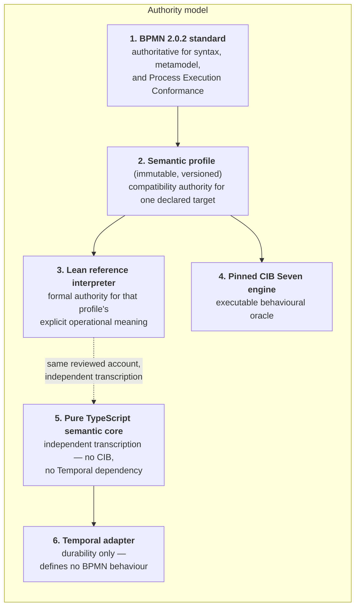

# Background for newcomers

## What this project is trying to build

A **BPMN execution engine** that runs on **Temporal**, whose semantics are pinned down by a **formal proof assistant**, and which is cross-checked against a **real production engine**.

Unpacking that sentence is most of the background you need.

**BPMN 2.0.2** (Business Process Model and Notation) is an OMG standard for modelling business processes — the boxes-and-arrows diagrams with start events, tasks, gateways and end events. It has two halves: a *notation* half (what the diagram looks like) and an *execution* half (what an engine must actually do when it runs the process). The execution half is what this project targets, and the specific conformance class is called **Process Execution Conformance**.

The catch: BPMN's execution semantics are described in English prose across hundreds of pages, with genuine ambiguities. Different engines interpret the same diagram differently. So "implement BPMN" is not a well-defined task until you also decide *whose reading of BPMN* you are implementing.

**CIB Seven** is a real, open-source BPMN engine (a fork of Camunda 7, Apache-2.0). This project uses it as an **oracle** — a reference implementation you can run and observe to answer "what does a working engine actually do here?" It is not treated as automatically correct; disagreements with the standard get *classified* rather than resolved by majority vote. Two releases are pinned and kept strictly apart: `2.2.0` for most semantic profiles and `2.0.0` for the A12-facing ones.

**A12 Workflows** is a commercial product (`release/2025.06`, EUPL-1.2) built on top of CIB Seven. Replacing it is the project's eventual business goal, which makes it a useful prioritisation lens: whatever BPMN features A12's real models use are worth implementing first. It is deliberately kept *outside* the repository's dependency and licence boundary — inspectable as research, never linked or vendored.

**Temporal** is a *durable execution* platform. You write ordinary-looking code; Temporal makes it survive crashes, restarts, and machine failures by recording every step and replaying it. This is a natural fit for long-running business processes — a process instance might wait three days for a human approval, and Temporal keeps that wait alive without you managing any state yourself. See [07](07-temporal-adapter.md) for what that costs.

**Lean 4** is a proof assistant: a programming language whose type checker can also verify mathematical proofs. You write definitions (which can be executed like ordinary programs) and theorems about them (which are checked by a small trusted "kernel"). If a theorem does not actually follow from its assumptions, the build fails. This is the tool the project uses to make its BPMN interpretation *precise* rather than merely *implemented*.

## Who is allowed to decide what



The critical rule is item 6: **Temporal provides durability and hidden orchestration work without defining BPMN behaviour.** Everything about how the system is layered follows from wanting that to stay true.

The dashed edge from Lean to the semantic core is the one people misread. It is *not* generation, extraction, or a proof — it is two hand-written transcriptions of one reviewed account. [06](06-typescript-core-correctness.md) is entirely about what that does and does not buy.

Not every profile uses every authority. Of the 15 registered semantic profiles, six declare **BPMN 2.0.2 normative authority with no CIB execution target at all** — the Inclusive Gateway, Event-Based Gateway, Call Activity, Simple Boolean Exclusive Gateway, Timer/User Task composition, and Intermediate Catch Message profiles. For those, box 4 is deliberately empty, which has consequences for how much independent evidence exists; [02](02-evidence-and-lanes.md) works through them.

## Three layers with one-way dependency

Beyond the authority model there is a *product* layering, and conflating the two is the most common way to get this project wrong:

```text
A12 Workflows adoption adapter and migration tooling
        ↓ uses
selected CIB Seven compatibility profiles
        ↓ refine or extend
vendor-neutral BPMN 2.0.2 execution core
        ↓ hosted by
Temporal durability and effect infrastructure
```

Lower layers never import or encode assumptions from a higher one. Concretely: A12 bean names, Camunda extension namespaces, CIB job/retry/incident mechanics, and Temporal attempt counters all stay out of the BPMN core, the Lean account, the IL, and the TypeScript core.

That boundary was **violated and then repaired** during the period this document covers — A12 delegate bean names and Camunda namespaces had leaked into the semantic core's types and Lean's production lowering, and commit `b0a4002` neutralised them. See [12](12-corrections-log.md).

Three coverage denominators are tracked separately and may never be combined into one percentage: reviewed BPMN Process Execution requirements, CIB profile coverage, and A12 adoption coverage. Success in one is never evidence for another.

## One more piece: who owns expression languages

BPMN says a `FormalExpression` names its expression language. It does not say what that language is or how it evaluates. This project's answer, recorded in [PROJECT-DESIGN.md](../bpmn-lean-experiment/docs/PROJECT-DESIGN.md#profile-selected-expression-evaluation), splits into two architectures — and **which one shipped first is the opposite of what an earlier version of this document predicted.**

**The implemented path is a project-owned language.** The [Simple Boolean expression decision](../bpmn-lean-experiment/docs/SIMPLE-BOOLEAN-EXPRESSION-DECISION.md) selects one immutable language URI naming a closed, total, read-only grammar of exactly five Boolean forms over Process-scope `string | null` bindings. **Lean and the TypeScript core each parse and evaluate it independently.** The source boundary rejects the whole language before Workflow start, the checked graph keeps both the exact source text and the typed expression, Lean reparses the source when it checks lowering, and the core evaluates only the typed expression during bounded internal closure. No Activity, no evaluator receipt, no suspension.

The point is not that the project wanted its own expression language. The point is that a *dependency-free total* language of five forms is small enough to transcribe twice and prove things about, so conditional routing became an ordinary capsule instead of a cross-runtime integration. Omitted language selection stays BPMN's XPath default and is rejected outright rather than silently reinterpreted.

**The delegated path exists but is deferred.** The [JUEL evaluation decision](../bpmn-lean-experiment/docs/JUEL-EVALUATION-ARCHITECTURE-DECISION.md) would hand exact expression text plus an approved context to the pinned CIB JUEL runtime behind a Java Temporal Activity, and bind the content-bound result back to the core. It is owner-selected as *the* CIB compatibility architecture, its 38-jar dependency graph is audited, and none of it is adopted — no Java evaluator module, no dependency, no wire contract. It reopens only when a CIB compatibility claim actually needs it.

Two honesty rules survive both paths. Under delegation, CIB and a project JUEL Worker would share one implementation and therefore form **one correlated truth account**, not two agreeing implementations. And under the implemented standards path, the trade runs the other way: Lean and TypeScript genuinely evaluate independently, but **CIB has no opinion at all**, so the Simple Boolean profile has no oracle lane and says so.

## Glossary

| Term | Meaning in this project |
|---|---|
| **Semantic profile** | An immutable, versioned document recording exactly which features, exclusions, observation boundary, oracle revision, and environment a compatibility claim covers. A profile ID is semantic authority, not a label. Fifteen are registered today; six are standards-only with no CIB target. |
| **Capsule** | A bounded unit of semantic work — one feature, closed across every evidence lane, with its own spec document and a required section structure. Eighteen capsule documents exist under `docs/capsules/`. |
| **Semantic core** | The pure TypeScript component. The retired architecture handoff called it a "reducer"; this project renamed it to avoid a Redux association. Its public transition is `applyStimulus`. |
| **Oracle** | An external implementation you observe to learn real behaviour. Here: a pinned CIB Seven build. |
| **Evidence lane** | One independent way of supporting a claim. Two lanes count as two *only if their failure modes are uncorrelated*. |
| **Differential testing** | Running the same input through several independent implementations and requiring their observable results to agree. |
| **Refinement** | "The host faithfully implements the semantic model" — the host may do more (retries, replays), but must not change any publicly visible semantic outcome. |
| **Replay** | Re-running a recorded Temporal execution history against the code to prove it is deterministic and history-compatible. Thirty histories are replayed per full pipeline run. |
| **Token** | Petri-net style marker. A token on a Sequence Flow means "control is here". Parallel processes have several at once. |
| **Control place** | The IL's name for a token container. One per admitted BPMN Sequence Flow. |
| **Stimulus** | An explicit external input: start the process, complete a task, deliver a message, fire a timer, complete an effect. Nothing happens without one. |
| **Closure** | After a stimulus commits, the engine fires *automatic* internal steps until it reaches a wait. Bounded by a fuel limit (currently 8). |
| **Definition scope** | A *static* ownership region in the checked graph and IL — which nodes, flows, operations, and control places belong to which Process or embedded Sub-Process. Existing profiles form one rooted tree; the Call Activity profile adds a second, parentless called root. |
| **Runtime scope occurrence** | The *dynamic* counterpart: one root occurrence plus at most one level of parent-linked child occurrence, or one occurrence-linked called root. Tokens and waits are owned by a scope occurrence, which is what makes child completion and regional cancellation expressible. |
| **Variable scope** | Runtime *data* ownership, deliberately separate from definition scopes. Still exactly two kinds: one Process scope (public) and private Activity-local scopes keyed by complete effect occurrence. Variable-scope traversal, shadowing, and nesting do not exist. |
| **Effect** | A committed intent to perform external work. The core owns the intent; a Temporal Activity performs it; the core validates the result. |
| **Event race** | The Event-Based Gateway mechanism: competing Message and Timer catches armed atomically under one race identity, exactly one winner committed, every loser withdrawn. |
| **Receipt** | A content-bound result from outside the core that the core validates against the exact pending request before applying it. |
| **Preflight** | A mandatory Temporal hosting/refinement review completed *before* production Lean or TypeScript code for a new transition family. |
| **Host capability** | A separate, pre-start check asking whether the *adapter* can host a program's reachable wait set — distinct from whether the program is semantically well-formed. Failing it is a typed `rejected` result before Workflow creation, never a crash. |
| **Canonical observation** | The single agreed public view of state — status, active waits, open tasks/messages/timers/effects, variables, enabled interactions, logical time. This, and only this, is what implementations are compared on. |
| **Law** | A theorem that holds for *all* inputs satisfying stated hypotheses. |
| **Non-law** | A theorem proving that a tempting-but-wrong alternative reading is **false**. A required lane, not a bonus. |
| **`by decide`** | A Lean tactic that proves a statement by having the trusted kernel *compute* the answer on concrete values. Great for fixtures; no substitute for a law. |
| **Soundness** | "everything the code does is permitted". The direction this project proves. |
| **Completeness** | "everything permitted is found by the code". Not claimed without a separate theorem. |
| **Separating witness** | An input on which two candidate readings give *different publicly observable* results. If they differ only internally, it is not a witness. |
| **Saturation certificate** | A checked closure property (every edge leaving a set lands back inside it) used instead of "I searched and found nothing" — see [01 §1.6](01-theorem-techniques.md#16-certificates-instead-of-bounded-search). |
| **Fidelity label** | How strongly an oracle observation supports a claim: `engine-observed`, `adapter-derived`, `adapter-decided`, or `not-claimed`. |
| **Comparator-side / verifier-side mutation** | A seeded defect applied to a clone of a target's own canonical result (proves the comparator is field-sensitive) versus one applied to retained raw producer observations (proves the evidence projection is live). Not interchangeable. |
| **`processClosed` / `processUnknown`** | Adapter-owned lifecycle results for a command addressed after Workflow closure. Deliberately *not* semantic outcomes. |
| **Cold / warm review** | A governed independent review by a sub-agent with no shared conversation history (`fork-turns-none`) versus one by an agent that already has context. Cold is the default for anything that selects BPMN meaning; warm is permitted only in named cases such as the same reviewer auditing its own findings' corrections. |
| **Trust base** | What you must believe for a proof to mean something — here, the Lean kernel plus the axioms a declaration actually uses. |
| **IL** | Intermediate Language. A small, typed, serializable representation between "parsed BPMN" and "running semantics". **Seventeen** operations today. |
