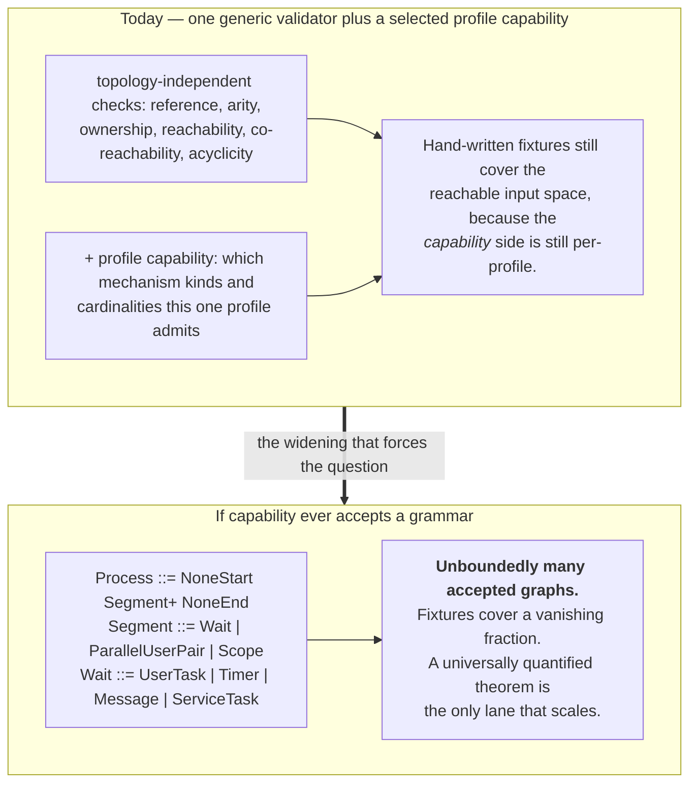
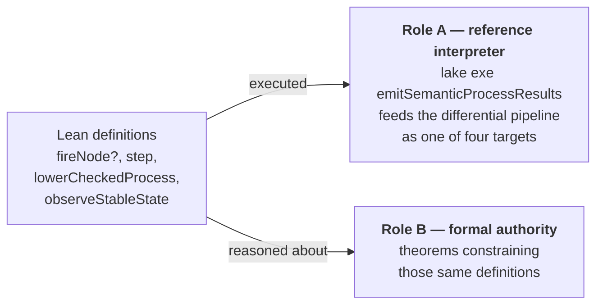
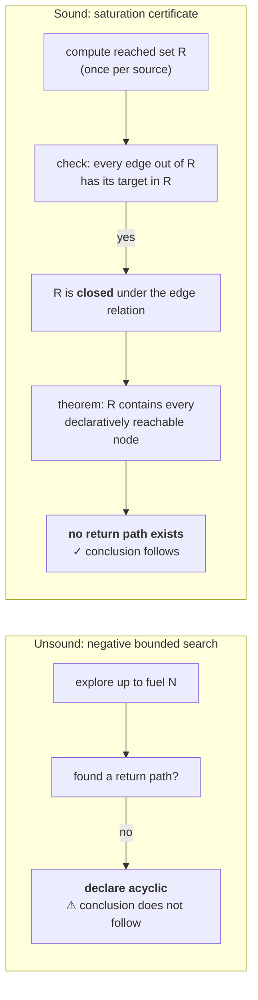
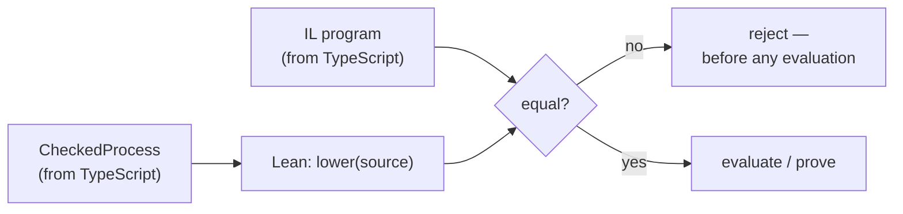
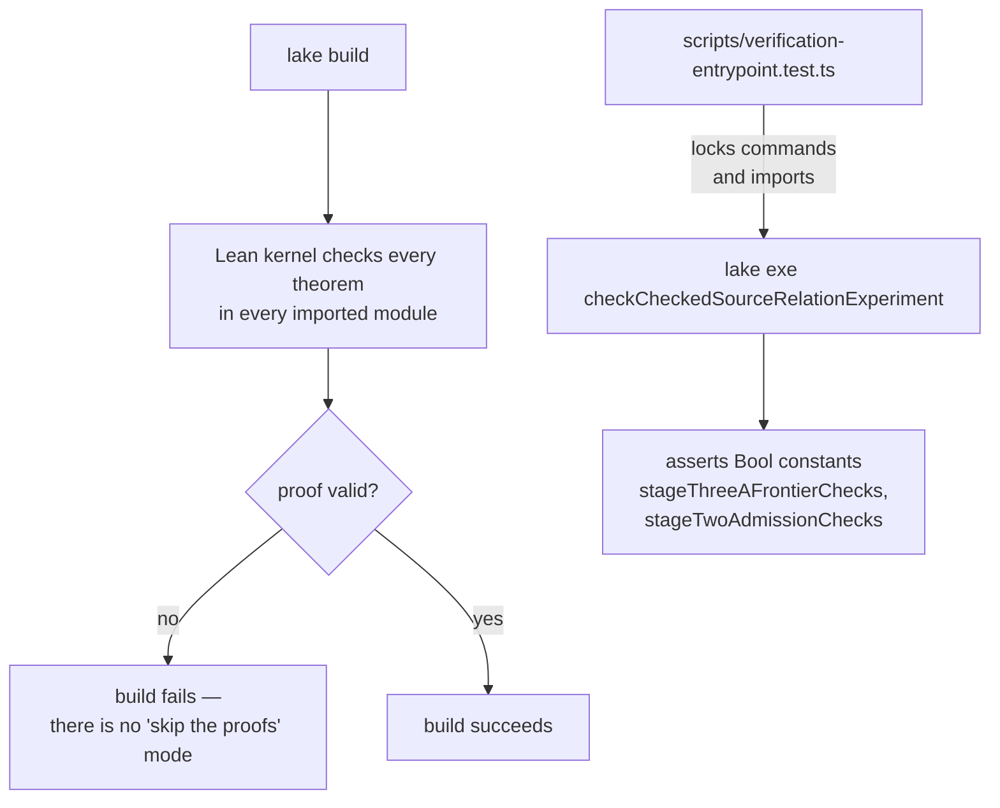

# How theorems are used

> *Question: how are theorems currently used in the project? What is their purpose?*

## 1.0 First: why formalise anything at all?

If you have never worked with a proof assistant, the honest first reaction to "we wrote 2,000 lines of Lean to describe a parallel gateway" is *why not just write tests?* The answer is worth taking seriously, because most of the time "just write tests" is correct.

**Tests make existential claims. Specifications make universal ones.**

A passing test says: *"there exists at least one input on which my code behaves as I expected."* Run a thousand tests and you have a thousand such statements. What you want to know is: *"for every input the engine accepts, the behaviour is X."* No finite number of examples gets you there — and the gap is not academic, because the interesting BPMN bugs live in state combinations nobody thought to write down.

Concretely, here is the moment fixtures stop covering the input space:



**Two things about that diagram are not what a reader would assume.**

The widening is **not** gated on the preservation theorem. The owner replaced that ordering with a targeted per-capsule preservation gate ([03](03-is-lean-goal-driven.md)), so a capsule states the exact source-to-result claim it can invalidate and closes the smallest reusable theorem *or executable guard* protecting it, rather than waiting on a universal result.

And the left-hand box is only half true. The [profile-parameterized admission work](../bpmn-lean-experiment/docs/PROFILE-PARAMETERIZED-ADMISSION-SPEC.md) split admission into a reusable topology-independent graph/program validator plus a per-profile mechanism-and-cardinality capability, and an executable architecture guard *prohibits* reintroducing a whole-topology execution-surface predicate. So the graph-shape half of admission is generalised; the capability half is still an enumerated multiset per profile.

**A useful way to hold this:** the quantified-theorem argument is about what happens when the number of *accepted graphs* becomes unbounded. Generalising the validator moved the project close to that without crossing it. The first profile admitting a *family* rather than a shape is where the argument becomes load-bearing, and no such profile exists.

**The second motivation is different and less obvious: BPMN's prose is ambiguous, so you must *choose* a reading — and a choice you cannot state precisely is a choice you cannot review, defend, or notice yourself violating.**

Take the converging parallel gateway. The standard says it waits for its incoming branches. Two readings are consistent with the English text, and they differ on real inputs (see [§1.3](#13-non-laws-proving-the-attractive-wrong-answer-wrong)). Writing an implementation *makes* the choice; it does not *record* it. A month later nobody can tell whether the behaviour is a decision or an accident. Formalising forces the choice into a reviewable artefact — a declarative relation a domain expert can read clause by clause against the specification.

**The third motivation is the one formal methods are uniquely good at: catching failures where your test and your code share an assumption.**

This is the failure mode no amount of testing removes, because the test was written by the same person, from the same misunderstanding, as the code. The project has a real instance, described in full in [§1.6](#16-certificates-instead-of-bounded-search): a cycle-detection routine that passed every test it had, and whose *tests were also wrong*, because both the code and the tests assumed "I searched and found no cycle" means "there is no cycle". Only the attempt to *prove* the property exposed that the code's success did not mean what everyone thought.

## What each assurance technique can and cannot tell you

Four lanes run deliberately, because each answers a different question and none subsumes another.

| Lane | Answers | Cannot answer | Cost |
|---|---|---|---|
| **Unit tests** | "does my code do what I expected on these inputs?" | anything about unlisted inputs; whether the expectation was right | low |
| **Differential testing** (Lean vs TypeScript vs Temporal) | "do two independent transcriptions agree?" | whether both transcribed a wrong reading | moderate |
| **Oracle observation** (pinned CIB Seven) | "what does a real production engine actually do?" | whether the engine is standard-conformant; anything its API does not expose | high |
| **Lean theorems** | "does the property hold for *every* input satisfying stated hypotheses?" | whether the formalised account is the right reading of BPMN | high, front-loaded |

Read the "cannot answer" column downward and the architecture falls out. Tests need differential comparison because expectations can be wrong. Differential comparison needs an oracle because shared transcription errors survive it. The oracle needs the standard because engines deviate. And theorems need all three because a proof about the wrong account is a rigorous statement about nothing.

**This is why the project forbids merging them.** BPMN requirements, CIB evidence, Lean properties, TypeScript correspondence, and Temporal refinement stay distinct claims, never summarised as one "supported". A single verdict would hide which column was empty.

## 1.1 Lean has two jobs, and it matters that they share definitions



**Role A: executable reference interpreter.** `lake exe emitSemanticProcessResults` decodes the same **51** answer-free scenario files the TypeScript core and CIB runner consume, executes them, and emits results into the comparison pipeline. This is not a proof — it is a second independent implementation, useful precisely because two transcriptions make different mistakes.

Lean also *echoes* what it decoded, and the pipeline requires that echo to equal the admitted document byte-for-byte, plus injects an extra answer field that the strict decoder must reject. So Role A doubles as an answer-smuggling guard: a target that could read expected values from its input would not be a second opinion at all.

**Role B: formal semantic authority.** Per the authority model, Lean is authoritative for "that profile's explicit operational meaning". Theorems are how that authority says anything beyond a finite list of cases.

The leverage comes from these being *the same* definitions. A theorem about token synchronisation constrains the very function whose output lands in the comparison pipeline. If Lean maintained a separate abstract "spec model" alongside its evaluator, the theorems would be about the wrong artefact — a classic and easy mistake.

## The taxonomy of theorems actually present

| Kind | Purpose | Real examples |
|---|---|---|
| **Evaluator soundness** | Every step the *executable* code takes is permitted by an independently written *declarative* rulebook. Mandated for every transition family. | `fireNode_sound`; the production `OperationStep` / `ProgramStep` / `EffectCompletionStep` soundness theorems; `throwError`, `selectMany` / `synchronizeSelected`, and two-constructor Event-race winner soundness |
| **Quantified laws** | Claims that survive beyond fixtures: refusal, preservation, identity — with exact hypotheses. | quantified full timer / effect identity-mismatch refusal *with state preservation*; quantified invalid-patch refusal; generic nonquiescent-completion refusal; monotonic counter and root-work preservation under regional cancellation; lowering laws preserving definition identity and Sequence-Flow origin |
| **Checked non-laws** | The nearest tempting alternative reading, proved **false**. | `duplicate_left_no_right_non_law`; the early-firing non-law; the direct-local-patch-to-Process-scope non-law; the normal-success non-law; the global-cancellation non-law; missing-record, incomplete-association, and erased-association non-laws; stranded-child non-resumability |
| **Finite fixture locks** | Kernel-verified concrete behaviour and cross-language ordering contracts. | `synchronize_consumes_per_incoming_and_preserves_excess`; `token_projection_ignores_storage_permutation`; the synthetic **four-kind** wait-ordering fixture with a reverse-ordered same-kind pair |
| **Exact closure bounds** | The precise number of internal steps a mechanism takes, locked per capsule so a widened grammar cannot silently exceed the fuel limit. | the Simple Boolean three-step closure; the Inclusive Gateway four-step closure and bound-three exhaustion; the Event-race two-step arming and bound-one exhaustion; Call Activity's exact 3/3/2 closures |
| **Structural / graph laws** | Reusable infrastructure so later semantic proofs are not rebuilt from scratch. | `reachedSet_complete`, `acyclicClosed_sound`, `graphReaches_antisymm`, `chainFrom_unique`, `structuredDecomposition_sound`, `filterMap_isolated` |
| **Countermodels** | A concrete divergence that catches a whole defect class if production code drifts. | the renamed positional-lowering countermodel |

## 1.2 A declarative relation and an evaluator, kept apart

This is the project's core proof pattern, and it recurs everywhere.

First, a **declarative relation** — a rulebook stating which transitions are *permitted*, saying nothing about how to find them:

```lean
/-- Direct checked-node relation in BPMN vocabulary. -/
inductive NodeStep (source : CheckedProcess) :
    CheckedNode → SourceRuntimeState → SourceRuntimeState → Prop where
  | userTask (id : NodeId) (name : Option String)
      (state : SourceRuntimeState) (instanceId : SemanticId)
      (running : state.control = .running instanceId)
      (enabled :
        hasToken state (firstFlowId (incomingFlowIds source id)) = true) :
      NodeStep source (.userTask id name) state
        (activateUserTask state instanceId id name
          (firstFlowId (incomingFlowIds source id))
          (firstFlowId (outgoingFlowIds source id)))
  -- … one constructor per node kind
```

Read it as: *"if the process is running, and the User Task's incoming flow has a token, then stepping that User Task is permitted, and the result is the state with that task activated."*

Second, an **executable evaluator** that actually computes a step:

```lean
/-- Executable selector for one checked node. It does not select a node by collection order. -/
def fireNode? (source : CheckedProcess) (node : CheckedNode)
    (state : SourceRuntimeState) : Option SourceRuntimeState :=
  match node with
  | .userTask id name =>
      match state.control with
      | .running instanceId =>
          let input := firstFlowId (incomingFlowIds source id)
          if hasToken state input then
            some (activateUserTask state instanceId id name input
                    (firstFlowId (outgoingFlowIds source id)))
          else none
      | .notStarted
      | .completed _ => none
  -- … one branch per node kind
```

Third, the **theorem tying them together**:

```lean
theorem fireNode_sound (source : CheckedProcess) (node : CheckedNode)
    (before after : SourceRuntimeState)
    (result : fireNode? source node before = some after) :
    NodeStep source node before after
```

*"Anything the executable code does was permitted by the rulebook."*

**Why two descriptions of the same thing?** Because they fail differently. The rulebook is written to be *readable and reviewable* against the BPMN standard — a domain expert can check it clause by clause. The evaluator is written to be *runnable* — it must pick one answer, handle every case, and terminate. If you only had the evaluator, "is this right?" would mean "read this code and squint". If you only had the rulebook, you could not run anything. The soundness theorem lets you review the readable version and trust the runnable one.

Note what the theorem carefully does **not** claim: completeness. See [§1.4](#14-claim-soundness-never-silently-claim-completeness).

## 1.3 Non-laws: proving the attractive wrong answer wrong

BPMN's converging parallel gateway ("join") waits for all its incoming branches. But *how* do you check that? Two readings look equivalent until you try them:

- **Count-based:** "are there at least as many tokens as incoming flows?"
- **Per-incoming-flow:** "does *each* incoming flow have at least one token?"

They differ exactly when tokens pile up unevenly. Two tokens on the left branch and none on the right satisfies the count test but not the per-flow test. The approved reading is per-incoming-flow, and the project proves the other reading wrong rather than merely not implementing it:

```lean
/-- The nearest count-based join proposition is false for two offers on only the left incoming flow. -/
theorem duplicate_left_no_right_non_law :
    countBasedJoinReady duplicateLeftNoRightState parallelJoinInputs = true ∧
      perIncomingJoinReady duplicateLeftNoRightState parallelJoinInputs = false := by
  decide
```

**Why this matters more than it looks.** A passing test suite tells you your code does what your tests say. It does not tell you the *plausible alternative* would have failed. Without the non-law, a future refactor could silently switch to count-based readiness and every existing test might still pass. The non-law is a tripwire on a specific wrong idea.

The review checklist makes this mandatory: *"identify the nearest realistic counterexample and require either a checked non-law or an executable negative witness."*

**Generalising the technique.** A non-law is *hypothesis discrimination*. Tests confirm your hypothesis; a non-law refutes its nearest rival. This is the same logical move as a discriminating experiment in natural science — an observation both hypotheses predict tells you nothing, so you look for where they diverge. The project applies it throughout: the early-firing non-law (a timer must not fire before its deadline), the direct-local-patch non-law (Activity-local variables must not leak straight into Process scope), the normal-success non-law (a business error must not also take the normal route). The Temporal lane uses the same move under a different name — see [07 §challenge 10](07-temporal-adapter.md#challenge-10--proving-the-durable-mechanism-was-actually-used).

## 1.4 Claim soundness, never silently claim completeness

`fireNode_sound` says *everything the evaluator does is permitted*. It says nothing about the converse. Those are genuinely different properties:

| Property | Statement | What its absence allows |
|---|---|---|
| **Soundness** | `evaluator produces T` ⟹ `T is permitted` | nothing bad; the evaluator may be *incomplete* (miss legal steps) |
| **Completeness** | `T is permitted` ⟹ `evaluator produces T` | the evaluator may silently refuse legal behaviour — a process stalls |
| **Determinism** | at most one `T` is permitted | the evaluator may be *choosing*, and that choice is then unreviewed semantics |

The rule is that you may claim only what you proved: *"Claim completeness, determinism, or equivalence only with exact checked hypotheses; nondeterministic semantics must receive an explicit semantic choice rather than inherit evaluator order."* The IL specification repeats it: *"A converse or exact equivalence claim requires a separate checked theorem; it must not be inferred from soundness."*

**Why the discipline is needed.** Soundness is much easier to prove than completeness, and the two are easy to conflate in prose. "We proved our evaluator correct" is the sentence that hides the gap. A reader assumes both directions; the proof delivers one. The project's answer is to name the direction every time and list the missing direction as an explicit absence in `IMPLEMENTATION-MAP.md`.

## 1.5 Exact hypotheses, which is a Goldilocks problem

A theorem is a conditional: *given these assumptions, this conclusion*. The assumptions are where usefulness is won or lost, with failure modes on both sides.

| Hypotheses | Result | Example of the failure |
|---|---|---|
| Too weak | theorem is **false**, will not compile | claiming a join fires without assuming all inputs are marked |
| Too strong | theorem is **true but useless**, or **vacuous** | assuming the exact fixture, so the theorem proves one concrete case dressed as a law |
| Assumes the conclusion | theorem is **circular** | assuming the evaluator's answer, then "proving" the evaluator gives that answer |
| Exactly right | theorem is **reusable** | premises a caller can actually discharge, no more |

The third row is a real hazard, and the project bans it explicitly: *"the preservation obligation cannot be stated without assuming the desired result"* is a documented stop condition, and *"Do not assume an `enabledTransitions` or `fireNode?` result as a premise"* is a review rejection criterion.

The too-strong row is more common and more insidious, because such theorems *compile*. Hence the standing review question: does each theorem have *"useful hypotheses and reusable semantic content rather than only proving one concrete serialized result"*? Three theorems failed exactly this test and were deleted — see [§1.14](#114-the-anti-vacuity-discipline).

A worked illustration of getting it right: a frontier theorem needed the hypothesis "the two tokens aim at two *distinct* nodes". Reviewing the hypothesis list found that a companion assumption — "the two Sequence Flows have distinct identifiers" — was **derivable** from graph well-formedness plus the distinct-nodes assumption, and so was removed. It also found the distinct-nodes assumption itself was **not** derivable, and proved that by exhibiting a well-formed graph where dropping it makes the theorem false (two flows into one converging gateway). That is hypothesis auditing in practice: for each premise, either derive it or prove it necessary.

## 1.6 Certificates instead of bounded search

This is the best motivating story in the repository, because the defect it fixed was invisible to testing *by construction*.

**The problem.** The engine must reject cyclic process graphs. The obvious implementation is a bounded search: explore outward from each node, up to some fuel limit, looking for a path back to the start. Find one → cyclic, reject. Find none → acyclic, accept.

That code can be perfectly correct as a *program* and still be unsound as a *proof step*, because:

> **"not detected within fuel N" ≠ "does not exist"**

Absence of evidence within a bound is not evidence of absence. And here is the crucial point: **every test of that routine passes.** Cyclic graphs get rejected. Acyclic graphs get accepted. The tests confirm the code does what you meant. What they cannot tell you is that the code's *success* does not carry the meaning the rest of the system relies on.

**How the project found it.** Not by testing. By trying to prove acyclicity and failing:

> *"The remaining ceiling could not honestly prove that finite vertex fuel detects every declarative path and therefore could not derive declarative acyclicity from a negative bounded search. Equating 'not detected within fuel' with 'no path exists' would reproduce the circular proof defect this stage exists to remove."*

The team **stopped a stage** rather than write a plausible-looking theorem resting on an unsound step.

**The fix — a saturation certificate.** Instead of asking "did I fail to find a path?", compute a reached set and then *certify a closure property*: every edge leaving the reached set lands back inside it.



A closed set genuinely proves absence: if `R` contains the start, is closed under edges, and does not contain a return target, then no path can escape `R` to reach it — for any path length, not just paths shorter than the fuel. Three theorems make it work:

| Theorem | What it establishes |
|---|---|
| `reachedSet_complete` | by induction on the *declarative* reachability relation: the certified set contains every reachable node |
| `acyclicClosed_sound` | for every accepted graph, a declarative return path is excluded |
| `graphReaches_antisymm` | makes the resulting acyclicity reusable by later proofs |

**And then — the part proving the fix was not cosmetic.** A three-node cycle is retained as a discriminating witness. At fuel one, the old bounded predicate **accepts** it (wrongly) and the certified predicate **rejects** it. At the real vertex-count fuel of three, both reject it.

That last sentence does careful work: because both predicates agree at production fuel, the witness demonstrates *the predicates genuinely differ* without implying any real fixture was ever mis-accepted — *"the witness distinguishes predicates rather than reporting a production fixture defect."* Precision about what a witness does and does not show is itself part of the method.

This result graduated: saturation-certified acyclicity is now part of standalone Lean `programWellFormed` in the production lane, not only the experiment.

**The transferable lesson.** Whenever code concludes something from a *failed search*, that conclusion needs a certificate, not a bound. This pattern recurs far beyond BPMN: type-checker termination checks, deadlock detectors, garbage-collection reachability, dependency-cycle linters. Most of them ship with the bounded-search version.

## 1.7 Typed identifier domains

Everything in the wire format is a string: node IDs, Sequence Flow IDs, control place IDs, operation IDs, process instance IDs, task occurrence IDs. On the wire that is fine. Inside the semantics it is a loaded gun, because nothing stops you passing a Sequence Flow ID where a node ID belongs — and both are `string`, so no tool complains.

The IL specification draws the line:

> *"String identifiers are wire representations, not permission to treat distinct identifier domains interchangeably in Lean or implementation code. Lean must use distinct types for process, node, Sequence Flow, operation, control-place, task-definition, and task-occurrence identifiers where those domains can be confused."*

Each domain gets its own single-field wrapper type, constructed with anonymous-constructor notation:

```lean
-- distinct types, not interchangeable, even though both wrap one String
def forkToA : CheckedSequenceFlow :=
  { id       := ⟨"Flow_ForkToA"⟩     -- SequenceFlowId
    sourceId := ⟨"Gateway_Fork"⟩     -- NodeId
    targetId := ⟨"UserTask_A"⟩ }     -- NodeId
```

**Without it**, the single most likely semantic bug in a token-based engine — confusing a flow with a node, or a task *definition* with a task *occurrence* — is invisible to the compiler. **With it**, that entire bug class is a compile error. This is the cheapest technique in the catalogue and probably the highest-yield.

A related invariant, subtle enough to name: *"Definition identity, semantic instance identity, and host-runtime identity remain distinct."* The BPMN element `UserTask_A` (definition), its particular activation in process instance 7 (semantic occurrence), and the Temporal Workflow hosting that instance (host identity) are three different things. Collapsing any two produces bugs that look like haunting.

## 1.8 Propositions that carry exactly the facts, and no internals

When one proof layer needs facts from another, the naive move is to pass along whatever internal structure holds them. That leaks implementation detail into theorem statements, and once a public proposition mentions a parser's accumulator, every parser change is a breaking change to the proof.

The answer is an explicit **structure of exactly the needed facts**:

```lean
/-- The graph facts needed to isolate an enabled node at a single-token frontier. -/
structure FrontierGraphFacts (source : CheckedProcess) : Prop where
  nodeIdsDistinct : allDistinct (source.nodes.map (·.id)) = true
  flowIdsDistinct : allDistinct (source.sequenceFlows.map (·.id)) = true
  arityValid : ∀ node ∈ source.nodes, nodeArityValid source node = true

/-- Extract the required identifier and arity facts from the executable graph validator. -/
theorem sourceGraphFacts (source : CheckedProcess)
    (wellFormed : sourceGraphWellFormed source = true) :
    FrontierGraphFacts source
```

Three fields. Not the whole validator, not its internal conjunction structure — the three facts downstream proofs actually consume. And the direction matters: an *executable* Boolean check is converted into *propositions*, so callers supply a runnable predicate and proofs consume logic.

The larger sibling `WholeProcessDecompositionFacts` exists for the same reason, and its documentation makes the intent explicit: *"no parser function, `ParsedTail`, or `.visited` occurs in that proposition."* The parser is proof plumbing; the exported proposition is graph facts only.

**Why this pays.** It makes proofs *auditable for smuggling*. If a theorem's premises mention only graph structure and runtime shape, you can verify by inspection that it does not secretly depend on parser state, admission order, or — worst of all — the answer it is supposed to compute.

## 1.9 Artifact equality before evaluation

TypeScript produces the lowered IL program in production. Lean *could* simply read that program and prove things about it. It is forbidden to:

> *"For each retained program emitted by TypeScript, Lean must decode both the checked graph and emitted program, recompute `lower source`, reject inequality, and only then evaluate or prove program properties. A scenario identifier or fixture name is not a substitute for this content equality."*



**The motivation.** If Lean only reasons about the already-lowered program, the *translation from BPMN to the IL* sits entirely outside the formal account — and translation is exactly where meaning gets lost: *"proving only the already-lowered program would leave the BPMN interpretation outside the formal account."*

Note the closing of the obvious shortcut. It would be tempting to check "this is the file named `parallel-fork-join`, so it must be the parallel program". Content equality against a recomputed lowering is required instead, so a mislabelled, hand-edited, or stale artefact cannot slip through under a trusted name.

**The limit, which matters more than the mechanism.** This re-derivation covers *graph → program* only. *XML → graph* has a single producer and Lean has no XML parser. See [06](06-typescript-core-correctness.md#1--a-shared-schema-frozen-input-contract--with-lean-re-deriving-it).

## 1.10 Refusing to let collection order become semantics

Programs are lists. Lists have order. Order is *usually* an artefact of serialisation, not a decision anyone made. But if a theorem's conclusion depends on it, the artefact has silently become a specification.

The IL states the intent: **"Array order has no semantic meaning."** Canonical serialisation sorts definitions and unordered references by identifier. And the corresponding stop condition: halt if *"canonical identifier order would become semantic scheduling."*

What this looks like in a proof: when characterising which transitions are enabled at a state with two concurrent tokens, the tempting statement is an equality —

```
enabledTransitions source state = contributionOf nodeA ++ contributionOf nodeB
```

— and that statement is **false**, because whichever of `nodeA`/`nodeB` appears first in `source.nodes` heads the result. An independent proof review demonstrated this by compiling two counterexamples: one on two graphs identical except for node order, and one on a *single unmodified* graph where merely exchanging which node you call "A" refutes the equality. The correct conclusion is a permutation:

```lean
(enabledTransitions source state).Perm
  (contributionOf nodeA ++ contributionOf nodeB)
```

`List.Perm` says "same elements, same multiplicities, order unspecified" — preserving the fact that two tokens on one branch differs from one token on each, while refusing to say which transition comes first.

**Why not a set?** Because a set discards multiplicity, and multiplicity *is* semantic here — the per-incoming-flow join rule of [§1.3](#13-non-laws-proving-the-attractive-wrong-answer-wrong) depends on counting tokens. The representation has to preserve exactly the distinctions that matter and erase exactly those that do not. That is a semantic decision disguised as a data-structure decision, which is why it goes through review.

There is a matching runtime law: `token_projection_ignores_storage_permutation` proves the public projection is unchanged when stored tokens are permuted. Order-independence is asserted at both the proof layer and the observation layer.

### The companion claim: canonical wait ordering

The same principle governs the public `activeWaits` projection, and it is the best worked example in the repository of a **conditional claim with a machine-checkable firing condition**, so it is worth following in full.

All four implementations order active waits by **semantic kind rank, then element ID**:

```lean
-- BpmnSemantics/SemanticProcess/Scenario.lean
  sortActiveWaitsByElementId taskWaits ++
    sortActiveWaitsByElementId messageWaits ++
    sortActiveWaitsByElementId timerWaits ++
    sortActiveWaitsByElementId effectWaits
```

| Implementation | Rule |
|---|---|
| `packages/semantic-core/src/scenario.ts` | kind rank, then element ID |
| `runners/…/CibSevenActiveWaitProjector.java` | kind rank, then element ID |
| `scripts/contract-cib-evidence-projection.ts` | kind rank, then element ID |
| `BpmnSemantics/SemanticProcess/Scenario.lean` | kind rank, then element ID |

The theorem locking it is `active_wait_projection_orders_by_semantic_kind`, and its **fixture is the load-bearing part**. It carries four wait kinds with element IDs chosen so a global element-ID sort *disagrees* with kind order, plus a **reverse-ordered same-kind pair** — `Z_UserTask` stored before `B_UserTask` — so the theorem discriminates the element half as well as the kind half. Its docstring says exactly that. A fixture that cannot fail for the right reason is not a lock.

**What makes this instructive is the mechanism that got it here.** For a period the four implementations followed three different rules and the theorem's name claimed more than its one-wait-per-kind fixture could establish. The repair was not to assert agreement but to state the weaker true claim with a **named premise and an explicit reopen trigger**: the contract held *"only while admitted programs are ID-sorted and mixed or repeated same-kind waits are unreachable"*, and any admission invalidating either premise *"must reopen the projection rule and add an element-ID sort in Lean or a checked theorem that the two orders coincide."*

Adding the Message wait kind changed the closed wait-kind domain, so the trigger fired. The [Intermediate Catch Message capsule](../bpmn-lean-experiment/docs/capsules/INTERMEDIATE-CATCH-MESSAGE-SPEC.md) honoured it rather than arguing around it, and declined the cheaper escape explicitly: an order-coincidence theorem was rejected because it *"would preserve the fragile ID-sorted-program premise that this domain change is required to reopen."*

A conditional claim with a named premise is therefore not a way of avoiding a fix here. It is a **scheduled fix with a firing condition**, and this one fired on the next capsule that touched its domain. That is the strongest available evidence that this project's conditional claims are load-bearing rather than decorative. The tail worth knowing is that the *code* caught up one capsule after the trigger fired while the *documentation* lagged further, and the eventual repair was to stop relying on readers and add an executable retired-vocabulary guard over `docs/`.

## 1.11 Auditing the trust base

A proof assistant reduces "do you trust this argument?" to "do you trust the kernel plus the axioms used?". That reduction is only useful if you know what was actually used, because legitimate escape hatches quietly widen the trust base:

| Escape hatch | What it does | Cost |
|---|---|---|
| `sorry` | admits a goal without proof | the theorem is worthless; shows up as `sorryAx` |
| `native_decide` | computes the answer with the *compiled* program, not the kernel | trusts the whole Lean compiler and your machine — far larger than kernel `decide` |
| a custom `axiom` | asserts a proposition outright | whatever you asserted is now unfalsifiable |

Lean can report the trust base of any declaration:

```lean
#print axioms enabledTransitionsAtSingleToken
-- 'enabledTransitions…' depends on axioms: [propext, Quot.sound]
```

`propext` and `Quot.sound` are two of Lean's three standard foundational axioms (the third is `Classical.choice`); seeing only those means no `sorry`, no `native_decide`, no home-made assumption. A mechanical, one-line integrity check on a claim.

The documented stance shows the concern is live: after review, *"the structural witnesses use kernel `decide` instead of `native_decide`."* That trades compile time for a dramatically smaller trust base. (Whether `#print axioms` auditing is routine practice rather than review-triggered was not verified.)

## 1.12 How theorems get checked — and why reachability is engineered



Theorems are verified at *build* time — an unproved `theorem` fails to compile, so `lake build` **is** the proof gate. On top of that, facts that can be *computed* get bundled into `Bool` constants which executables assert, giving the experiment lane a runnable gate too.

Reachability is engineered rather than accidental, which is a subtle and good detail. The library root `BpmnSemantics.lean` imports no `Experiments` module, so plain `lake build` never sees the experimental proofs. They enter the default gate only via explicit `lake build checkCheckedSourceRelationExperiment` / `lake exe checkCheckedSourceRelationExperiment` lines in `scripts/verify.sh`, and `scripts/verification-entrypoint.test.ts` asserts that both the commands and the specific module imports are present. **A theorem nobody imports proves nothing about the shipped gate** — the project treats that as an invariant worth its own test.

A second, newer guard runs in the same spirit at the *naming* level rather than the reachability level. The source-hygiene gate requires every durable checked fact in a maintained `*Conformance.lean` module to have a descriptive **public** `theorem` name, reserving `private theorem` for supporting lemmas. The rationale is the same defect the wait-ordering rename fixed: a theorem whose name is invisible or whose name over-claims will mislead every future reader, and names are the cheapest part of a proof to get right. The generated statistics count 815 public theorem declarations against 93 supporting lemmas.

## 1.13 What theorems deliberately do *not* do

The rules require BPMN requirements, CIB evidence, Lean properties, TypeScript correspondence, and Temporal refinement to remain **distinct claims**:

- Lean theorems say **nothing** about CIB compatibility — that is the oracle lane.
- They say **nothing** about Temporal — that is the replay and history-evidence lane.
- They say **nothing** about the TypeScript core. A correspondence proof is explicitly *absent* and *not planned*; agreement is *observed*, not proved. See [06](06-typescript-core-correctness.md).
- Proving things about the Lean account does not validate the account: *"The source relation is a second transcription of the reviewed capsule account… It is not an independent BPMN authority."* If the reading of BPMN is wrong, Lean will faithfully prove properties of the wrong reading.

That last bullet is the honest limit of formalisation, and it is what [02 — evidence and lanes](02-evidence-and-lanes.md) exists to address.

## 1.14 The anti-vacuity discipline

The operative worry is not that theorems are hard — it is that they are easy to **overclaim**. A theorem can be true, compile, and mean nothing.

Three real examples caught and deleted during a Stage 2 review:

| Claimed | Actually was |
|---|---|
| A structured-chain derivation | A proposition inhabited for *every* list — it excluded nothing |
| A parser soundness theorem | A restatement of the parser's own checks — circular |
| A uniqueness theorem | `Option.some` injectivity for one deterministic function call — i.e. "a function returns one value" |

All three were removed. Hence the standing review question — *does each theorem have "useful hypotheses and reusable semantic content rather than only proving one concrete serialized result"?* — and the rule that `by decide` on fixtures never substitutes for a quantified law.

## 1.15 The purpose, in one paragraph

Theorems exist to make a *future* capability safe: once admitted profiles accept a grammar rather than an enumerated mechanism set, fixtures stop covering the input space and a universally quantified theorem is the only lane that scales. That is deliberately **not** the project's sequencing rule, though. The governing rule is a *targeted per-capsule preservation gate*: each capsule widening admission or replacing a representation protects its own exact source-to-result risk, and the universal theorem reopens only when a second capsule needs the same proposition. [03](03-is-lean-goal-driven.md) is about why that ordering was chosen and how it performs.

**And there is a second purpose that the future-proofing framing undersells.** Across the capsules closed under the targeted gate, what the theorems mainly buy is not coverage of unbuilt cases — it is *catching the cross-implementation disagreement a shared fixture hides*. Essentially every capsule produces at least one non-law or exact-closure bound refuting a reading that would have passed its fixtures. Quantified laws remain the only lane that scales; checked non-laws and exact closure bounds are what pay for themselves immediately.
