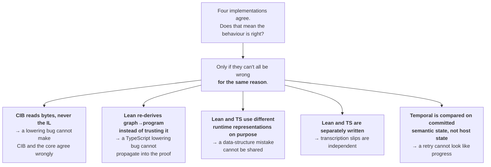

# Evidence, lanes, and mutations

Theorems are half the assurance system. This is the other half — and it exists because of the limit named at the end of [01](01-theorem-techniques.md#113-what-theorems-deliberately-do-not-do): *if the reading of BPMN is wrong, Lean will faithfully prove properties of the wrong reading.*

## What "evidence" means here, and why it is not just another test

In this project, **evidence** is a specific, disciplined artefact: *a recorded observation of what an independent system actually did, bound to the exact content that produced it.* That is materially different from a test.

| | A test | Evidence |
|---|---|---|
| Written by | you | recorded from a foreign system |
| Asserts | that your code matches your expectation | what a different implementation actually did |
| Fails when | your code changes | your code, the foreign system, **or the input** changes |
| Can be wrong because | your expectation was wrong | the foreign system is not authoritative |

Five mechanisms make the evidence lane trustworthy, and each closes a specific way of cheating.

### 1 · Answer-free inputs

Scenario files contain stimuli and a list of *which observations to make* — never the expected values. The real scenario for the sequential process lists two stimuli and ten observation names, and no results at all. The rule is explicit: *"Keep neutral scenario inputs physically separate from retained expected results. Target runners receive no oracle answer."*

The stimuli now carry *input* data — the sequential start installs `requestTitle`, the completion submits `decision` and an explicit null `reviewNote` — which sharpens the distinction rather than blurring it. Data a caller supplies is input; what the engine does with it is the answer, and the answer is still absent.

**Why:** if the input file carried the answer, an implementation could read it. Not paranoia — the pipeline injects an extra field into a scenario document and requires the strict Lean decoder to *reject* it, and separately requires Lean's decoded echo to equal the admitted document exactly. Two guards on the same cheat.

### 2 · Content binding

Retained evidence carries the SHA-256 of the scenario *and* of the profile that produced it:

```json
"scenario": { "id": "user-task-discovery-completion", "sha256": "…" },
"profile":  { "id": "cibseven-2.2.0-user-task-process-data-draft", "sha256": "…" }
```

**Why:** without it, editing a scenario silently invalidates every stored observation while all comparisons stay green. With it, drift is a hash mismatch.

This is also load-bearing in a second way that only became visible as the catalog grew. Lean consumes the admitted scenario file *directly*, so there is no second compiled copy to diff against; `TESTING-SPEC.md` records that *"retained CIB content binding rather than a second compiled scenario copy detects disk-content drift"* for the 18 CIB-backed cases. Which means the 10 standards-only cases have no equivalent disk-drift detector — a small, honest consequence of the same design.

### 3 · Evidence replacement is an explicit, separate operation

Regenerating stored observations happens through a dedicated command (`replace:cib-evidence`), never as part of ordinary verification. The rule is blunt: *"never refresh expected evidence merely to make a gate green."*

**Why:** the single most common way an assurance system rots is that a failing comparison gets "fixed" by re-recording the new behaviour as expected. Making replacement a deliberate, reviewable act with an audit trail removes the temptation. Replacement is also *release-grouped*, so regenerating `2.2.0` evidence cannot silently touch the `2.0.0` envelopes.

### 4 · Mutation guards — evidence that the evidence works

Every new evidence projection must come with a *deliberate seeded defect* that the comparison is required to catch. The current set is large and, more importantly, differentiated by where it is injected:

| Where the defect is injected | What its detection establishes | Examples |
|---|---|---|
| A clone of the core's canonical result (**comparator-side**) | the comparator is sensitive to that one field | omitted parallel open task, dropped live sibling, one-millisecond timer deadline shift, changed Message ID, substituted Simple Boolean route, changed Inclusive selected set, opposite Event-race winner, changed Service Task operation, changed final variable, null-to-string boundary drift, premature scope exit, retained cancelled Error sibling |
| The Workflow definition or its Event History (**host-side**) | the *durable mechanism* was actually used, not shortcut | timer-bypass, Activity-bypass, command-ID-only Update key, gateway route substitution, `selectMany` selection bypass, Message Signal payload and history substitution, direct-channel erasure, Event-race barrier and batching-premise removal, fixed-priority selection, scope bypass, Error-propagation bypass, Call early-return and identity erasure |
| Retained raw producer observations (**verifier-side**) | the raw-to-canonical **evidence projection** detects it | raw Process-status, logical-time, and Process-variable drift; raw effect-binding; raw subscription removal; sibling-retention projection; any unclaimed Message projection |

**Why:** a comparison that observes the wrong field passes forever. A mutation is a test of the test.

> **⚠ Resolved — and now doctrine.** An earlier version of this record described all of these as projection guards. Independent review found that most were applied to a clone of the TypeScript core's *own* canonical output, which proves only that the **comparator** is field-sensitive — nothing about whether the CIB projector, retained evidence, Lean, or Temporal would surface a real behavioural difference.
>
> That distinction is now a first-class rule in [TESTING-SPEC.md](../bpmn-lean-experiment/docs/TESTING-SPEC.md)'s evidence-lane table:
>
> > *"Comparator-side mutations (applied to a clone of a target's canonical result) establish that the comparator detects one claimed field distinction; verifier-side mutations (applied to retained raw producer observations) establish that the raw-to-canonical evidence projection detects it … a comparator-side mutation establishes nothing about the evidence projection."*
>
> The vocabulary did its job. The mutations added by the six capsules since then lean markedly toward the **host-side** row — Event-race barrier removal and SDK-batching-premise removal are the sharpest examples, because both attack a *premise* rather than a value. That is a stronger class than the comparator clones that triggered the finding.

### 5 · Fidelity labels — how strongly does this observation actually support the claim?

This is the subtlest mechanism and the most unusual. Every CIB observation carries one of four labels:

| Label | Meaning |
|---|---|
| `engine-observed` | the engine's own API reported this |
| `adapter-derived` | computed from engine state by project code |
| `adapter-decided` | the project's adapter chose it; the engine never said it |
| `not-claimed` | no CIB claim is made about this field at all |

The timer capsule is the clearest worked case, and worth stating precisely because it is easy to over-read: the *deadline* and completed *logical time* are `adapter-derived` — the runner writes the scenario's firing time into the controlled engine clock and the projector reads that clock back — while the genuinely `engine-observed` facts are the raw job due-date delta and the pre-due/due eligibility transition. "We verified the timer against the reference engine" would quietly cover all of that, and only the last part is real corroboration.

The classification is enforced structurally rather than by prose: a schema-depth test requires **all eleven top-level fields** of `scenario.schema.json#/$defs/stateObservation` — and every nested occurrence, wait, Message subscription, timer, effect, interaction, and variable field — to be classified, so a new field cannot be added without a fidelity decision.

The sharpest instance of the same honesty: for the boundary-error capsule, CIB Seven is the *source* of the mapping rule the project adopted. The record therefore states that CIB *"supplies rather than corroborates"* it, and *"do not count CIB as independent evidence for the rule it supplies."* You cannot use a source as confirmation of itself.

> **⚠ Resolved — the unobserved-fields finding.** Independent review found six canonical fields with no raw producer observation at all: `outcome`, the `deployment` observation, per-command outcomes, `status`, `logicalTimeMs`, and `variables` — meaning roughly half of each retained CIB result was adapter assertion validated against nothing.
>
> Commit `08d8b84` closed the substantive part, adding verifier-side tests that bind status, logical time, and variables to raw state queries and bind canonical semantic instance identity to the answer-free start stimulus. `IMPLEMENTATION-MAP.md`'s CIB row now lists raw Process-instance count, engine-clock, Process-variable, timer-job, effect-job, effect-execution, and mapping-execution observations.
>
> One honest caveat survives, and the project states it itself: the verifier *"reuses the Java projector's ordering, raw-binding translation, activation, lifecycle-state, and empty-argument rules, so it checks raw-to-canonical consistency rather than independently deriving projection semantics."* `TESTING-SPEC.md` draws the consequence explicitly — *"A verifier that reuses producer projection rules remains a raw-to-canonical consistency check and does not become another independent evidence lane."*

## Evidence lanes, and the rule that makes them count

The organising concept is the **evidence lane**, defined by three things — its producer, what its passage can establish, and what it cannot — plus a fourth requirement that decides whether two lanes are genuinely two:

> **Two lanes are distinct only if their failure modes are uncorrelated.**

Two producers that share an account, an internal representation, a fixture, or a projection cannot fail apart, so they count once regardless of how many artefacts they produce. That judgement is recorded per capsule rather than inferred from how many targets agreed.

| Lane | Passage can establish | Passage cannot establish |
|---|---|---|
| Normative BPMN/profile review | Selected requirement and interpretation are explicit | Any implementation performs them |
| CIB compatibility | Pinned CIB behaves as observed under the declared profile | Universal BPMN correctness |
| Lean | The explicit Lean account executes and its stated laws hold | Correctness of CIB, parser, TypeScript, Temporal, or effects |
| TypeScript differential | The independently written core agrees on maintained inputs | Universal Lean correspondence, or that the core chose its operational account independently |
| Temporal refinement | The tested durable host preserves core-visible results and replays | Unsupported BPMN meaning |
| MIWG interchange | Structural import/reference/encoding behaviour for pinned models | Execution conformance |
| Seeded mutation | Comparator-side: the comparator detects one field distinction. Verifier-side: the raw-to-canonical projection detects it | Projection completeness |

That single correlation rule explains a surprising number of architectural choices that would otherwise look like extra work for its own sake:



Every one is a deliberate cost paid to *decorrelate* failures. Sharing the IL with CIB would be less code. Letting Lean trust the emitted program would be less code. Sharing a runtime representation would be much less code. All three are refused, and the reason is always the same: convenience that correlates two lanes silently converts them into one.

### But the decorrelation is narrower than that diagram suggests

**And it narrowed further in this revision.** Independent review traced the actual data flow, and `IMPLEMENTATION-MAP.md` now carries the qualifier in its **Current claim** section — the first thing a reader sees:

> *"the TypeScript compiler in `@bpmn-lean/bpmn-source` is the sole producer of the checked BPMN graph and Semantic Process program that Lean, the TypeScript core, and the Temporal adapter all consume. Lean independently recomputes graph-to-program lowering and rejects inequality before evaluation; it has no BPMN XML parser, so a defect in XML-to-checked-graph translation propagates identically into those three targets."*

So arrow **D2** covers only half the translation. Arrow **D1** is real and is what saves it — but only for facts CIB's API exposes. Review's conclusion was that the number of genuinely uncorrelated lanes is **two** — normative/profile review, and pinned-CIB host observation at its recorded fidelity — not four.

**And the same paragraph now adds a clause that matters more than the original finding.** It continues: *"Pinned CIB Seven can separate that defect only for a declared CIB profile whose exact source it executes; the standards-only Simple Boolean profile has no such source-level oracle and states that limitation explicitly."*

Read that against the catalog. Of 28 registered pipeline cases, **18 have a CIB lane and 10 do not**:

| Case family | CIB lane | Why absent |
|---|---|---|
| sequential User Task (3 cases), parallel fork/join (3), timer, Service Task, CreateDocument, boundary Error, Receive Task, embedded Sub-Process (4), Sub-Process Error (3) | present, 18 cases | a classified relationship (`CIB-AGR-*`, `CIB-OP-*`, `CIB-EXT-*`) was selected |
| Timer/User Task composition | absent | CIB does not establish the composition or the structural-admission rule |
| Simple Boolean Exclusive Gateway | absent | CIB cannot execute the project's language |
| Intermediate Catch Message | absent | no Message compatibility claim was selected |
| Inclusive Gateway (4 cases) | absent | no Inclusive relationship or expression profile was selected |
| Event-Based Gateway (2 cases) | absent | no Event-Based Gateway relationship was selected |
| Call Activity | absent | no Call Activity relationship was selected |

For those ten, **one of the two genuinely uncorrelated lanes does not run at all.** What remains is normative/profile review plus three targets that share one XML producer. That is not a defect — declining to invent a CIB relationship just to have an oracle is the correct call, and each profile says so in writing. But it is a *material change in the shape of the residual* since the last revision, and it is the reason the newest capsules lean so much harder on non-laws, exact closure bounds, and host-side bypass mutations: those are the guards that still work when the oracle is absent.

That the qualifier sits in paragraph two of the implementation map, rather than in one capsule's footnote, remains the substantive repair.

## The residual, stated plainly

Even with all of that, [PROJECT-DESIGN.md](../bpmn-lean-experiment/docs/PROJECT-DESIGN.md) distinguishes **two kinds of independence**, and the project claims only one:

| | Achieved? |
|---|---|
| Independent **transcription** — two implementations written separately from the same reviewed account | **yes** |
| Independent **choice of account** — two parties independently deciding what BPMN means | **no, and not claimed** |

So Lean and TypeScript can agree perfectly and both be wrong about BPMN. That is why the oracle stays on exact bytes, why normative clause references sit in every scenario's provenance block, and why disagreements with CIB get *classified* — as agreement, operational detail, interpretation, extension, configuration, limitation, or candidate deviation — rather than voted on. Majority voting between sources is explicitly forbidden.

`IMPLEMENTATION-MAP.md` lists **"uncorrelated Lean and TypeScript account failure"** in the differential pipeline's *absent* column. Independent review singled that sentence out as the most accurate in the documentation set. [06](06-typescript-core-correctness.md) unpacks what it means for the semantic core specifically.

## Separating witnesses — and the trap of a witness that separates nothing

A **separating witness** is an input on which two candidate accounts give *different publicly observable results*. It is the concrete artefact behind every semantic decision.

The trap, which the review checklist names: *"confirm every claimed separating witness differs at the approved public observation boundary; a hidden microstep, storage order, or evaluator choice is not a discriminator unless the contract exposes it."*

If two accounts differ only in something nobody can see through the canonical observation, you have not found a discriminator — you have found an implementation detail. The project hit this exactly: a flow-only branch permutation in the parallel topology turned out to be *observationally symmetric* at the public boundary, so it was **discarded as a witness** and replaced by a stronger mutation that also reads task metadata through the wrongly paired flow, which does change public output.

A witness that does not separate is worse than no witness, because it produces false confidence.

The newest capsules show the mature version of this discipline, and it is genuinely hard to do. Several of them introduce *hidden* runtime state — the Inclusive Gateway's owner-scoped selected-branch record, the Event-Based Gateway's race and activation counters, Call Activity's occurrence-owned call record. None of that is publicly observable, so each capsule pairs a **hidden-state non-projection** theorem (this state never reaches the canonical observation) with a discriminator that works *through* the public surface anyway — a dropped true branch, a retained loser, an erased called identity. Proving that hidden state exists *and* that its effects are visible is two obligations, not one.

## Three live examples of the discipline working

**A disagreement kept visible.** A schema-valid BPMN model with a duplicate same-flow Parallel Gateway produced divergent behaviour in CIB Seven. It was not resolved by voting, not silently adopted, and not quietly dropped. It was classified as candidate deviation **`CIB-DEV-0001`**, given a stable identifier, and left prominently visible — and the project deliberately declined to expand its CIB profile to claim parallel compatibility.

**An available agreement declined.** For the *deferred* JUEL condition architecture, the project's evaluator and CIB Seven would share the same JUEL implementation. Rather than count that as two agreeing implementations, the decision states that they would form *"one correlated expression-truth account"*. Declining to count an available agreement is the harder half of the correlation rule.

**A lane declared empty rather than manufactured.** When conditional routing actually shipped, it used a project-owned language CIB cannot execute — so instead of stretching a CIB relationship to cover it, the profile declares BPMN normative authority and **no CIB execution target**. The gateway's retained CIB probes were reclassified as evidence for the deferred overlay, not repurposed as corroboration for the capsule that shipped. Five other profiles now do the same. An empty lane, labelled empty, is worth more than a lane filled with something that does not fit.
