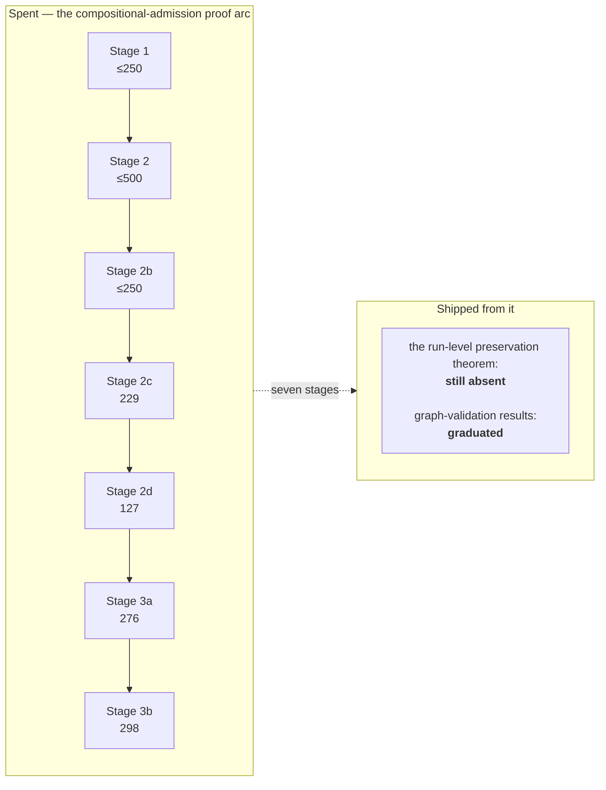

# Is the Lean work goal-driven?

> *Question: is the project using Lean goal-driven — to capture BPMN/CIB semantics and implement a TypeScript adapter to run BPMN 2 / CIB processes in Temporal?*

**Short answer: yes, with one part deliberately reined in.** Lean's executable role is straightforwardly on-goal. Lean's *proof* role once ran ahead of delivery, the project's own instrumentation is what showed it, and the owner superseded the staged proof programme that was consuming the effort — replacing it with a targeted per-capsule gate.

This document records the diagnosis, the resolution, and **how the replacement gate performs across the roughly twenty capsules that have closed under it.**

## The executable role is doing real product work

Lean is one of three or four targets (depending on whether the case has a CIB lane) in the **51-case** differential pipeline. It strictly decodes the same answer-free scenarios, echoes what it decoded so the pipeline can prove no answer was smuggled in, independently recomputes canonical lowering and rejects inequality before evaluating, and independently normalises the timer literal `PT1S` to `1000` milliseconds. That is component 2 of the four stated components, and it has caught real defects in the shipped path:

| Defect | How Lean surfaced it |
|---|---|
| Mixed-wait projection order | TypeScript sorted active waits by element ID; the parallel capsule's `PAR-PROJECT-01` rule groups by semantic *kind* first. Fixed in TypeScript — and then, when the Message kind arrived, the reopen trigger fired and Lean's own within-kind order was fixed too ([01 §1.10](01-theorem-techniques.md#110-refusing-to-let-collection-order-become-semantics)) |
| Disconnected operation island | Standalone `programWellFormed` accepted a User Task island whose control places had no producer or consumer path from initiation |
| Over-permissive graph validator | `checkedWellFormed` accepted empty, flowless, and dangling-reference graphs because of maximally-extending `fun` bodies in the validator |
| Unsound cycle rejection | A negative bounded search was treated as proof of acyclicity. Replaced by a saturation certificate, which **graduated into production** `programWellFormed` ([01 §1.6](01-theorem-techniques.md#16-certificates-instead-of-bounded-search)) |

These are cross-implementation checks catching transcription errors a single implementation cannot catch. Straightforwardly on-goal, and not the subject of this question.

## Where the question bites

Compare what the proof lane *cost* with what *shipped* from it. A frozen seven-stage compositional-admission arc sits in the tree today, and it is the clearest available measurement of that ratio.

Hard numbers, re-measured at `0adda45`:

- `BpmnSemantics/Experiments/` holds **2,984 nonblank Lean lines**, of which roughly 465 belong to an unrelated representation spike — so about **2,500 nonblank lines of checked-source proof work**. What movement there is comes from maintenance under atomic replacements, not from new stages: the freeze is holding.
- For scale: the whole `BpmnSemantics/` tree is **29,309 nonblank Lean lines**, so the frozen experiment lane is about **a tenth** of all Lean in the repository — a substantial standing cost for a result that is not adopted.
- Plain `lake build` still does not reach any of it: the library root imports no `Experiments` module. The *default verification gate* does, through explicit `lake build` / `lake exe` targets plus `scripts/verification-entrypoint.test.ts` locking both the commands and the imports.
- Measured stage deltas: 2c = 229, 2d = 127, 3a = 276, **3b = 298** (nonblank, against `362f91f`, excluding 11 byte-identical relocated lines). Stages 1, 2, and 2b have ceilings summing to 1,000 but **no auditable deltas** — Stage 2 and 2b shared an uncommitted tree, which the documentation concedes.
- Before all of that, the predecessor experiment ("C2") spent ~700 lines and ended *not adopted*, with its correspondence layer removed rather than retained.
- Stage sizes read **229 → 127 → 276 → 298**. That is not amortising downward, and each stage carried a full independent-review cycle.

The capability that motivated the arc — *stop writing a new compiler per topology* — did eventually ship, but **not from this arc.** The [profile-parameterized admission work](https://github.com/mbackschat/bpmn-lean-experiment/blob/0adda45/docs/PROFILE-PARAMETERIZED-ADMISSION-SPEC.md) removed the whole-topology execution-surface predicates in ordinary implementation work, without the preservation theorem, and an executable architecture guard now prohibits reintroducing one. That is worth sitting with: the goal the seven stages were built to unlock was reached by a different, cheaper route once the theorem stopped gating it.

### Something *did* graduate from the arc

The **graph-validation results graduated**: saturation-certified executable path completeness and declarative acyclicity are in the *implemented* column of the Lean row, and standalone `programWellFormed` checks exact producer/consumer shape, reachability, co-reachability, and certified acyclicity.

That matters for judging the arc. The stage that produced a genuine **soundness fix** to production code is the one that graduated. The stages aimed at the run-level theorem are the ones that did not. That is a signal about *which kind* of proof work pays here, not about whether proof work pays at all.

## The uncomfortable dependency ordering — and its reversal

The proposal required the preservation theorem to close **before** widened admission shipped. So the gate was being built bottom-up (graph lemmas → decomposition → frontier → eventual run-level induction) before the thing it gated existed. Stage 4 — state mapping, full correspondence, stimulus-list induction — was budgeted at 700 lines and unstarted. And the earlier C2 experiment had already demonstrated that reaching the run-level theorem is exactly where this class of effort dies.

An independent proof review of the next candidate stage added a concrete composition data point: the natural conclusion for a two-token frontier is a *permutation* statement (deliberately order-independent), and that **does not compose** with the experiment's `closeSupported` function, which resolves the parallel choice by taking the head of a list — i.e. by `source.nodes` collection order. So even after that stage, closure soundness would need an explicit semantic choice before it could begin. The remaining path was longer than the stage ledger made it look.

**On 2026-07-30 the owner superseded the programme.** From `PLAN.md`, the sentence that does the real work:

> *"The former universal preservation prerequisite is intentionally replaced by the targeted preservation gate approved below; the closure-limit and multiple-enabledness safeguards move into that gate rather than disappearing with the staged programme."*

Nothing was thrown away. Stages 1–3b remain accepted, frozen experiments in the tree and in the gate, and the archived proposal keeps the reopen conditions.

## What replaced it

The **targeted per-capsule preservation gate**. Instead of one universal theorem gating all admission widening, every capsule that widens admission or replaces lowering, runtime representation, or public observation must:

1. state the exact source-to-result claim it can invalidate;
2. retain the smallest separating lowering or representation discriminator;
3. close the smallest reusable theorem *or executable guard* that protects that claim;
4. executable-check that every newly reachable internal closure stays within `semanticProcessClosureLimit` (still 8);
5. show that every newly reachable multiple-enabled state is an approved order-invariant set, receives an explicit semantic choice, or is rejected identically by Lean and TypeScript;
6. show that every newly reachable stable `running` state is terminally complete or exposes an explicit semantic resumption surface — a User Task, timer, effect, interaction, or subscription.

And the universal theorem is not abandoned — it has a **reopen trigger**: *"A general preservation theorem becomes mandatory only when a second capsule needs the same proposition or the targeted proof cannot isolate the risk without recreating the general bridge."*

Obligation 6 deserves a note, because it is the one that reads like boilerplate and is not. The rule spells out the distinction: *"Tokens alone do not establish progress: a half-ready join beside a live wait is valid because the wait is the resumption surface, while a stable running state with tokens and no possible semantic ingress is a failed preservation check."* The TypeScript core implements exactly that as `isStableStateResumable`, with a documented comment saying *"Hidden tokens alone are not evidence of progress"* — and it additionally requires event-race and called-process associations to be *valid* rather than merely present, because "a wait exists" is insufficient once a wait can be recorded against a corrupted association.

## Did the replacement hold? Now roughly twenty capsules of evidence

The residual worth testing is *does the targeted gate stay local, or do several capsules each close a slightly different version of the same proposition and pay for the general bridge in instalments?* Roughly twenty capsules — the whole M1–M6 engine programme — have closed under it, and the verdict is a split.

**The proof obligations stayed local. Emphatically, and now through a much harder set of cases.** Every capsule discharged obligation 4 with an *exact* closure figure rather than a bound inherited from elsewhere: Simple Boolean's three steps, the Inclusive four-step with bound-three exhaustion, the Event-race two-step arming with bound-one exhaustion, Call Activity's 3/3/2, cyclic control flow's automatic cut-DAG closure at no more than six operations, Terminate End's exact 5/3/2, the configured Task's 2/1 · 1/0 · 2/1 separation. Nobody needed a general closure-fuel-stability theorem, which is precisely what the superseded programme would have built first.

The gate also held on three shapes nobody had tested it against in August:

- **Cycles.** M2's cyclic-control-flow capsule removed acyclicity as a structural precondition — the exact thing the superseded arc treated as the premise its whole law set rested on — and closed instead with a general per-offered-token merge relation, a unique-offer evaluator soundness bridge, full-cycle interception by the selected cut, actual execution of every finite reviewed repeat/rework schedule, and actual-reachability active-unit bounds. That is the single strongest datapoint that the targeted gate can absorb a premise change, not only a feature addition.
- **Cancellation.** Terminate End closed reusable selected-root-retaining subtree cancellation over *every represented owner family*, with aggregate-increment and unrelated-state preservation, without a general cancellation theory.
- **Publication.** M5's E1 proved committed-transition trace and replay completeness, control positions and deltas, nonpublication for every refusal or exhaustion path, and source-compiled TypeScript parity — a genuinely new proof obligation class that the gate did not have to be widened to accommodate.

Three capsules did have to record a lane as **deliberately open**, which is the third shape the owner added on 2026-08-07 and the one that widens a proof boundary. The boundary-Timer family is where it landed, and `IMPLEMENTATION-MAP.md` states the gaps rather than smoothing them: both Sub-Process boundary-Timer victory bridges *"take hypotheses their own transitions do not establish"*, `BoundedScopeVictoryStep` is **not** wired into global `ProgramStep` soundness while `BoundedScopeArmingStep` is, and the interrupting Activity boundary Timer's quantified stale-identity law still depends on a key-uniqueness invariant `RuntimeState` does not enforce. Those are recorded absences with named reopen triggers, which is what the shape is for — and they are also the first places since the supersession where the gate's answer was "not affordable here" rather than "closed locally".

**The overall cost does not fall.** The [capsule cost ledger](https://github.com/mbackschat/bpmn-lean-experiment/blob/0adda45/docs/CAPSULE-COST-LEDGER.md) holds forty measured increments, and the engine capsules sit in a stubborn band:

| Capsule | Code churn | Doc churn |
|---|---:|---:|
| Inclusive Gateway | `+3123/-151` | `+115/-45` |
| Sub-Process Error propagation | `+3370/-398` | `+218/-133` |
| Non-interrupting boundary Timer | `+3578/-713` | `+313/-20` |
| Message Start Event | `+3584/-138` | `+165/-97` |
| Terminate End Event | `+3689/-199` | `+111/-76` |
| Timer Start Event | `+3711/-141` | `+149/-98` |
| Interrupting Sub-Process boundary Timer | `+3970/-1002` | `+428/-62` |
| Event-Based Gateway | `+4606/-63` | `+140/-60` |
| Interrupting Activity boundary Timer | `+5521/-838` | `+363/-31` |
| Bounded Call Activity | `+5801/-392` | `+160/-71` |
| Resumption-bounded cyclic control flow | `+5795/-283` | `+354/-41` |
| Service Task incident and retry | `+6038/-966` | `+185/-118` |
| Service Task incident-gated cancellation | `+6438/-354` | `+122/-113` |

**But one thing did change, and it is the first good news on this axis in three revisions.** Within a *family*, the second and third members are measurably cheaper than the first, and the ledger attributes the fall to the mechanism rather than to a smaller feature. The interrupting Sub-Process boundary Timer came in at `+3970` against its Activity sibling's `+5521` because it *"added no new host scheduler, no new direct-VM harness, and no new durable timer ownership, instead parameterizing the sibling's scheduler over a host-family descriptor"* — and removals rose because that generalisation *deleted the copied module rather than leaving it beside a third*. The non-interrupting one then fell again to `+3578`, as "a descriptor beside two existing ones". Message Start fell 38% against cyclic control flow; the configured Task fell 20% against the Service Task effect it reuses.

So the curve is not flat everywhere. **It is flat across families and falling within them.** That is exactly the shape the "vertical-slice limit" rule predicts, and the first time the ledger has enough rows to show it.

**The honest reading is therefore a split verdict with a sharper diagnosis.** The superseded programme's complaint was that *proof* effort was not amortising; the targeted gate fixed that, and roughly twenty capsules later the obligations are still local. What it did not fix, and was never designed to fix, is that opening a *new* seam costs full price. [04](04-feasibility.md) is where that matters, and [18](18-the-bpm-platform.md#the-size-of-it-and-the-cost) is where the same measurement produces a very different answer for product work.

## This was never uncontrolled drift

The governance was visibly working the whole time, and that deserves equal weight:

- The original bundled Stage 3 was **rejected** as "unaffordable and dependency-inverted".
- The C2 effort stop is recorded as *"the approved outcome doing its job, not a failed experiment"*.
- Vacuous theorems were **deleted**, as catalogued in [01 §1.14](01-theorem-techniques.md#114-the-anti-vacuity-discipline).
- Every sub-stage needed a fresh owner decision; later stages were explicitly unauthorised rather than drifting forward.
- The "permanent proof boundary" alternative — keep artifact-equality and structural theorems, explicitly *decline* run-level preservation — was considered and owner-rejected *at the time*, then revisited when seven stages of cost data existed.
- Nothing was thrown away at supersession.

## What the reflection checklist demands

`CLAUDE.md`'s capsule-reflection checklist asks the project to compare each capsule's commit-bounded churn *"with the previous comparable capsule"*, and — the operative half — to **"remove one identified process weight before starting the next capsule when the measured cost did not fall."**

Stage sizes 229 → 127 → 276 → 298 were the first firing of that rule, and the removed weight was the universal-theorem prerequisite itself. The ledger records it firing repeatedly since, and **the removals are specific and executable rather than gestures**:

| Capsule whose cost rose | Weight removed before the next one |
|---|---|
| Interrupting Activity boundary Timer | the duplicated host readiness-and-schedulability shape copied from `event-race-readiness-scheduler.ts`, which had produced a lost-command defect whose symptom pointed elsewhere; one shared owner replaced the copy |
| Interrupting Sub-Process boundary Timer | **the per-capsule diary `PLAN.md`'s resume point had become** — a section every capsule paid to append to and nobody pruned |
| Preserve-only admission | installing a document-wide admission rule inside each profile source reader; the rule now runs once above the reader dispatch, with a case per dispatch path |
| Resumption-bounded cyclic control flow | *no removal was possible*, and the row says so: deleting any of its mechanisms *"would weaken the reviewed claim rather than simplify its delivery"* |

That last row is what makes the rule credible. A reflection rule that always produces a removal produces theatre. And the rule is now double-entry: the [process assessment ledger](https://github.com/mbackschat/bpmn-lean-experiment/blob/0adda45/docs/PROCESS-ASSESSMENT-LEDGER.md) records the *escaped failure* that motivated each removal, with an instance count and an escalation rule of its own. [19](19-process-self-measurement.md) is about that instrument.

Meanwhile the review regime is still cost, arriving where cost is already high — and this window produced the first hard number attached to it. A correction-audit loop ran three rounds with nothing terminating it, at *"roughly 640,000 reviewer tokens on one planning document"*, and **the owner stopped it rather than any rule.** The bound is now explicit at two audits per stage. That is a real reduction bought by a real overrun.

## The residual question, restated

The old residual — *does the targeted gate stay local?* — is answered **yes**, now with roughly twenty capsules of evidence, no reopen-trigger firing, and three capsules that recorded a deliberately-open lane instead of quietly weakening a claim.

The live residual is different and larger: **the gate made proofs affordable and did nothing about opening new seams.** Within a family, cost now demonstrably falls — the boundary-Timer trio went `+5521` → `+3970` → `+3578`, each fall attributed to a named reuse and a deleted copy. Across families it does not. If a *new* seam costs three to six thousand lines and roughly forty mechanism families remain, the constraint is the seam count, not the proof theory.

The two candidate levers are unchanged, and only one of them moved. Reuse of an existing seam is now project policy under the "vertical-slice limit" rule and is measurably working. Generalising one mechanism from a literal to a family has **still not been attempted**, and three more `PT1S`-pinned capsules landed on top of the one that was supposed to measure it — see [11 §2](11-open-questions.md#2--can-one-mechanism-be-generalised-from-a-literal-to-a-family).
