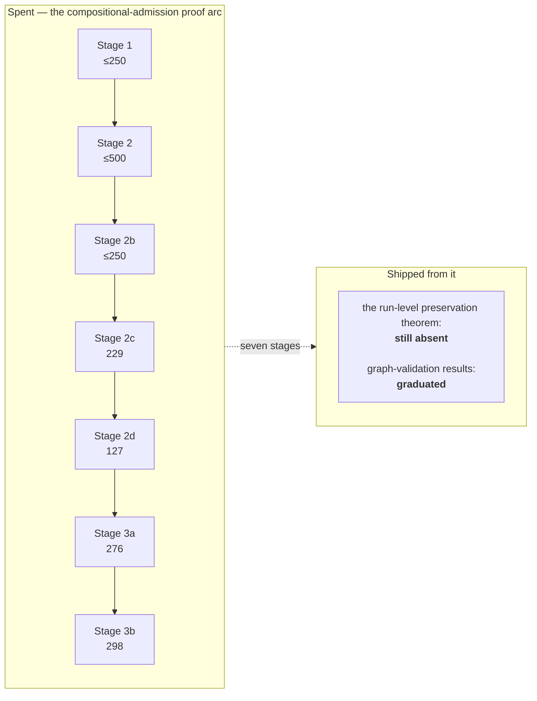

# Is the Lean work goal-driven?

> *Question: is the project using Lean goal-driven — to capture BPMN/CIB semantics and implement a TypeScript adapter to run BPMN 2 / CIB processes in Temporal?*

**Short answer: yes — and the part that had drifted was corrected by the owner on 2026-07-30.** Lean's executable role was never in question. Lean's *proof* role had become goal-distant in delivery, the project's own instrumentation is what showed it, and the staged proof programme that consumed the effort was **superseded**.

This document records the diagnosis, the resolution, and — new in this revision — **how the replacement gate actually performed across the six capsules that have since used it.** That third part is the only one that was still speculative last time.

## The executable role is doing real product work

Lean is one of three or four targets (depending on whether the case has a CIB lane) in the **28-case** differential pipeline. It strictly decodes the same answer-free scenarios, echoes what it decoded so the pipeline can prove no answer was smuggled in, independently recomputes canonical lowering and rejects inequality before evaluating, and independently normalises the timer literal `PT1S` to `1000` milliseconds. That is component 2 of the four stated components, and it has caught real defects in the shipped path:

| Defect | How Lean surfaced it |
|---|---|
| Mixed-wait projection order | TypeScript sorted active waits by element ID; the parallel capsule's `PAR-PROJECT-01` rule groups by semantic *kind* first. Fixed in TypeScript — and then, when the Message kind arrived, the reopen trigger fired and Lean's own within-kind order was fixed too ([01 §1.10](01-theorem-techniques.md#110-refusing-to-let-collection-order-become-semantics)) |
| Disconnected operation island | Standalone `programWellFormed` accepted a User Task island whose control places had no producer or consumer path from initiation |
| Over-permissive graph validator | `checkedWellFormed` accepted empty, flowless, and dangling-reference graphs because of maximally-extending `fun` bodies in the validator |
| Unsound cycle rejection | A negative bounded search was treated as proof of acyclicity. Replaced by a saturation certificate, which **graduated into production** `programWellFormed` ([01 §1.6](01-theorem-techniques.md#16-certificates-instead-of-bounded-search)) |

These are cross-implementation checks catching transcription errors a single implementation cannot catch. Straightforwardly on-goal, and not the subject of this question.

## Where the question bit

Compare what was *spent* on the proof lane with what *shipped* from it.

Hard numbers, re-measured at `5b65954`:

- `BpmnSemantics/Experiments/` holds **2,865 nonblank Lean lines**, of which 465 belong to an unrelated representation spike — so about **2,400 nonblank lines of checked-source proof work**. (It grew by ~220 lines since the last revision purely from maintenance under the atomic scope and channel replacements, not from new stages.)
- For scale: the maintained tree is 14,444 nonblank Lean lines total, so the frozen experiment lane is roughly a sixth of all Lean in the repository.
- Plain `lake build` still does not reach any of it: the library root imports no `Experiments` module. The *default verification gate* does, through explicit `lake build` / `lake exe` targets plus `scripts/verification-entrypoint.test.ts` locking both the commands and the imports.
- Measured stage deltas: 2c = 229, 2d = 127, 3a = 276, **3b = 298** (nonblank, against `362f91f`, excluding 11 byte-identical relocated lines). Stages 1, 2, and 2b have ceilings summing to 1,000 but **no auditable deltas** — Stage 2 and 2b shared an uncommitted tree, which the documentation concedes.
- Before all of that, the predecessor experiment ("C2") spent ~700 lines and ended *not adopted*, with its correspondence layer removed rather than retained.
- Stage sizes read **229 → 127 → 276 → 298**. That is not amortising downward, and each stage carried a full independent-review cycle.

The capability that motivated the arc — *stop writing a new compiler per topology* — did eventually ship, but **not from this arc.** The [profile-parameterized admission work](../bpmn-lean-experiment/docs/PROFILE-PARAMETERIZED-ADMISSION-SPEC.md) removed the whole-topology execution-surface predicates in ordinary implementation work, without the preservation theorem, and an executable architecture guard now prohibits reintroducing one. That is worth sitting with: the goal the seven stages were built to unlock was reached by a different, cheaper route once the theorem stopped gating it.

### Something *did* graduate from the arc

The **graph-validation results graduated**: saturation-certified executable path completeness and declarative acyclicity are in the *implemented* column of the Lean row, and standalone `programWellFormed` checks exact producer/consumer shape, reachability, co-reachability, and certified acyclicity.

That matters for judging the arc. The stage that produced a genuine **soundness fix** to production code is the one that graduated. The stages aimed at the run-level theorem are the ones that did not. That is a signal about *which kind* of proof work pays here, not about whether proof work pays at all.

## The uncomfortable dependency ordering — and its reversal

The proposal required the preservation theorem to close **before** widened admission shipped. So the gate was being built bottom-up (graph lemmas → decomposition → frontier → eventual run-level induction) before the thing it gated existed. Stage 4 — state mapping, full correspondence, stimulus-list induction — was budgeted at 700 lines and unstarted. And the earlier C2 experiment had already demonstrated that reaching the run-level theorem is exactly where this class of effort dies.

An independent proof review of the next candidate stage added a concrete composition data point: the natural conclusion for a two-token frontier is a *permutation* statement (deliberately order-independent), and that **does not compose** with the experiment's `closeSupported` function, which resolves the parallel choice by taking the head of a list — i.e. by `source.nodes` collection order. So even after that stage, closure soundness would need an explicit semantic choice before it could begin. The remaining path was longer than the stage ledger made it look.

**On 2026-07-30 the owner superseded the programme.** From `PLAN.md`, the sentence that does the real work:

> *"The former universal preservation prerequisite is intentionally replaced by the targeted preservation gate approved below; the closure-limit and multiple-enabledness safeguards move into that gate rather than disappearing with the staged programme."*

Nothing was thrown away. Stages 1–3b remain accepted, frozen experiments in the tree and in the gate, and the archived proposal keeps the reopen conditions.

## What replaced it

The **targeted per-capsule preservation gate**. Instead of one universal theorem gating all admission widening, every capsule that widens admission or replaces lowering, runtime representation, or public observation must:

1. state the exact source-to-result claim it can invalidate;
2. retain the smallest separating lowering or representation discriminator;
3. close the smallest reusable theorem *or executable guard* that protects that claim;
4. executable-check that every newly reachable internal closure stays within `semanticProcessClosureLimit` (still 8);
5. show that every newly reachable multiple-enabled state is an approved order-invariant set, receives an explicit semantic choice, or is rejected identically by Lean and TypeScript;
6. show that every newly reachable stable `running` state is terminally complete or exposes an explicit semantic resumption surface — a User Task, timer, effect, interaction, or subscription.

And the universal theorem is not abandoned — it has a **reopen trigger**: *"A general preservation theorem becomes mandatory only when a second capsule needs the same proposition or the targeted proof cannot isolate the risk without recreating the general bridge."*

Obligation 6 deserves a note, because it is the one that reads like boilerplate and is not. The rule spells out the distinction: *"Tokens alone do not establish progress: a half-ready join beside a live wait is valid because the wait is the resumption surface, while a stable running state with tokens and no possible semantic ingress is a failed preservation check."* The TypeScript core implements exactly that as `isStableStateResumable`, with a documented comment saying *"Hidden tokens alone are not evidence of progress"* — and it now also requires event-race and called-process associations to be *valid*, not merely present, because the newer capsules made "a wait exists" insufficient.

## Did the replacement hold? Six capsules of evidence

Last revision, this was the open residual: *does the targeted gate stay local, or do three capsules each close a slightly different version of the same proposition and pay for the general bridge in instalments?* Six capsules have since closed under the gate — Simple Boolean Exclusive Gateway, Inclusive Gateway, Event-Based Gateway, Call Activity, Receive Task, and the two Sub-Process capsules. The verdict is genuinely mixed, and the two halves point in opposite directions.

**The proof obligations stayed local. Emphatically.** Every capsule discharged obligation 4 with an *exact* closure figure rather than a bound inherited from elsewhere — the Simple Boolean three-step closure, the Inclusive four-step closure with bound-three exhaustion, the Event-race two-step arming with bound-one exhaustion, Call Activity's 3/3/2. Nobody needed a general closure-fuel-stability theorem, which is precisely what the superseded programme would have built first. Obligation 5 was discharged case by case too: the Inclusive Gateway introduced the first *data-dependent* multiple-enabled state, and rather than reach for a commutation law it closed a **data-independent activation-order equality** for that exact shape. The reopen trigger did not fire, and no capsule complained that it should have.

**The overall cost did not fall. It rose.** The commit-bounded [capsule cost ledger](../bpmn-lean-experiment/docs/CAPSULE-COST-LEDGER.md) — itself created in this window, which is the right response to the previous revision's complaint that costs were unmeasurable — records:

| Capsule | Code churn | Doc churn |
|---|---:|---:|
| Ordinary embedded Sub-Process completion | `+5266/-1698` | `+283/-158` |
| Sub-Process Error propagation | `+3370/-398` | `+218/-133` |
| Message-addressed Receive Task | `+3805/-788` | `+504/-191` |
| Inclusive Gateway | `+3123/-151` | `+115/-45` |
| Event-Based Gateway | `+4606/-63` | `+140/-60` |
| Bounded Call Activity | `+5801/-392` | `+160/-71` |

The last row is the largest code figure in the ledger, above even the Sub-Process foundation that introduced definition scopes from nothing. The ledger's own comparison note is careful about it — the contiguous range absorbs one unrelated review-process commit, so the figure is *"a conservative upper bound for Call Activity rather than a pure feature attribution; no subtraction is used to make the comparison look cheaper."* That refusal to flatter the number is exactly right, and it does not change the direction.

**So the honest reading is a split verdict.** The superseded programme's diagnosis was that *proof* effort was not amortising. The targeted gate fixed that: proof obligations are now local, proportional, and discharged without general bridges. What it did not fix — and was never designed to fix — is that each new BPMN mechanism still costs three to six thousand lines across source admission, wire schemas, Lean, the core, Temporal, differential artefacts, and six owner documents. The bottleneck moved from the proof lane to the breadth lane. [04](04-feasibility.md) is where that matters.

## This was never uncontrolled drift

The governance was visibly working the whole time, and that deserves equal weight:

- The original bundled Stage 3 was **rejected** as "unaffordable and dependency-inverted".
- The C2 effort stop is recorded as *"the approved outcome doing its job, not a failed experiment"*.
- Vacuous theorems were **deleted**, as catalogued in [01 §1.14](01-theorem-techniques.md#114-the-anti-vacuity-discipline).
- Every sub-stage needed a fresh owner decision; later stages were explicitly unauthorised rather than drifting forward.
- The "permanent proof boundary" alternative — keep artifact-equality and structural theorems, explicitly *decline* run-level preservation — was considered and owner-rejected *at the time*, then revisited when seven stages of cost data existed.
- Nothing was thrown away at supersession.

## What the reflection checklist predicted, and what it now demands

`CLAUDE.md`'s capsule-reflection checklist asks the project to compare each capsule's commit-bounded churn *"with the previous comparable capsule"*, and — the operative half — to **"remove one identified process weight before starting the next capsule when the measured cost did not fall."**

Stage sizes 229 → 127 → 276 → 298 were the first firing of that rule; the removed weight was the universal-theorem prerequisite itself. The ledger shows the rule being honoured a second time at a smaller scale: the Receive Task closure *"removes one repeated process weight by sharing Message Temporal support, server, and Workflow bundle"*, and the Event-Based Gateway lane reused it. Those are real removals.

But the checklist's condition is now being met repeatedly and the removals are not keeping pace. Between the Inclusive Gateway (`+3123`) and Call Activity (`+5801`) the measured cost roughly doubled, and the weight removed in between was a shared test bundle. Meanwhile a *new* process weight arrived in the same window: the formalised review regime — cold proposal review, conditional semantic-checkpoint review, closure review, plus warm correction audits, each with a committed immutable target and a receipt validated as a `HEAD` ancestor by an executable guard. That regime is unambiguously good for correctness; the Call Activity closure review caught a genuine missing production witness and a wrong history count. It is also, unambiguously, cost. The project has partially priced it in — stage-specific review focus, static findings before CPU-heavy gates, target-bound neutral review packets, and one combined checkpoint/closure review for genuinely single-lane closures — which is the checklist working. Whether that is enough is the open question [11](11-open-questions.md) now carries.

## The residual question, restated

The old residual — *does the targeted gate stay local?* — is answered **yes**, with six capsules of evidence and no reopen-trigger firing.

The new residual is different and larger: **the gate made proofs affordable and did nothing about breadth.** If a mechanism costs 3,000–5,800 lines and roughly forty remain, the cost curve is the constraint, not the proof theory. The two candidate levers are visible but unproven: reuse of an existing seam (which demonstrably worked for Receive Task, and is now project policy under the "vertical-slice limit" rule), and generalising one mechanism from a literal to a family (which has still not been attempted — see [11 §2](11-open-questions.md#2--can-one-mechanism-be-generalised-from-a-literal-to-a-family--unchanged)).
