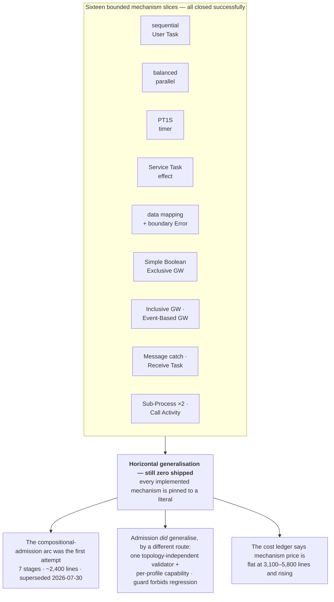

# Is the goal feasible?

> *Question: do you see the goal as feasible? It's still a long way, right?*

Yes — a long way. But the distance is very unevenly distributed, and that is the useful part of the answer. The stated goal is really three goals with different odds.

**What changed since the last revision:** goal 1 got materially stronger, goal 2 is unchanged in substance but was described wrongly, and goal 3 now has *measured* cost data instead of a worry. That third change is the important one, and it is not encouraging.

## Goal 1 — Temporal hosting of BPMN: feasible, largely demonstrated

This was the genuinely novel engineering risk and it is substantially retired. The previous revision already listed the core seam; four days of capsules widened it considerably:

- one semantic-lifetime Workflow per process instance, hosting **every** admitted model as data — no generated Workflow per diagram;
- durable timers whose firing is derived **only** from committed semantic state, never from the fact that a Temporal timer went off;
- external effects as Temporal Activities, with host retries kept strictly distinct from engine-visible retries;
- content-bound command identity, so a duplicate command is recognised as the same command and a *different* command reusing an ID is rejected rather than aliased;
- **passive Signal ingress** for Message delivery, with an ordered durable receipt ledger and malformed-versus-conflicting-versus-semantically-refused all separately classified;
- **a cancellable durable Timer racing a Message**, with atomic core-owned winner selection, complete loser withdrawal, and a typed *fail-closed* result when the host cannot order two same-activation readiness signals;
- **one level of embedded Sub-Process, and a called Process, hosted inside the same Workflow** — no Child Workflow, no cancellation event, with the histories asserted to contain zero of either;
- **a separate pre-start host-capability check** that returns typed `rejected` before Workflow creation when the program's reachable wait set exceeds what the adapter can schedule;
- Worker replacement mid-process in every one of those directions, replay, and cleanup all evidenced — 30 histories replayed and 56 isolated executions per full pipeline run;
- and a **runnable product command** that points all of this at a caller-owned Temporal service, with the BPMN Worker owning no server or port lifecycle at all.

The project's own "vertical-slice limit" rule exists *because* this seam is considered proven — new features are told to reuse it rather than re-evidence it, and the ledger shows that working. This is the strongest part of the project, and [07](07-temporal-adapter.md) walks through the fourteen problems it had to solve to get here.

**The one place the durability story is genuinely incomplete** is worth naming rather than buried: the adapter admits *one* host-driven wait at a time. A token split combined with a timer or effect is rejected pre-start as `concurrentHostDrivenWaits`, and only one exact Message/`PT1S` managed race is admitted. That is an adapter limitation, correctly typed as an adapter limitation rather than BPMN meaning — but a general multi-wait scheduler is unbuilt, and several remaining BPMN mechanisms will need one.

## Goal 2 — replacing A12 Workflows: feasible, not close, but estimable

The denominator is defined, which is more than most migration projects manage: 62 physical BPMN files, 50 distinct exact-byte models, 7 production delegates, plus a façade and blueprint surface.

| Measure | Current |
|---|---:|
| Models admitted unchanged at the static source boundary | **1 of 50** |
| Models executed end-to-end through an adoption adapter | **0 of 50** |
| Adoption adapter package | none |
| Java delegate bridge | none |

None of those numbers moved in four days, which is expected: six BPMN capsules closed and none of them was an A12 capsule. That is the layering working as designed.

> **⚠ Correction to the previous revision.** It presented the condition-expression census as coverage the *first shipped* expression capsule achieves — "the first selected value domain therefore covers 9 of 16 occurrences, 5 of 11 exact strings, and 4 of 8 condition-bearing models." **That attribution was wrong.** Those figures describe the *deferred* read-only JUEL context, not the language that shipped.
>
> The A12 ledger is explicit: *"None of the 16 retained A12 JUEL condition occurrences uses that language URI, so this standards slice claims zero unchanged A12 expression or model adoption."* The implemented Simple Boolean language covers **0 of 16 occurrences, 0 of 11 strings, and 0 of 8 models**. The JUEL figures remain on the books for the architecture that would achieve them, which is approved and unadopted.

The census itself is unchanged and is still a good example of how this project measures breadth. Across the 50 distinct models, 8 contain 16 `conditionExpression` occurrences comprising 11 distinct exact strings, driving 10 divergent Exclusive Gateway decisions:

| Condition class | Occurrences | Consequence |
|---|---:|---|
| Boolean literal | 1 | no variable value required |
| Root variable compared with null | 8 | needs complete Process-scope presence/null context over a `string \| null` domain |
| Nested truth test, string comparison, inequality, Boolean comparison | 7 | needs nested typed data |

Two structural facts from the ledger sharpen the adoption picture beyond expressions. All 38 A12 Service Tasks use `camunda:delegateExpression` and **omit** the standard BPMN `implementation` attribute, so the current capsule's required URN is *"correctly classified as a probe-fixture profile choice, not an A12 migration rule"* — a target profile must infer the protocol from the A12 profile without rewriting source. And 23 of those 38 have neither async flag, meaning CIB executes delegate invocation, Process advancement, variable writes, and rollback *in one engine transaction*, where a Temporal Activity introduces a durable external boundary. The ledger classifies that as *"a material migration classification per handler, not a source flag that may be silently added or an adapter detail hidden by canonical success agreement."* That is the kind of thing migration projects usually discover in production.

What stands between is mostly **breadth** — general expressions, general data mappings, the delegate bridge, the façade adapter, plus whatever BPMN mechanisms those 50 models actually use. Breadth is estimable. This is a long grind, not a research problem.

## Goal 3 — OMG Process Execution Conformance: feasible in principle, and the arithmetic just got worse

Not because any single piece is impossible. Because of the cost per mechanism, which is now measured rather than feared.

**What is implemented today**, against 13 identified reusable mechanism families:

| Mechanism | Bounded how? |
|---|---|
| Sequential User Task lifecycle and refusal | — |
| Per-incoming-flow parallel synchronisation | exactly two balanced branches |
| Process-start and task-completion data | closed `string`-or-`null` Process bindings |
| Intermediate Catch Timer | the literal `PT1S` only |
| Timer/User Task composition | one finite acyclic linear witness |
| Intermediate Catch Message subscription | one operation-addressed, payload-free catch |
| Receive Task | one direct-addressed, payload-free Message |
| Service Task external effect | one protocol/operation binding, success-only |
| Input/output data mapping | `string`-or-`null` values only |
| Attached interrupting Error route | one exact error code |
| Exclusive Gateway conditional routing | two conditional flows + one default, five Boolean forms, `string \| null` context |
| Inclusive Gateway split/join | one structured two-condition-plus-default region |
| Event-Based Gateway race | one exact operation-addressed Message versus `PT1S` Timer |
| Call Activity | one in-document called Process, empty data, normal return only |
| Embedded Sub-Process completion | one level, ordinary completion |
| Sub-Process Error propagation | one direct-parent exact-code handler |
| Runtime variable scoping | one Process scope plus effect-occurrence-owned Activity-local scopes |

That table grew from seven rows to seventeen in four days, which is real progress. **And every single row is still a single bounded instance, not a general mechanism.** That remains the crux, and it is now quantified.

### The cost curve, finally measured

The previous revision's central worry was that *"the cost never falls — you would pay full capsule price for each of roughly forty remaining mechanisms."* That was a prediction. The [capsule cost ledger](../bpmn-lean-experiment/docs/CAPSULE-COST-LEDGER.md), created in this window, turns it into a measurement:

```text
code churn (nonblank additions) per closed increment, in ledger order

Process-start data           +289   ▌
User Task completion data    +651   ▎▌
Runnable MVP                 +950   ▊▌
Lean comment discipline    +1,607   ▌▌▌
Profile-param. admission   +1,760   ▌▌▌▌
Inclusive Gateway          +3,123   ▌▌▌▌▌▌▌
Intermediate Catch Message +3,181   ▌▌▌▌▌▌▌
Sub-Process Error prop.    +3,370   ▌▌▌▌▌▌▌▌
Receive Task               +3,805   ▌▌▌▌▌▌▌▌▊
Event-Based Gateway        +4,606   ▌▌▌▌▌▌▌▌▌▌▌
Embedded Sub-Process       +5,266   ▌▌▌▌▌▌▌▌▌▌▌▌
Call Activity              +5,801   ▌▌▌▌▌▌▌▌▌▌▌▌▌
```

Read it in the order the work happened and the shape is unmistakable: the small increments are the *data* and *tooling* ones, and every genuinely new BPMN mechanism sits between 3,100 and 5,800 lines with no downward trend. The largest figure is the most recent.

Three honest qualifications, all of which the ledger itself supplies:

- Call Activity's range absorbs one unrelated review-process commit, so it is *"a conservative upper bound … rather than a pure feature attribution."* The project explicitly refuses to subtract it to make the number look better.
- Churn is not value. The ledger says so first: it *"does not measure semantic value, proof strength, test independence, JSON evidence volume, generated output, or wall time."*
- Reuse demonstrably works where a seam already exists. The Receive Task closure removed a repeated weight by sharing Message Temporal support and Workflow bundles, and the Event-Based Gateway lane consumed that. The Sub-Process Error capsule came in materially below the completion foundation that preceded it, exactly as the ledger predicted it should.

So the curve is not flat because reuse fails. It is flat because **each new mechanism opens a new seam**, and a new seam costs full price no matter how much of the old one it reuses. Call Activity reused the entire User Task Update host and still cost 5,801 lines, because a second root definition, a distinct semantic instance identity, and paired invoke/return operations are all genuinely new.

### The remaining set is harder structurally, not just larger

**What remains:** loops and multi-instance Activities, compensation and transactions, Event Sub-Processes, escalation, general Error propagation and ancestor handler search, general cancellation, incidents, arbitrary nesting, general expressions and typed variables, Message payload and correlation, Collaborations and Message Flows, performer/assignment, Script and Business Rule Tasks, additional start/intermediate/end Events, and general BPMN XML admission.

Several of those need the multi-wait host scheduler goal 1 does not have. Several need account decisions where BPMN's prose is genuinely ambiguous, so each needs profile decisions and fresh oracle probes, not just implementation — and they interact combinatorially with boundary events and cancellation.

## The flat-state concern: now largely answered for one level

The original version of this document raised a structural worry. Runtime state was **flat**: a control field, a token list, wait lists, activation counters, logical time. Nested BPMN scopes would not *extend* that shape — they would **replace** it with a scope tree carrying per-scope ownership and interruption propagation, and proofs written over the flat representation would not survive intact.

That worry has now been tested twice, and it was right about the mechanism and wrong about the danger.

**First test — variable scoping.** Commit `3b2e44d` atomically replaced the flat Process-variable field with one Process scope plus private Activity-local scopes keyed by complete effect occurrence, in both implementations, leaving *"every canonical trace and shared wire artifact unchanged"* — no schema change, no evidence regeneration, no Temporal Command difference. It cost `+540/-73` code lines, the second-smallest increment in the ledger.

**Second test — definition and execution scoping, which is the real thing.** The [ordinary embedded Sub-Process capsule](../bpmn-lean-experiment/docs/capsules/EMBEDDED-SUBPROCESS-COMPLETION-SPEC.md) introduced exactly what the worry described:

- a canonical **definition-scope forest** in the checked graph, with exact node and Sequence Flow ownership;
- a matching forest in the IL, with operation and control-place ownership plus entry-root and called-root completion strategies;
- **runtime scope occurrences** — one root plus one level of parent-linked child — owning tokens and all four wait kinds;
- `terminate` **removed** and replaced by `reachNoneEnd` plus quiescent `completeScope`, with new `enterScope` structure;
- and then the [Error propagation capsule](../bpmn-lean-experiment/docs/capsules/SUBPROCESS-ERROR-PROPAGATION-SPEC.md) added **regional cancellation** of a child occurrence subtree with monotonic counter and root-work preservation.

That is parent chains, ownership resolution, interruption propagation, and token cancellation across a subtree — four of the five things the previous revision listed as untested. They now have Lean relations, laws, non-laws (`global-cancellation`, `stranded-child non-resumability`), independent TypeScript behaviour, four CIB-backed schedules, and Temporal evidence. It cost `+5266/-1698` and then `+3370/-398`, and the second was cheaper than the first because it reused the foundation — which is the ledger's own stated expectation being met.

**What is still not established.** *Arbitrary* nesting, repeated activation of one definition scope, loops that re-enter a scope, concurrent occurrences of the same child definition, Event Sub-Processes, and handler search beyond one direct parent. And the *variable*-scope side did not follow: `IMPLEMENTATION-MAP.md` still lists as absent *"variable-scope traversal, shadowing, or variable scope kinds beyond the implemented effect-local slice."* Definition scopes nest one level; variable scopes still do not nest at all. Those two were deliberately kept separate, and only one of them grew.

So the honest reading is much better than last time: the manoeuvre the question was about has been performed on the hard case, not just the easy one, and the proofs did survive the replacement. What is untested is *depth and repetition*, which is a smaller and more ordinary risk than "will the representation hold at all".

## The real risk, updated

**The project has proven it can do vertical slices excellently, and has now proven it can reuse a seam. It has still not generalised a mechanism from a literal to a family.**



Each of those slices ran the full stack: source admission → profile → Lean relation and evaluator → TypeScript core → CIB probe *where a relationship was selected* → Temporal adapter → differential scenario → retained evidence → mutation guards → docs across six owner files → independent cold review. All of them closed.

If that pattern holds, conformance is not blocked by a technical wall. It is blocked by **the cost per mechanism not falling** — you would pay 3,000–5,800 lines for each of roughly forty remaining mechanisms, plus their interactions, plus a review cycle each. The proof lane is no longer the bottleneck ([03](03-is-lean-goal-driven.md)); the breadth lane is.

So the pivotal question is not "is BPMN formalisable" — it demonstrably is, repeatedly, in the academic literature, and now sixteen times in this repository. It is whether *this* assurance discipline can generalise a mechanism **once**. The cheapest available measurement of that is still untaken and still the right one: take the timer from `PT1S`-only to a general ISO-8601 duration subset. It touches admission, lowering, Lean normalisation, the core, the CIB controlled clock, and the Temporal durable timer — every lane — while introducing no new semantic mechanism at all. See [11 §2](11-open-questions.md#2--can-one-mechanism-be-generalised-from-a-literal-to-a-family--unchanged).

## Credit where it is due

The reason these numbers are even available is that the project refuses to fake them:

- no percentage-complete claim anywhere;
- no conformance claim, and the Proto-MVP closure states in writing that it *"is not a BPMN Process Execution conformance percentage or a broad CIB compatibility claim"*;
- **three separate denominators** (BPMN requirements, CIB profile coverage, A12 adoption) that are never merged, and success in one is never used as evidence for another;
- absences documented as prominently as presences — the *absent* columns in `IMPLEMENTATION-MAP.md` are longer and more specific than the implemented ones;
- vacuous theorems deleted rather than counted;
- an oracle disagreement kept visible as candidate deviation `CIB-DEV-0001` rather than absorbed into a compatibility claim;
- six profiles that declare **no CIB lane at all** rather than stretching a relationship to manufacture one;
- and now a cost ledger whose comparison notes argue *against* the project's own convenience — refusing to subtract an unrelated commit from its largest measurement, and recording elapsed time as `Unknown` rather than estimating it.

That last point is the newest and, for a reader trying to judge feasibility, the most valuable. A project that builds the instrument that shows its costs are not falling is telling you something reliable. Slow and accurately measured beats fast and self-deceiving — and the measurement is what will make the next scope decision arguable on evidence rather than on impression.
