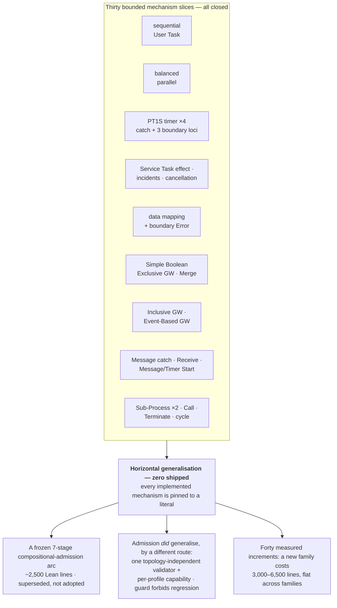

# Is the goal feasible?

> *Question: do you see the goal as feasible? It's still a long way, right?*

Yes — a long way. But the distance is very unevenly distributed, and that is the useful part of the answer. The stated goal is really three goals with different odds, and a fourth sits alongside them: a BPM platform, which is the largest consumer of effort in the repository and contributes nothing to any of the first three by design. That last fact is the most consequential thing on this page, and [18](18-the-bpm-platform.md) is where it is argued.

## Goal 1 — Temporal hosting of BPMN: feasible, demonstrated, and now productised

This was the genuinely novel engineering risk and it is substantially retired. What exists today:

- one semantic-lifetime Workflow per process instance, hosting **every** admitted model as data — no generated Workflow per diagram;
- durable timers whose firing is derived **only** from committed semantic state, never from the fact that a Temporal timer went off;
- external effects as Temporal Activities, with host retries kept strictly distinct from engine-visible retries;
- content-bound command identity, so a duplicate command is recognised as the same command and a *different* command reusing an ID is rejected rather than aliased;
- **passive Signal ingress** for Message delivery, with an ordered durable receipt ledger and malformed-versus-conflicting-versus-semantically-refused all separately classified;
- **a cancellable durable Timer racing a Message**, with atomic core-owned winner selection, complete loser withdrawal, and a typed *fail-closed* result when the host cannot order two same-activation readiness signals;
- **one level of embedded Sub-Process, and a called Process, hosted inside the same Workflow** — no Child Workflow, no cancellation event, with the histories asserted to contain zero of either;
- **a separate pre-start host-capability check** that returns typed `rejected` before Workflow creation when the program's reachable wait set exceeds what the adapter can schedule;
- Worker replacement mid-process in every one of those directions, replay, and cleanup all evidenced — **62 histories replayed and 102 isolated executions** per full pipeline run, derived from the 51-case catalog's `replaySelection` fields;
- **durable Temporal Schedules** hosting a Timer Start Event, with the stored Workflow-ID base kept deliberately distinct from the opaque service-returned execution identity, and a mutation proving that treating one as the other fails;
- **direct `client.start` hosting** for a Message Start Event through the ordinary Workflow start input, with a test-owned Signal-With-Start discriminator that must fail;
- **incidents as a semantic outcome**, with host-only `technicalFailure` routed into a committed semantic incident and an exact retry, and a separate incident-gated root cancellation producing a typed cancelled receipt through *ordinary* Workflow completion rather than native termination — with a native-termination mutation that must fail;
- a **family-parameterized boundary-deadline scheduler** serving three distinct boundary loci from one owner, replacing a copy rather than sitting beside it;
- an **atomic revisioned publication Query** with a cursor accumulator, retention evidence, and pure repeated-Query history stability, so a downstream product can build history without reading Event History;
- and a **runnable product command covering every registered profile**, plus a browser product on top of it ([18](18-the-bpm-platform.md)).

The project's own "vertical-slice limit" rule exists *because* this seam is considered proven — new features are told to reuse it rather than re-evidence it, and the ledger now shows that working with measured falls inside each family ([03](03-is-lean-goal-driven.md#did-the-replacement-hold-now-roughly-twenty-capsules-of-evidence)). This is the strongest part of the project, and [07](07-temporal-adapter.md) walks through the problems it had to solve to get here.

**The one place the durability story is genuinely incomplete** is worth naming rather than buried. The adapter recognises **four managed operation classes** — the Event-Based Gateway race, the bounded User Task, the bounded Sub-Process scope, and the monitored User Task — each owning one scheduler instance, and **admits at most one managed operation across all four**. A token split combined with a timer or effect is still rejected pre-start as `concurrentHostDrivenWaits`. Each additional managed class widens the *set of programs the host will accept one at a time*; the concurrency budget stays at one. That is an adapter limitation, correctly typed as an adapter limitation rather than BPMN meaning — but a general multi-wait scheduler is still unbuilt, and several remaining BPMN mechanisms will need one.

## Goal 2 — replacing A12 Workflows: feasible, not close, but estimable

The target is [A12 Workflows](https://github.com/mgm-tp/a12-workflows), and its denominator is defined — which is more than most migration projects manage: 62 physical BPMN files, 50 distinct exact-byte models, 7 production delegates, plus a façade and blueprint surface.

| Measure | Current |
|---|---:|
| Models admitted unchanged at the static source boundary | **1 of 50** |
| Models executed end-to-end through an adoption adapter | **0 of 50** |
| Adoption adapter package | none |
| Java delegate bridge | none |

**None of those numbers has moved across roughly twenty engine capsules and a complete product**, which is the layering working rather than neglect: A12 had every opportunity to leak into the roadmap as the platform was built, and it did not. What does exist is an [A12 add-on product boundary specification](../bpmn-lean-experiment/docs/A12-ADD-ON-BOUNDARY-SPEC.md) whose whole purpose is to keep A12-specific production decisions *out* of the MIT products — the two A12-shaped vertical slices are retained as optional adoption evidence behind a data-only future seam, exact-byte bound to an immutable baseline, with a preservation oracle that executes the frozen tooling in an isolated export and compares the results. Its cost row is the largest in the ledger at `+16959`, of which 13,794 is frozen legacy source the owner declined to discard.

So goal 2's distance is large and its posture is good: *not* taking an A12 shortcut is an executable property rather than a policy.

**A trap worth naming, because it is easy to fall into from the ledger's own numbers.** The A12 condition-expression census below describes what the *deferred* read-only JUEL context would reach — 9 of 16 occurrences, 5 of 11 exact strings, 4 of 8 condition-bearing models. It is **not** coverage the implemented expression capsule achieves. The A12 ledger is explicit: *"None of the 16 retained A12 JUEL condition occurrences uses that language URI, so this standards slice claims zero unchanged A12 expression or model adoption."* The implemented Simple Boolean language covers **0 of 16 occurrences, 0 of 11 strings, and 0 of 8 models**. The JUEL figures are on the books for an architecture that is approved and unadopted.

The census itself is a good example of how this project measures breadth. Across the 50 distinct models, 8 contain 16 `conditionExpression` occurrences comprising 11 distinct exact strings, driving 10 divergent Exclusive Gateway decisions:

| Condition class | Occurrences | Consequence |
|---|---:|---|
| Boolean literal | 1 | no variable value required |
| Root variable compared with null | 8 | needs complete Process-scope presence/null context over a `string \| null` domain |
| Nested truth test, string comparison, inequality, Boolean comparison | 7 | needs nested typed data |

Two structural facts from the ledger sharpen the adoption picture beyond expressions. All 38 A12 Service Tasks use `camunda:delegateExpression` and **omit** the standard BPMN `implementation` attribute, so the current capsule's required URN is *"correctly classified as a probe-fixture profile choice, not an A12 migration rule"* — a target profile must infer the protocol from the A12 profile without rewriting source. And 23 of those 38 have neither async flag, meaning CIB executes delegate invocation, Process advancement, variable writes, and rollback *in one engine transaction*, where a Temporal Activity introduces a durable external boundary. The ledger classifies that as *"a material migration classification per handler, not a source flag that may be silently added or an adapter detail hidden by canonical success agreement."* That is the kind of thing migration projects usually discover in production.

What stands between is mostly **breadth** — general expressions, general data mappings, the delegate bridge, the façade adapter, plus whatever BPMN mechanisms those 50 models actually use. Breadth is estimable. This is a long grind, not a research problem.

## Goal 3 — OMG Process Execution Conformance: feasible in principle, and the arithmetic just got worse

Not because any single piece is impossible. Because of the cost per mechanism, which is now measured rather than feared.

**What is implemented today.** The [BPMN requirement ledger](../bpmn-lean-experiment/docs/BPMN-REQUIREMENT-LEDGER.md) now supports a much sharper statement than a hand-made table, and it is the right figure to quote because it is the project's own denominator:

> **All thirteen reusable mechanism families are disposed `unsupported` at family level. Thirty-four of forty-three reviewed requirement rows are `supported`, five are `unsupported`, three are `undecided`, and one is `rejected`.**

That is not a contradiction; it is the ledger's design. A family row *"remains `unsupported` until the family has a complete reviewed account, while the 'closed slice' column names any narrower requirements already supported below."* So thirty-four bounded propositions are closed, and **no family is.**

The closed slices, each still pinned to a literal:

| Mechanism | Bounded how? |
|---|---|
| Sequential User Task lifecycle and refusal | — |
| Per-incoming-flow parallel synchronisation | exactly two balanced branches |
| Process-start and task-completion data | `string`/`null`, plus Boolean, and — at M6 completion only — non-negative safe integers and ordered string lists |
| Intermediate Catch Timer | the literal `PT1S` only |
| Timer/User Task composition | one finite acyclic linear witness |
| Intermediate Catch Message subscription | one operation-addressed, payload-free catch |
| Receive Task | one direct-addressed, payload-free Message |
| Service Task external effect | one protocol/operation binding |
| Service Task incident and retry | one literal-generation-1 incident, one exact retry |
| Incident-gated Process cancellation | one exact incident-gated hosting-root command |
| Input/output data mapping | `string`-or-`null` values only |
| Attached interrupting Error route | one exact error code |
| Exclusive Gateway conditional routing | two conditional flows + one default, five Boolean forms, `string \| null` context |
| Exclusive Merge | identity-only, exactly three inputs, only in the cycle profile |
| Inclusive Gateway split/join | one structured two-condition-plus-default region |
| Event-Based Gateway race | one exact operation-addressed Message versus `PT1S` Timer |
| Call Activity | one in-document called Process, empty data, normal return only |
| Embedded Sub-Process completion | one level, ordinary completion |
| Sub-Process Error propagation | one direct-parent exact-code handler |
| Terminate End | one exact nested occurrence, containing scope only |
| Cyclic control flow | one exact resumption-bounded User Task cycle |
| Message Start Event | one top-level, operation-addressed, payload-free |
| Timer Start Event | one top-level `PT1S`, one Schedule action |
| Interrupting boundary Timer on an Activity | one exact `PT1S` on a User Task |
| Interrupting boundary Timer on a Sub-Process | one `PT1S`, one child task |
| Non-interrupting boundary Timer | one `PT1S`, one firing |
| Configured Task extension | one exact versioned binding to the existing effect |
| User Task assignment and form metadata | one literal candidate group, one generated form field |
| Preserve-only admission | one generic profile retains selected notation without executing it |
| Runtime variable scoping | one Process scope plus effect-occurrence-owned Activity-local scopes |

**Every single row is a single bounded instance, not a general mechanism.** That is the crux, and the *shape* of the table makes it visible: three separate rows are `PT1S` boundary timers on three different loci — the same literal pinned three more times, in three capsules that each paid full price.

### The cost curve, measured

"Does the cost per mechanism fall?" is answerable rather than arguable here, because the project built the instrument. The [capsule cost ledger](../bpmn-lean-experiment/docs/CAPSULE-COST-LEDGER.md) records reproducible commit-bounded nonblank churn for **forty** closed increments. The engine rows:

```text
nonblank code additions per closed engine increment

Process-start data                 +289   ▌
User Task completion data          +651   ▎▌
Runnable MVP                       +950   ▊▌
Per-element admission diagnostics +1,153   ▌▌▌
Lean comment discipline           +1,607   ▌▌▌
Profile-param. admission          +1,760   ▌▌▌▌
Boolean Process data              +2,806   ▌▌▌▌▌▌
Preserve-only admission           +3,053   ▌▌▌▌▌▌▌
Inclusive Gateway                 +3,123   ▌▌▌▌▌▌▌
Intermediate Catch Message        +3,181   ▌▌▌▌▌▌▌
Configured Task extension         +3,276   ▌▌▌▌▌▌▌
Sub-Process Error propagation     +3,370   ▌▌▌▌▌▌▌▌
Parallel metadata composition     +3,522   ▌▌▌▌▌▌▌▌
Non-interrupting boundary Timer   +3,578   ▌▌▌▌▌▌▌▌
Message Start Event               +3,584   ▌▌▌▌▌▌▌▌
Terminate End Event               +3,689   ▌▌▌▌▌▌▌▌
Timer Start Event                 +3,711   ▌▌▌▌▌▌▌▌
Receive Task                      +3,805   ▌▌▌▌▌▌▌▌▊
Sub-Process boundary Timer        +3,970   ▌▌▌▌▌▌▌▌▌
User Task assignment metadata     +4,127   ▌▌▌▌▌▌▌▌▌▌
Event-Based Gateway               +4,606   ▌▌▌▌▌▌▌▌▌▌▌
Embedded Sub-Process              +5,266   ▌▌▌▌▌▌▌▌▌▌▌▌
Activity boundary Timer           +5,521   ▌▌▌▌▌▌▌▌▌▌▌▌
Cyclic control flow               +5,795   ▌▌▌▌▌▌▌▌▌▌▌▌▌
Call Activity                     +5,801   ▌▌▌▌▌▌▌▌▌▌▌▌▌
Service Task incident + retry     +6,038   ▌▌▌▌▌▌▌▌▌▌▌▌▌▌
Incident-gated cancellation       +6,438   ▌▌▌▌▌▌▌▌▌▌▌▌▌▌▌
```

The small increments are the *data* and *tooling* ones. **Every genuinely new BPMN mechanism sits between 3,000 and 6,500 lines, and the band has not narrowed as the repository has grown.**

Three qualifications, all of which the ledger supplies itself:

- Several ranges absorb unrelated commits, and the ledger says so rather than subtracting. Call Activity's is *"a conservative upper bound … rather than a pure feature attribution."* The Sub-Process boundary Timer's documentation figure has eighteen of forty commits from an unrelated episode, measured at `+137`, so its own figure is nearer `291` than `428`.
- Churn is not value. The ledger says so first: it *"does not measure semantic value, proof strength, test independence, JSON evidence volume, generated output, or wall time."*
- Elapsed time is `Unknown` on all forty rows for want of reliable timestamps — the correct refusal, and it means the instrument cannot price review effort at all.

**But the band conceals a real result, and it is the most encouraging number in this document.** Within a *family*, cost falls, and the ledger attributes each fall to a named mechanism rather than to a smaller feature. The three boundary-Timer capsules went `+5521` → `+3970` → `+3578`: the second *"added no new host scheduler, no new direct-VM harness, and no new durable timer ownership, instead parameterizing the sibling's scheduler over a host-family descriptor"*, and its removals rose because that generalisation **deleted the copied module rather than leaving it beside a third**. The configured Task fell 20% against the Service Task effect it reuses. Message Start fell 38% against cyclic control flow.

So the curve is **flat across families and falling within them**, and the reason is not that reuse fails. It is that **each new family opens a new seam**, and a new seam costs full price no matter how much of an old one it reuses. Call Activity reused the entire User Task Update host and still cost 5,801 lines, because a second root definition, a distinct semantic instance identity, and paired invoke/return operations are all genuinely new.

### The remaining set is harder structurally, not just larger

**What remains:** loops and multi-instance Activities, compensation and transactions, Event Sub-Processes, escalation, general Error propagation and ancestor handler search, general cancellation, incidents, arbitrary nesting, general expressions and typed variables, Message payload and correlation, Collaborations and Message Flows, performer/assignment, Script and Business Rule Tasks, additional start/intermediate/end Events, and general BPMN XML admission.

Several of those need the multi-wait host scheduler goal 1 does not have. Several need account decisions where BPMN's prose is genuinely ambiguous, so each needs profile decisions and fresh oracle probes, not just implementation — and they interact combinatorially with boundary events and cancellation.

## The structural worry about flat state, and how it turned out

There is a natural worry about a representation like this one. Runtime state could have stayed **flat** — a control field, a token list, wait lists, activation counters, logical time — in which case nested BPMN scopes would not *extend* it but **replace** it with a scope tree carrying per-scope ownership and interruption propagation, and every proof written over the flat shape would need redoing.

That replacement has been performed, twice, and the proofs survived it.

**The easy half — variable scoping.** The flat Process-variable field was atomically replaced by one Process scope plus private Activity-local scopes keyed by complete effect occurrence, in both implementations, leaving *"every canonical trace and shared wire artifact unchanged"* — no schema change, no evidence regeneration, no Temporal Command difference. Cost: `+540/-73`, among the smallest increments in the ledger.

**The hard half — definition and execution scoping.** The [ordinary embedded Sub-Process capsule](../bpmn-lean-experiment/docs/capsules/EMBEDDED-SUBPROCESS-COMPLETION-SPEC.md) introduced exactly what the worry described:

- a canonical **definition-scope forest** in the checked graph, with exact node and Sequence Flow ownership;
- a matching forest in the IL, with operation and control-place ownership plus entry-root and called-root completion strategies;
- **runtime scope occurrences** — one root plus one level of parent-linked child — owning tokens and every wait kind;
- `terminate` **removed** and replaced by `reachNoneEnd` plus quiescent `completeScope`, with new `enterScope` structure;
- and then the [Error propagation capsule](../bpmn-lean-experiment/docs/capsules/SUBPROCESS-ERROR-PROPAGATION-SPEC.md) added **regional cancellation** of a child occurrence subtree with monotonic counter and root-work preservation, later joined by `terminateScope` for selected-occurrence cancellation.

That is parent chains, ownership resolution, interruption propagation, and token cancellation across a subtree — all with Lean relations, laws, non-laws (`regional_interruption_is_not_global_cancellation`, stranded-child non-resumability), independent TypeScript behaviour, CIB-backed schedules, and Temporal evidence. It cost `+5266/-1698` and then `+3370/-398`, the second cheaper because it reused the first.

**What is still not established.** *Arbitrary* nesting, repeated activation of one definition scope, loops that re-enter a scope, concurrent occurrences of the same child definition, Event Sub-Processes, and handler search beyond one direct parent. And the *variable*-scope side did not follow: `IMPLEMENTATION-MAP.md` lists as absent *"variable-scope traversal, shadowing, or variable scope kinds beyond the implemented effect-local slice."* Definition scopes nest one level; **variable scopes do not nest at all.** The two dimensions were deliberately decoupled and only one moved, so a Sub-Process-local variable is not expressible.

The honest reading is therefore good: the manoeuvre was performed on the hard case and the proofs held. What is untested is *depth and repetition*, which is a smaller and more ordinary risk than "will the representation hold at all". [14](14-scopes-and-cancellation.md) is the full account.

## The real risk

**The project does vertical slices excellently and reuses a seam demonstrably. It has never generalised a mechanism from a literal to a family.**



Each slice runs the full stack: source admission → profile → Lean relation and evaluator → TypeScript core → CIB probe *where a relationship was selected* → Temporal adapter → differential scenario → retained evidence → mutation guards → six owner documents → independent cold review. All of them closed.

So conformance is not blocked by a technical wall. It is blocked by **the price of a new family** — 3,000 to 6,500 lines each, times the thirteen families the project's own ledger disposes as `unsupported`, plus their interactions, plus a review cycle each. The proof lane is not the bottleneck ([03](03-is-lean-goal-driven.md)); the breadth lane is.

The pivotal question is therefore not "is BPMN formalisable" — it demonstrably is, repeatedly in the literature and thirty times here. It is whether *this* assurance discipline can generalise a mechanism **once**. The cheapest available measurement remains untaken and remains the right one: take the timer from `PT1S`-only to a general ISO-8601 duration subset. It touches admission, lowering, Lean normalisation, the core, the CIB controlled clock, and the Temporal durable timer — every lane — while introducing no new semantic mechanism at all. And it has become *more* valuable, not less: there are now four separate `PT1S`-pinned capsules that a duration family would have to reach, so the measurement doubles as a test of whether generalisation composes across siblings. See [11 §2](11-open-questions.md#2--can-one-mechanism-be-generalised-from-a-literal-to-a-family).

## Credit where it is due

The reason these numbers are even available is that the project refuses to fake them:

- no percentage-complete claim anywhere;
- no conformance claim; the MVP's own closure states that it *"is not a BPMN Process Execution conformance percentage or a broad CIB compatibility claim"*;
- **four separate denominators** — BPMN requirements, CIB profile coverage, A12 adoption, and closed platform milestones — never merged, and success in one is never used as evidence for another;
- absences documented as prominently as presences — the *absent* columns in `IMPLEMENTATION-MAP.md` are longer and more specific than the implemented ones;
- all thirteen mechanism families disposed `unsupported` at family level, even though thirty-four bounded requirement rows are `supported`, because a closed slice does not close a family;
- vacuous theorems deleted rather than counted;
- an oracle disagreement kept visible as candidate deviation `CIB-DEV-0001` rather than absorbed into a compatibility claim;
- sixteen profiles that declare **no CIB lane at all** rather than stretching a relationship to manufacture one;
- a cost ledger whose comparison notes argue *against* the project's own convenience — refusing to subtract an unrelated commit from its largest measurement, recording elapsed time as `Unknown` on every row rather than estimating it, and flagging three contaminated ranges as upper bounds;
- and a [process assessment ledger](../bpmn-lean-experiment/docs/PROCESS-ASSESSMENT-LEDGER.md) that counts the project's own escaped process failures, with a gate that fails when a repeated finding is answered with prose instead of a guard ([19](19-process-self-measurement.md)).

The last two are what make this page possible. A project that builds the instrument showing its costs are not falling — and a second one counting the times it got its own claims wrong — is telling you something reliable. Slow and accurately measured beats fast and self-deceiving, and the measurement is what makes the next scope decision arguable on evidence rather than on impression.
