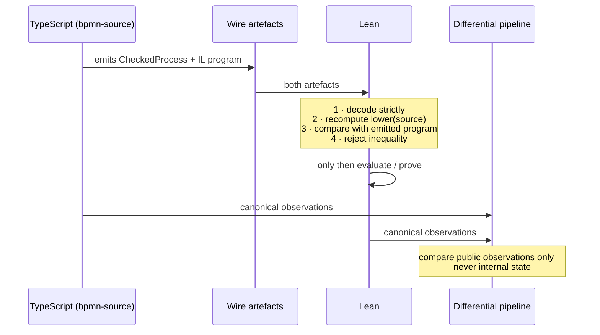

# The semantic core, the IL, and their relation

> *Question: sketch how the semantic core is used and its responsibility, and how the IL is used. Its relation to the TypeScript core is also interesting.*

For *how the TypeScript core is authored and checked*, see [06](06-typescript-core-correctness.md). This document covers what it **is** and what the IL between it and BPMN looks like.

## The packages and the flow

```text
exact BPMN XML bytes
        │
        │  @bpmn-lean/bpmn-source        (owns bpmn-moddle, admission, lowering)
        ▼
CheckedProcess ──────────────► Semantic Process IL program
   (source-facing graph)          (control places + operations, both scope-owned)
        │                                 │
        │                                 ├──► @bpmn-lean/semantic-core   ── hosted by ──► temporal-adapter
        │                                 │      applyStimulus / projections
        │                                 │
        │                                 └──► Lean: decode, re-lower, compare, evaluate, prove
        │
        └──► (bytes only) ──► CIB Seven          ← never sees the IL
```

| Package | Nonblank `src` | Nonblank tests | Owns |
|---|---:|---:|---|
| `@bpmn-lean/bpmn-source` | 9,706 | 10,178 | `bpmn-moddle`, byte capture, admission, lowering to the IL |
| `@bpmn-lean/semantic-core` | 13,092 | 14,796 | the meaning: state, transitions, closure, observations |
| `@bpmn-lean/engine-api` | 2,236 | 1,464 | the narrowed public entry points Product 2 may consume |
| `@bpmn-lean/differential` | 291 | 6,645 | orchestrating the multi-target comparison |

Nonblank counts over the tracked tree at the baseline commit. The ratio worth watching is `differential`: 291 lines of source against 6,645 of test, because its "source" is a thin catalogue and its substance *is* the comparison matrix.

**Temporal hosting is no longer one package.** `packages/temporal-adapter/` is a subsystem directory of six independently built workspace packages with no production umbrella export, split along real execution environments rather than along layers:

| Package | Nonblank `src` | Owns |
|---|---:|---|
| `protocol` | 3,539 | Temporal-facing contracts, identity, transport, host admission — depends on the semantic core but on **no** Temporal SDK package |
| `client` | 2,460 | start, Query, Signal, Update, retained-result resolution; owns `@temporalio/client` |
| `workflow` | 3,390 | the deterministic Workflow and its schedulers; owns `@temporalio/workflow` |
| `worker` | 189 | bundling, Worker lifecycle, Activity hosting |
| `runner` | 669 | the product command's composition and entry points |
| `testkit` | 7,548 | ephemeral servers, mutations, calibration, evidence — owns `@temporalio/testing`, excluded from production graphs |

The split is what lets Product 2 consume the client boundary without pulling Worker and test infrastructure into its server's dependency closure, and an executable guard enforces the exact internal and SDK dependency direction. Note the size of `testkit` against everything else: **the deliberately-wrong Workflows, ephemeral servers, and evidence extraction are larger than all five production packages combined**, which is what the evidence discipline in [02](02-evidence-and-lanes.md) costs when you actually pay for it.

Dependency direction is strict: `bpmn-source`, the adapter packages, `engine-api`, and `differential` all depend on `semantic-core`; **`semantic-core` depends on nothing.** Verifiably — `rg -n "temporalio|bpmn-moddle|node:" packages/semantic-core/src/` returns nothing, not even a Node built-in.

Note the CIB branch carefully. It consumes **exact bytes only**: CIB Seven *"does not consume the Semantic Process IL and does not define its structure."* That is what keeps the oracle's failure mode uncorrelated with the IL's. If CIB read the IL, a lowering bug could make both agree on the wrong answer, and the oracle would stop being independent evidence. It is also, per [02](02-evidence-and-lanes.md#but-the-decorrelation-is-narrower-than-that-diagram-suggests), the *only* lane that can catch an XML-to-graph misread — and it is deliberately absent for 27 of the 51 registered cases.

## The semantic core: responsibility in one sentence

**It is a pure function from (immutable program, runtime state, one explicit stimulus) to (new state, outcome), plus the canonical projections over that state.** No I/O, no clock, no host, no parser.

The central signature, whose shape has survived every capsule closed against it:

```ts
applyStimulus(
  program: SemanticProcessProgram,
  state: RuntimeState,
  stimulus: Stimulus,
  closureLimit: number = semanticProcessClosureLimit,   // 8
): CommandResult

// CommandResult = {
//   outcome: CommandOutcome.Committed | CommandOutcome.Rejected;
//   state: RuntimeState;
//   internalStepBoundExceeded: boolean;
// }
```

Everything else is arranged around that one step. The core is **62 modules**; the ones carrying the contract:

| File | Nonblank | Owns |
|---|---:|---|
| `semantic-process-runtime.ts` | 562 | `applyStimulus`, `applyInternalOperation`, internal closure, the fuel-8 bound, `isStableStateResumable` |
| `flow-node-occurrence-open-set.ts` | 557 | the open occurrence set behind flow-node metrics |
| `flow-node-occurrence-lifecycle.ts` | 554 | exact starts and completed-or-cancelled terminals at the evaluator boundary |
| `semantic-process-graph-admission.ts` | 530 | topology-independent structural validity: reference, arity, ownership, reachability, acyclicity |
| `scenario.ts` | 525 | canonical projections, `advanceScenario`, `deployProcess`, `runScenario` |
| `semantic-process-operation-admission.ts` | 476 | per-operation-kind admission, separated from graph shape |
| `control-position-projection.ts` | 416 | independent current control and scope positions for the publication contract |
| `semantic-process-contract.ts` | 401 | the checked-graph and IL program types — the 24-arm operation union lives here |
| `stimulus.ts` | 370 | `stimulusCommandId`, `sameStimulus`, `isWellFormedStimulus`, `isWellFormedEffectExecutionResult` |
| `semantic-process-state.ts` | 366 | `RuntimeState`, `ScopedVariables`, token / wait / occurrence primitives |
| `effect-transport-material.ts` | small | `projectEffectTransportMaterial` — what the adapter is *allowed* to see |
| `deep-readonly.ts` | small | the project-wide deep-immutability utility |

Three things to read out of that list.

**The split is by responsibility, not by size.** Admission is three separate files — graph shape, operation kind, profile capability — because those are three different questions with three different owners, and the [profile-parameterized admission work](https://github.com/mbackschat/bpmn-lean-experiment/blob/0adda45/docs/PROFILE-PARAMETERIZED-ADMISSION-SPEC.md) exists precisely to keep them apart. Each mechanism with hidden runtime state has its own runtime module (`-call-runtime`, `-event-race-runtime`, `-scope-runtime`, `-error-runtime`, `-inclusive-gateway-runtime`, `-incident-runtime`, `-termination-runtime`, `-monitored-task-runtime`, `-bounded-scope-runtime`, `-bounded-task-runtime`) rather than growing `semantic-process-runtime.ts`. The hygiene gate enforces a 600-line review target and a 1,000-line hard ceiling; the largest core module sits at 562, which is visible pressure that the split is doing work.

**Four of the twelve largest modules exist to serve a downstream product.** `flow-node-occurrence-*` and `control-position-projection` are there because Product 2 needs history, diagram overlays, and metrics, and is forbidden to derive them from Temporal Event History ([18](18-the-bpm-platform.md#the-four-operations-and-the-two-rules-that-make-the-assurance-transfer)). That is the "missing fact is a stop condition" rule showing up as roughly two thousand lines inside the semantic core rather than as a shortcut in the platform.

**The `stimulus.ts` / `effect-transport-material.ts` group is an architectural decision made concrete.** Those functions exist so the Temporal Workflow **asks** the core rather than reimplementing policy. `IMPLEMENTATION-MAP.md` records that the adapter delegates *"current projection, stimulus well-formedness, command identity, and same-stimulus comparison"* to core operations. Two consequences: the adapter cannot drift from core policy, and the production Workflow is **561 nonblank lines** while the IL carries 24 operations.

**One narrowing is deliberate and worth understanding**, because it looks like an omission. `CommandResult.outcome` admits only `Committed | Rejected`, while the wire enum has five members and Lean models all five plus an `ambiguousInternalChoice` flag. The core refuses to express host or harness failure through a semantic channel: a closure-bound overrun is a harness failure, a post-closure command is an adapter-owned lifecycle result, and neither is a BPMN outcome. The two-arm union has survived every capsule since it was written — see [06](06-typescript-core-correctness.md#3--deliberately-divergent-runtime-representations--with-receipts) for what the asymmetry with Lean costs.

## What the IL is, and why it is not a BPMN mirror

Two artefacts, both immutable, both content-bound to the source's SHA-256 digest:

**`CheckedProcess`** — source-facing. Keeps BPMN node and Sequence Flow identity, and now also carries a **definition-scope forest** with exact node and Sequence Flow ownership. Records only structural facts established at admission; explicitly *"no runtime token counts, active User Task occurrences, commands, scheduler choices, or Temporal identity."*

**`SemanticProcessProgram`** — `controlPlaces` plus `operations` plus its own definition-scope forest, and **no mutable state at all**.

**Twenty-four operation kinds**, as a closed discriminated union — the count is from `SemanticOperationKind`, cross-checked against the `operation` union in `contracts/schemas/semantic-process.schema.json`:

```ts
export enum SemanticOperationKind {
  Initiate = "initiate",                            // control
  InitiateMessage = "initiateMessage",              // control
  InitiateTimer = "initiateTimer",                  // control
  EnterScope = "enterScope",                        // scope
  EnterBoundedScope = "enterBoundedScope",          // scope
  InvokeProcess = "invokeProcess",                  // scope
  ReturnProcess = "returnProcess",                  // scope
  AwaitUserTask = "awaitUserTask",                  // interaction
  AwaitBoundedUserTask = "awaitBoundedUserTask",    // interaction
  AwaitMonitoredUserTask = "awaitMonitoredUserTask",// interaction
  AwaitMessage = "awaitMessage",                    // subscription
  AwaitTimer = "awaitTimer",                        // subscription
  AwaitEffect = "awaitEffect",                      // effects
  Duplicate = "duplicate",                          // control
  Synchronize = "synchronize",                      // control
  MergeExclusive = "mergeExclusive",                // control
  Choose = "choose",                                // control
  SelectMany = "selectMany",                        // control
  SynchronizeSelected = "synchronizeSelected",      // control
  AwaitEventRace = "awaitEventRace",                // subscription
  ThrowError = "throwError",                        // propagation
  TerminateScope = "terminateScope",                // propagation
  ReachNoneEnd = "reachNoneEnd",                    // control
  CompleteScope = "completeScope",                  // scope
}
```

The lowering table:

| Checked BPMN construct | IL construct |
|---|---|
| Sequence Flow | `ControlPlace` |
| none Start Event (root) | `initiate` |
| Message Start Event | `initiateMessage` |
| Timer Start Event | `initiateTimer` |
| none Start Event (child scope) | *entry structure* — becomes part of `enterScope`, **not** a second initiation |
| User Task | `awaitUserTask` |
| User Task with an interrupting boundary Timer | `awaitBoundedUserTask` |
| User Task with a non-interrupting boundary Timer | `awaitMonitoredUserTask` |
| exact `PT1S` Intermediate Catch Timer | `awaitTimer` (`durationMs: 1000`) |
| Intermediate Catch Message Event | `awaitMessage` (`operationMessage` channel) |
| Receive Task | `awaitMessage` (`directMessage` channel) |
| exact Service Task binding, and the configured Task extension | `awaitEffect` |
| diverging Parallel Gateway | `duplicate` |
| converging Parallel Gateway | `synchronize` |
| converging identity-only Exclusive Gateway | `mergeExclusive` |
| diverging Exclusive Gateway with conditions | `choose` |
| diverging Inclusive Gateway | `selectMany` |
| converging Inclusive Gateway | `synchronizeSelected` |
| diverging Event-Based Gateway | `awaitEventRace` |
| embedded Sub-Process | `enterScope` + `completeScope` |
| embedded Sub-Process with an interrupting boundary Timer | `enterBoundedScope` + `completeScope` |
| Call Activity | paired `invokeProcess` + `returnProcess` |
| Error End Event with a resolved handler | `throwError` |
| Terminate End Event | `terminateScope` |
| none End Event | `reachNoneEnd` |

**One BPMN element class does not get one opcode, and one opcode is not one element class.** Three quite different Service Task bindings — a payload-free probe, an A12-shaped `CreateDocument` with data mappings, and one with an attached interrupting Error route — all lower to the *same* `awaitEffect`, differing only in payload. Two quite different BPMN constructs, an Intermediate Catch Message Event and a Receive Task, lower to the same `awaitMessage` and differ only in the channel arm of one closed `operationMessage | directMessage` union. That is the design rule: *"a small language of semantic mechanisms rather than a mirror of BPMN element classes."*

The channel union is worth pausing on as the clearest instance. When the Receive Task capsule arrived it could have added a second wait operation. Instead it replaced `MessageChannel` **atomically** with a closed two-arm union across TypeScript, Lean, all three wire schemas, Java, the artefacts, and Temporal command identity — one pre-release replacement, no parallel reader, no compatibility switch. The differential mutation that guards it substitutes the *complete opposite arm* and requires the pre-delivery Query to diverge, the exact direct delivery to reject, and only the substituted arm to complete. That is what "the same mechanism, not the same code path" has to mean to be worth anything.

### Why there is no `terminate` operation

The IL once had one, and its removal is the single most instructive thing in the language's design.

`terminate` conflated two things that are only the same in a single-scope world: *a none End Event was reached* and *this scope is finished*. Once one level of embedded Sub-Process existed, a child's End Event must not end the Process, and a child scope must complete only when its owned region has no token, no wait, and no child occurrence. So `reachNoneEnd` records the end occurrence and `completeScope` fires **only on quiescence**, removing the child and emitting exactly one parent-owned continuation.

Read against the IL's own kill-switch criteria, this is the interesting part: the fix was not to add a flag to `terminate` or a second `terminateChild` opcode. It was to notice that one opcode was two mechanisms and split it — which is exactly the *"no universal `event` operation with a bag of flags"* rule applied to an operation that already existed. The specification explicitly forbids the alternatives: no bag of flags, no duplicating the BPMN metamodel as opcodes, no erasing distinctions merely because two constructs look similar in one test case.

### The effect descriptor is neutral

```ts
// packages/semantic-core/src/semantic-process-contract.ts
export const EffectProtocol = {
  Activity: "urn:bpmn-lean:effect-protocol:activity-v1",
} as const;

export const EffectOperation = {
  Probe: "urn:bpmn-lean:effect-operation:probe-v1",
  MappedSuccess: "urn:bpmn-lean:effect-operation:mapped-success-v1",
  MappedBoundaryError: "urn:bpmn-lean:effect-operation:mapped-boundary-error-v1",
} as const;
```

Profile-registered opaque URNs, and nothing else. No A12 delegate bean name, no A12 data shape, no `http://camunda.org/schema/1.0/bpmn` namespace literal appears here or in Lean's production `Lowering.lean` — that vocabulary survives only inside capsule *conformance fixtures*, which is the correct place for it. Source and profile admission normalises an admitted binding to one of these identities, validated as a safe string, before anything downstream sees it.

**Why this matters more than it looks.** The tempting design is a closed union of the product bean names you currently support, because it type-checks the exact set you have and reads as tight. It also means every vendor-neutral capsule that widens the effect surface edits a table of someone else's product vocabulary, and the layering rule in [00](00-background.md#four-layers-with-one-way-dependency) is violated the moment it does. The observable payoff of the neutral form is that **roughly twenty capsules have closed without touching the descriptor at all** — which a bean-name union could not have delivered.

## Worked example — what lowering actually produces

The checked graph is written out; the program is *derived*, which is itself a design statement. From the Lean fixtures, source `Start → User Task "Approve" → End`:

```lean
def sequentialCheckedProcess : CheckedProcess :=
  { identity :=
      { semanticProfile := ⟨"cibseven-2.2.0-user-task-process-data-draft"⟩
        sourceId := ⟨"sequential-user-task-process"⟩
        sourceSha256 :=
          "b5704a6d526ce5029e21b2de214653860bb23f7ed6169c4d912cd2412486378d" }
    processId := ⟨"Process_SequentialUserTask"⟩
    definitionScopes := [rootDefinitionScope ⟨"Process_SequentialUserTask"⟩]
    nodeScopes := rootNodeScopes ⟨"Process_SequentialUserTask"⟩
      [⟨"EndEvent_1"⟩, ⟨"StartEvent_1"⟩, ⟨"UserTask_Approve"⟩]
    sequenceFlowScopes := rootSequenceFlowScopes ⟨"Process_SequentialUserTask"⟩
      [⟨"Flow_StartToTask"⟩, ⟨"Flow_TaskToEnd"⟩]
    nodes :=
      [ .noneEndEvent ⟨"EndEvent_1"⟩
      , .noneStartEvent ⟨"StartEvent_1"⟩
      , .userTask ⟨"UserTask_Approve"⟩ (some "Approve") ]
    sequenceFlows :=
      [ { id := ⟨"Flow_StartToTask"⟩
          sourceId := ⟨"StartEvent_1"⟩
          targetId := ⟨"UserTask_Approve"⟩ }
      , { id := ⟨"Flow_TaskToEnd"⟩
          sourceId := ⟨"UserTask_Approve"⟩
          targetId := ⟨"EndEvent_1"⟩ } ] }

def sequentialProgram : Program :=
  lowerCheckedProcess sequentialCheckedProcess
```

Things to read out of this:

- **The program is not written down.** It is `lowerCheckedProcess` applied to the graph, so every theorem about `sequentialProgram` is a theorem about the *lowering function's output* rather than about a hand-copied literal that could drift from it. Writing the program out as a literal would be a small but real transcription risk, and the fixture deliberately avoids it.
- **Ownership is explicit even when there is only one scope.** A single-Process model still declares a root definition scope and maps every node and flow into it. The uniform shape is why adding a child scope was a *replacement* rather than a special case.
- **Nodes are sorted by identifier** — `EndEvent_1` before `StartEvent_1` — which is serialisation, not execution order. Execution order is a runtime consequence of tokens. (This sorting is load-bearing in a way that is easy to miss: it is why the two implementations' different internal-step selectors currently coincide — see [06](06-typescript-core-correctness.md#3--deliberately-divergent-runtime-representations--with-receipts).)
- **The source digest travels with the graph**, so no derived artefact can drift from the bytes it came from.

The lowered program for this model has two control places (`place:Flow_StartToTask`, `place:Flow_TaskToEnd`) and three operations (`initiate`, `awaitUserTask`, `reachNoneEnd`), each carrying both its runtime payload and a separate `origin`. That duplication is deliberate: validation requires them equal, *runtime identity* reads the payload, *source traceability* reads `origin`. The spec makes it a convention every future occurrence-producing operation must follow, so runtime identity never derives from provenance.

## Three IL constraints that carry real weight

**1 · Array order has no semantic meaning.** Canonical serialisation sorts definitions and unordered references by identifier. This has teeth: a proof about the enabled-transition list may not conclude exact list *equality* if that equality depends on collection order, because doing so would silently turn a serialisation convention into a scheduling rule. See [01 §1.10](01-theorem-techniques.md#110-refusing-to-let-collection-order-become-semantics).

There is one deliberate, documented exception, and the exception proves the rule. `choose` carries *"exactly two declaration-ordered typed Simple Boolean candidates"* — because BPMN's first-true-wins rule makes XML Sequence Flow declaration order genuinely semantic for an Exclusive Gateway. Its sibling `selectMany` carries *canonically* ordered candidates, because Inclusive selection is order-independent. Two nearly identical operations, opposite ordering contracts, each stated explicitly. That is the distinction being made on purpose rather than inherited from a serializer.

**2 · Lowering must do no semantic work.** It *"must not resolve token races, choose an execution order, create runtime task occurrences, inspect future scenario commands, or encode expected observations."* Lowering translates; it does not decide. `throwError` shows where the line falls: lowering *resolves* one exact Error code to one attached handler, because that is a static graph fact, and does nothing about cancellation, which is a runtime consequence.

**3 · Runtime state is not part of the program.** Token counts, occurrences, scoped variables, selected-branch records, races, call records, the logical clock, and committed outcomes all live in `RuntimeState`, which the program never contains.

## How Lean and the TypeScript core relate

The IL is a **shared contract**. Lean and the core are **independent transcriptions over it**.



**Mechanism 1 — Lean re-derives the program instead of trusting it.** *"decode both the checked graph and emitted program, recompute `lower source`, reject inequality, and only then evaluate or prove program properties."* So Lean checks **lowering**, not just execution. And the obvious shortcut is closed: *"A scenario identifier or fixture name is not a substitute for this content equality."* The pipeline additionally mutates one operation origin without breaking structural validity and requires Lean to reject the program as unequal to its own lowering — the guard has a guard.

**Mechanism 2 — they deliberately do not share runtime representations.** *"Lean and TypeScript may use different internal runtime representations. They must implement the same reviewed transition account and canonical observation contract; sharing an IL does not require sharing evaluator algorithms or runtime data structures."*

**Mechanism 3 — the independence claim is bounded honestly.** *"Agreement between Lean and TypeScript is useful correspondence evidence, not evidence that two independent semantic accounts selected the same meaning."*

That third sentence is the most important one in the specification and the easiest to skip. [06](06-typescript-core-correctness.md) is the full treatment, including the concrete places where the two representations actually diverge.

## Two things worth flagging about the IL

**It contains its own kill switch, and the criteria are specific.** Nine "stop and reconsider" conditions, including *"the IL becomes a wrapper that selects an old topology evaluator"* and *"a new opcode mirrors a BPMN surface class without a reusable semantic mechanism"*, plus a standing instruction: if a condition is violated, *"stop and reconsider the boundary rather than preserve the name 'IL' around an unsuitable representation."* The whole design is written against a named prior failure — a rejected "A12 Core IL" proposal — with its *decision criteria* transposed rather than its architecture.

**The growth rules hold across all twenty-four operations, in the sense the rules actually claim.** Each is classified by *mechanism* first — trigger source, catching or throwing, locus, interrupting behaviour, scope ownership, subscription cardinality, correlation, lifecycle — and each lands in a named layer:

| Layer | Operations |
|---|---|
| control | `initiate`, `initiateMessage`, `initiateTimer`, `duplicate`, `synchronize`, `mergeExclusive`, `choose`, `selectMany`, `synchronizeSelected`, `reachNoneEnd` |
| interaction | `awaitUserTask`, `awaitBoundedUserTask`, `awaitMonitoredUserTask` |
| subscription | `awaitMessage`, `awaitTimer`, `awaitEventRace` |
| scope | `enterScope`, `enterBoundedScope`, `completeScope`, `invokeProcess`, `returnProcess` |
| propagation | `throwError`, `terminateScope` |
| effects | `awaitEffect` |

**The three interaction operations are where the growth rules are under the most strain, and it is worth being honest about it.** `awaitUserTask`, `awaitBoundedUserTask`, and `awaitMonitoredUserTask` are the same BPMN element with different boundary attachments, and the IL's own rule forbids *"a new opcode that mirrors a BPMN surface class without a reusable semantic mechanism"*. The defence is that each is a genuinely different transition family — one waits, one races a deadline against its own completion, one spawns a branch without ending its host — and the host classifies all three as distinct managed classes. That defence is sound and it is also exactly the argument a fourth boundary locus would make.

**Where the next real stress test lies** is therefore not the operation count. It is *repetition*: every scope operation today assumes at most one level, one activation, and no re-entry. `enterScope` has a `childScopeId`; nothing in the shape prevents a second occurrence of the same child, but every law and closure bound assumes there is not one. Loops and multi-instance Activities are where the growth rules meet a case the current shape genuinely does not cover.
