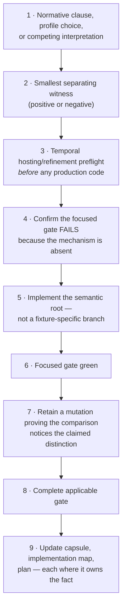

# How the TypeScript semantic core is written — and what establishes that it is right

> *Question: the Lean evaluator and the TypeScript semantic core are supposed to be aligned, but the TypeScript core is neither generated from Lean nor derived from it. So how does it actually get coded, and how is its correctness proven?*

## Short answer

It is **written by hand, twice, on purpose.** Nothing generates it, nothing extracts it, and no theorem relates it to Lean. Its correctness is not *proven* — it is *constrained from four sides at once* and then *observed to agree* with two or three other implementations on 28 fixed scenarios.

That is a weaker claim than "verified", and the project says so in its own words rather than letting the reader assume otherwise:

> *"Agreement between Lean and TypeScript is useful correspondence evidence, not evidence that two independent semantic accounts selected the same meaning."*

A TypeScript-correspondence proof is listed as **explicitly not planned** in [docs/IMPLEMENTATION-MAP.md](../bpmn-lean-experiment/docs/IMPLEMENTATION-MAP.md), with the reason given: proving it would require formalising TypeScript itself. So the interesting question is not "where is the proof" but "what does the project do *instead*, and how much does that buy?"

## Why not generate it from Lean?

Lean can compile to executables, and extraction to other languages exists in the proof-assistant world. Three reasons the project refuses it.

**1. Generation would collapse two evidence lanes into one.** The whole point of having a Lean interpreter *and* a TypeScript core is that two people transcribing the same rules make *different* mistakes. Generated code shares every defect of its generator by construction. [docs/TESTING-SPEC.md](../bpmn-lean-experiment/docs/TESTING-SPEC.md) states the governing rule: *two lanes are distinct only if their failure modes are uncorrelated.* A generated core would fail in exactly the same places as Lean, so the differential pipeline would become a very expensive way to compare a program with itself.

**2. The production host constrains the code shape in ways Lean output would not respect.** The core runs inside a Temporal Workflow sandbox. It must be deterministic, dependency-free, free of I/O and clocks, deeply immutable at compile time, and — a real constraint — written in Node's *erasable-syntax* TypeScript subset so it can execute under type-stripping with zero JavaScript emit. See [07 — the Temporal adapter](07-temporal-adapter.md#challenge-1--determinism-and-replay) for why. Extracted code satisfies none of that automatically.

**3. Idiomatic-TypeScript readability is a stated requirement, not a nicety.** `CLAUDE.md` demands closed discriminated unions, exhaustive enum-based switches with a `never` check, `DeepReadonly` contracts, and code that "target TypeScript contributors should be able to discover and use … from editor tooling without reading its implementation." Extracted Lean is not that.

The architecture decision is recorded in [docs/PROJECT-DESIGN.md](../bpmn-lean-experiment/docs/PROJECT-DESIGN.md): the core is *"a separately written, deterministic realization of the reviewed account"* — and, in the same row, *"is not an independent choice of operational account."* Both halves matter, and the next section is about the second one.

## The distinction that does all the work: two kinds of independence

This is the single most important idea for answering the question, and it is easy to skim past.

| | Achieved? | Meaning |
|---|---|---|
| Independent **transcription** | **yes** | Two implementations written separately from the same reviewed account. Catches inverted guards, mistyped identity fields, off-by-one activations, forgotten state preservation. |
| Independent **choice of account** | **no, and not claimed** | Two parties independently deciding what BPMN *means*. Would catch a wrong reading of the standard. |

So Lean and TypeScript can agree perfectly and both be wrong about BPMN. `PROJECT-DESIGN.md` is explicit about *why* they cannot be account-independent as currently written:

> *"the capsule currently prescribes the microstate inventory and the internal closure bound, so both realizations share that decomposition and would reproduce an error in it identically."*

That sentence names the exact residual. Account-level independence comes from somewhere else entirely: normative review of the BPMN clause, and pinned CIB Seven observation at the fidelity the capsule records. Not from Lean-versus-TypeScript agreement.

`PROJECT-DESIGN.md` also notes that a capsule *may* buy account independence deliberately — by specifying only the observable contract and letting each realisation choose its own decomposition — but that this is a per-capsule decision with a real cost that must be recorded rather than assumed. **None of the sixteen closed capsules has bought it**, including the six that closed after the option was written down. That is worth reading as data rather than as an oversight: given a documented, owner-sanctioned way to buy a genuinely second lane, six consecutive capsules declined it. The option costs a full second design decomposition per capsule, and the measured price of a capsule is already 3,000–5,800 lines ([04](04-feasibility.md#the-cost-curve-finally-measured)).

## So what is the actual authoring workflow?

The capsule is the specification; the code is a transcription of it. [docs/TESTING-SPEC.md](../bpmn-lean-experiment/docs/TESTING-SPEC.md) fixes the order of operations:



Two things about this are unusual and worth pausing on.

**Step 3 comes before step 5.** The durability question is settled before either semantic implementation is written. `PROJECT-DESIGN.md` explains why: *"A Lean definition can be sound and the pure semantic core can transcribe it correctly while the durable adapter still loses an input, applies a duplicate, exposes an intermediate state, leaks transport retries, closes before a command outcome is delivered, or lacks a hosting mechanism for a semantic wait or effect."* Discovering that at implementation time would push adapter policy into semantics by accident.

**Step 5 says "the semantic root, not a fixture-specific branch."** This is the rule that keeps the core from degenerating into a per-model dispatcher. It is enforced socially, by review, and structurally, by the IL: there is no place to put a model-specific branch, because the core only ever sees seven generic operation kinds.

Lean and TypeScript are written from the same capsule, by the same author, usually in the same change. The independence is *of the artefact*, not of the person — which is exactly why the project calls it transcription independence and refuses to call it more.

## What is prescribed, and what is left to the implementer

This boundary determines what agreement can possibly establish.

| Prescribed by the capsule (shared, so errors reproduce identically) | Chosen per implementation (so errors differ) |
|---|---|
| Which rules exist, each with a stable ID such as `XGW-DEFAULT-01` | Data structures for tokens, waits, variables, activation counters |
| The microstate inventory — what counts as one internal step | Field names, module layout, function decomposition |
| The internal closure bound (currently 8), and each capsule's *exact* closure figure | The internal-step *selector* among enabled operations |
| The canonical observation contract — the eleven public fields | Whether ordering is achieved by sorting, by construction, or by concatenation |
| The stimulus vocabulary and command-identity rule | Validation strategy, error representation, exhaustiveness technique |
| Every wire shape, frozen by JSON Schema | The public transition signature's exact result type |
| Which runtime state is *hidden* — selected-branch records, races, call records — and that it never reaches the observation | How that hidden state is stored, keyed, and cleaned up |

The right-hand column is not incidental. The project deliberately widens it, because a shared representation would erase the only independence it has:

> *"Lean and TypeScript may use different internal runtime representations. They must implement the same reviewed transition account and canonical observation contract; sharing an IL does not require sharing evaluator algorithms or runtime data structures."*

## The four things that actually constrain the core

Nothing here is a proof. Together they are what the project has instead.

### 1 · A shared, schema-frozen input contract — with Lean re-deriving it

Both implementations consume the same two artefacts: the `CheckedProcess` graph and the `SemanticProcessProgram`. Both are immutable, content-bound to the source SHA-256, and frozen by JSON Schema.

Crucially, Lean does **not** trust the program it is handed. It decodes both artefacts, recomputes `lower(source)` itself, compares, and refuses to evaluate on inequality. A scenario name is explicitly not a substitute for that content equality. So a lowering bug in TypeScript cannot silently propagate into the Lean lane.

The limit of this, stated in `IMPLEMENTATION-MAP.md`: Lean re-derives only **graph → program**. The **XML → graph** step has a single producer, `packages/bpmn-source/src/checked-process-compiler.ts`, and Lean has no XML parser. A misread element ID, mapping target, or flow direction propagates identically into Lean, the core, and Temporal. Only CIB Seven, which executes the raw bytes, can separate it — and only within its declared observation boundary.

**That limit widened.** Ten of the 28 registered cases are standards-only, with CIB *deliberately absent* because no relationship was selected. For those ten, the one lane that could catch an XML-to-graph misread does not run. The implementation map says so directly: the standards-only profiles have *"no such source-level oracle"* and state that limitation explicitly. See [02](02-evidence-and-lanes.md#but-the-decorrelation-is-narrower-than-that-diagram-suggests) for the case-by-case breakdown.

### 2 · Comparison on canonical observations only

The differential pipeline runs 28 answer-free scenarios through three or four targets and compares **only** the canonical observation: status, active waits, open user tasks, open message subscriptions, open timers, open effects, variables, enabled interactions, logical time, per-command outcomes, and deployment.

Internal state is never compared. That is what makes agreement informative rather than tautological — if the comparison reached into runtime representations, the two implementations would have to share them, and then agreement would mean nothing.

The newer capsules made this rule *harder* rather than easier to keep. Each of the Inclusive Gateway, Event-Based Gateway, and Call Activity mechanisms carries hidden runtime state that must not appear in the observation — a selected-branch record, a race with activation counters, a call record with a called instance identity. So each capsule pays for a **hidden-state non-projection** theorem alongside its behaviour laws, and each needs a discriminator that reaches the public surface anyway. Call Activity's is the neatest: erase the called identity and the *Query identity inverts*, so the erasure is visible even though the identity itself is not projected.

### 3 · Deliberately divergent runtime representations — with receipts

This is the part that is easiest to assert and hardest to verify, so here is the actual evidence from the current tree.

**Token multiplicity is represented in two genuinely different ways.**

```lean
-- BpmnSemantics/SemanticProcess/RuntimeState.lean:135
structure RuntimeState where
  control : ProcessControl
  initiationPending : Bool
  scopeOccurrences : List RuntimeScopeOccurrence
  tokens : List ControlToken             -- multiplicity by list repetition
  waits : List UserTaskWait
  messageWaits : List MessageWait
  timerWaits : List TimerWait
  effectWaits : List EffectWait
  selectedBranchSets : List SelectedBranchSet
  eventRaces : List EventRace := []
  calledProcessOccurrences : List CalledProcessOccurrence := []
  variables : ScopedVariables
  activations : List TaskActivation
  …
  deriving Repr, DecidableEq
```

```ts
// packages/semantic-core/src/semantic-process-state.ts:129
export type RuntimeState = DeepReadonly<{
  control: ControlState;
  initiationPending: boolean;
  scopeOccurrences: RuntimeScopeOccurrence[];
  controlTokens: ControlPlaceTokens[];   // { placeId, multiplicity }[] — sorted, run-length encoded
  userTaskWaits: SemanticUserTaskWait[];
  messageWaits: SemanticMessageWait[];
  timerWaits: SemanticTimerWait[];
  effectWaits: SemanticEffectWait[];
  selectedBranchSets: SelectedBranchSet[];
  eventRaces: EventRace[];
  calledProcessOccurrences: CalledProcessOccurrence[];
  variables: ScopedVariables;
  taskActivations: ActivationCounter[];
  …
}>;
```

Same semantics — a multiset over control places — via *list repetition* in Lean and an *explicit sorted multiplicity counter* in TypeScript. This is why Lean needs the law `token_projection_ignores_storage_permutation` at all: in Lean, list order is visible and must be proved irrelevant. In TypeScript the sorted-counter form makes a permutation *unrepresentable*. Two different guarantees of the same order-independence — which is precisely the decorrelation the design is paying for.

**Six capsules later, the divergence is still there and is now structural rather than incidental.** Both states grew the same *field names* — scopes, message waits, selected-branch sets, races, call records — because the capsules prescribe the microstate inventory. But the representation choices stayed separate all the way down: Lean derives `DecidableEq` on the whole structure so `by decide` can compute over it, and gives the three newest lists Lean-side default values (`:= []`) so existing fixtures keep elaborating; TypeScript has no defaults and instead spells out a complete `initialState` literal that the compiler checks against a `DeepReadonly` shape. Those are opposite answers to "how do I add a field without breaking every existing construction site", and each is idiomatic in its own language. Convergence here would have been the warning sign.

**The public transition signatures are not even the same arity.**

```lean
-- Lean models the full command-outcome space
inductive CommandOutcome
  | committed | rolledBack | rejected | semanticFailure | unsupported

def applyStimulus (closureLimit : Nat) (program : Program)
    (state : RuntimeState) (stimulus : Stimulus) : StimulusResult
-- StimulusResult carries: outcome, state, internalStepBoundExceeded, ambiguousInternalChoice
```

```ts
// TypeScript narrows to what the core can currently produce
type SemanticCommandOutcome = CommandOutcome.Committed | CommandOutcome.Rejected;

export function applyStimulus(
  program: SemanticProcessProgram, state: RuntimeState,
  stimulus: Stimulus, closureLimit: number = semanticProcessClosureLimit,
): CommandResult
// CommandResult carries: outcome, state, internalStepBoundExceeded — and no ambiguity flag
```

Lean carries an `ambiguousInternalChoice` field that TypeScript does not have, and Lean's `applyStimulus` has five outcome arms where TypeScript's has two. They agree on the canonical observations for every admitted scenario while disagreeing on the shape of the result value itself.

**The internal-step selectors are different algorithms that coincide by an argument, not by construction.** The TypeScript core documents this itself, and the comment has *grown* as capsules arrived — it is worth reading in full because it is the most honest single comment in the repository:

```ts
// packages/semantic-core/src/semantic-process-runtime.ts:359
// Semantic policy, not semantic truth. This selector advances the lowest
// canonical operation ID, while Lean's `closeSupported` advances the head of the
// program-ordered enabled list. In the one admitted multiple-enabled state (the
// disjoint two-User-Task pair) the two choices coincide only because
// `isWellFormedSemanticProcessProgram` requires `isSortedById(operations)` under
// this same `compareCanonicalStrings` order, making the sorted head and the
// program-order head the same operation. This selector also has no ambiguity
// signal, while Lean rejects every other multiple-enabled state as an unresolved
// semantic choice; admission currently keeps those states unreachable here.
```

Three things are load-bearing in that comment. *"Semantic policy, not semantic truth"* — the opening clause is a category claim, not a hedge. The coincidence is **contingent** on a third component's sorting requirement. And the final sentence names the live asymmetry: Lean *refuses* an unresolved multiple-enabled state, TypeScript silently picks the lowest ID, and what keeps them equal is that admission makes every other such state unreachable.

`IMPLEMENTATION-MAP.md` carries the same asymmetry in the core's *absent* column, and its wording is worth quoting because it enumerates exactly what the agreement rests on: no ambiguity refusal exists, *"so agreement with Lean at the admitted independent two-User-Task states rests on canonical operation order, explicit activation-order equality for both the static parallel and data-dependent Inclusive cases, and per-profile rejection or unreachability of every other multiple-enabled shape."*

Note the middle clause. The Inclusive Gateway introduced the first **data-dependent** multiple-enabled state — two branches selected because two conditions were true of the same variable bindings — which the static parallel case did not exercise. Rather than widen the selector or reach for a general commutation law, the capsule closed a *data-independent activation-order equality* for that exact shape. So the list of things propping up the agreement got one item longer, and the item is a theorem rather than an assumption.

**The companion wait-ordering divergence is now closed.** The previous revision recorded that TypeScript sorted active waits by kind rank then element ID while Lean grouped by kind and then followed `program.operations` order, with a named premise and a reopen trigger. The trigger fired when the Message wait kind arrived, and Lean now runs `sortActiveWaitsByElementId` per kind group against a four-kind fixture with a reverse-ordered same-kind pair. All four projectors agree on both halves. Full story in [01 §1.10](01-theorem-techniques.md#110-refusing-to-let-collection-order-become-semantics).

This is the honest texture of the alignment. Not "the two agree because they are the same"; rather "the two agree, here is exactly why, here is what would break it" — and, on the one occasion where the breaking condition arrived, it was honoured.

### 4 · Compile-time and mutation-time guards

Where a proof is unavailable, the project reaches for the type checker and for seeded defects.

- **Deep immutability** — one project-owned tuple-preserving `DeepReadonly<T>`, with compile-time *negative* checks that top-level, nested-object, and array or tuple mutation are rejected.
- **Closed unions with exhaustive switches** — every semantic variant is a discriminated union, every switch ends in an `assertNever` that fails to type-check if an arm is added and unhandled. Adding an IL operation therefore breaks the build everywhere it must be considered.
- **Structural program admission** — `isWellFormedSemanticProcessProgram` rejects a malformed topology before execution, so the evaluator's total functions are total over a checked domain.
- **Erasable-syntax enforcement** — a guard rejects non-erasable TypeScript in directly executed roots, keeping the zero-JavaScript-emit invariant.
- **Seeded mutations** — see [02 — evidence and lanes](02-evidence-and-lanes.md#4--mutation-guards--evidence-that-the-evidence-works). The important nuance, now doctrine in `TESTING-SPEC.md`: a *comparator-side* mutation (applied to a clone of a target's own canonical result) establishes only that the comparator is sensitive to that field. It establishes nothing about whether any producer would surface a real behavioural difference there.

## What this does and does not establish

| Established | Not established |
|---|---|
| The core executes the same 28 answer-free scenarios to the same canonical observations as Lean and Temporal — and CIB Seven for 18 of them — under each case's declared target relation | That the core agrees with Lean on any *unlisted* input |
| Transcription defects between Lean and TypeScript — inverted guard, wrong identity field, missing state preservation — are caught wherever a scenario reaches them | That either transcription reflects the right reading of BPMN |
| The core has no host, parser, or oracle dependency (verifiably: no Temporal SDK, no `bpmn-moddle`, not even a Node built-in) | Independent *choice* of account — the capsule prescribes the microstate decomposition for both, and no capsule has bought the alternative |
| Lowering from graph to program is independently re-derived by Lean and inequality is refused before evaluation | Lowering from XML to graph — single producer, correlated into three of four targets, **with no oracle at all for 10 of 28 cases** |
| Immutability, exhaustiveness, and topology admission are enforced by the compiler; program validation is now as strong as Lean's graph backstop | Completeness, determinism, or Lean-to-TypeScript equivalence as theorems |
| Hidden runtime state — selected branches, races, call records — provably does not reach the canonical observation, and is still discriminated through it | That the *selector* agreement is anything more than contingent on canonical operation order |

`IMPLEMENTATION-MAP.md` puts the residual in one line in the differential-pipeline row's *absent* column: **"uncorrelated Lean and TypeScript account failure."** Independent review called that the most accurate sentence in the documentation set, and it is the correct one-line answer to the question at the top of this page.

## What would strengthen it, cheapest first

> **⚠ Item 1 of the previous list closed on its own.** It read *"a stronger TypeScript program validator"*, quoting `IMPLEMENTATION-MAP.md`'s line that *"TypeScript program validation remains weaker than the Lean graph backstop."* That sentence no longer appears anywhere in the docs. The [profile-parameterized admission work](../bpmn-lean-experiment/docs/PROFILE-PARAMETERIZED-ADMISSION-SPEC.md) gave TypeScript *"topology-independent scoped structural program validation plus exact profile definition-scope/operation-kind cardinality"*, split across `semantic-process-graph-admission.ts`, `-operation-admission.ts`, and `-profile.ts`, and both implementations now reject unknown or mismatched profiles independently. The asymmetry was closed as a *side effect* of removing whole-topology admission predicates, not as its own work item — which is the cheapest way a gap can close.

The remaining list, unchanged in substance and now shorter:

1. **Buy account independence for one capsule deliberately.** Specify only the observable contract for the next mechanism, let each realisation choose its own microstate decomposition, and record the cost. That converts one shared-account risk into a genuinely second lane — and would be the first measurement of what account independence actually costs. Six capsules have now declined this since it became an explicit option, so the cost is presumably real; nobody has measured it.
2. **Property-based differential testing over generated admitted programs.** Agreement rests on 28 hand-written scenarios. Randomised stimulus sequences against generated programs would not prove correspondence, but it would move the claim from "agrees on 28 cases" to "agrees on a large sampled space" without formalising TypeScript. The project has this scoped as deferred item D1, with a realistic estimate (220–340 lines, no new dependency) and a named obstacle: malformed documents need a per-case admission envelope because the strict Lean decoder rejects a whole invocation while the core classifies structural admission separately. It becomes materially more valuable the moment a profile admits a *family* rather than a shape.
3. **A second XML producer, or targeted differential admission tests.** This is the correlated lane that matters most, and it now matters *more* than at the last revision, because ten cases have no CIB lane to fall back on. The cheapest partial fix is still not a second parser but adversarial admission tests whose expected checked graph is derived from the XML by hand.

None of these is a correspondence proof, and the project is right that a real one would mean formalising TypeScript. The realistic target is not proof — it is making the remaining correlation *small, named, and guarded*. On that measure the last four days were mixed: item 1 of the old list closed, the selector agreement acquired one more supporting theorem, and the XML-producer correlation got wider.
