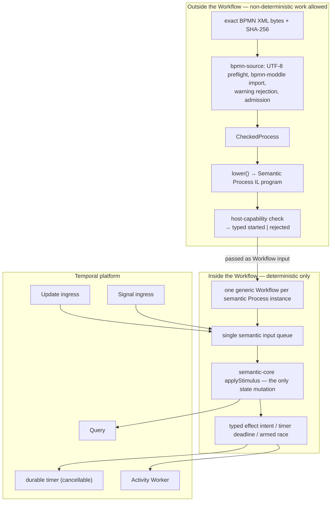

# How the Temporal adapter works, and the problems it had to solve

> *Question: explain how the Temporal adapter works, which challenges it faces, and how the project solved them.*

## The adapter's job in one sentence

**Make a pure state machine survive crashes, restarts, duplicate messages, and multi-day human waits — without letting any of that machinery change what the BPMN process means.**

Every design decision below follows from taking the second half of that sentence literally. `CLAUDE.md` states it as a non-negotiable boundary: *"Temporal provides durability and hidden orchestration work without defining BPMN behaviour."* The interesting engineering is in the word "without".

## What Temporal gives you, and what it costs

Temporal is a *durable execution* platform. You write ordinary-looking code; Temporal records every externally-visible step in an **Event History** and, after a crash, **replays** that history to rebuild your program's in-memory state. A process instance can wait three days for an approval and the wait costs nothing but a history entry.

The price is that your Workflow code must be **deterministic**. Replay re-executes it from the top and requires it to issue the same sequence of durable operations. Anything that could differ between runs — a clock read, a random number, a network call, iteration over a hash map with unstable order, native crypto — corrupts replay.

For a BPMN engine that is a good trade, because a BPMN interpreter is *naturally* a deterministic function of (program, state, input). The whole architecture is arranged to keep it that way.

## Where the work happens



**Nothing is parsed inside the Workflow.** Parsing, admission, and lowering run before `workflow.start`, with an explicit byte limit and a parser settlement deadline. The Workflow receives an already-admitted IL program as input. `CLAUDE.md` makes this mandatory: *"Every new Workflow execution must contain the admitted current executable definition; no fallback constructor may invent it."*

**One Workflow Definition hosts every model.** This is the interpreter-not-code-generator choice. A BPMN diagram is *data* interpreted by a generic Workflow, not a generated Workflow class. `TEMPORAL-EXECUTION-RESEARCH.md` flags the alternative as a false equivalence: *"the BPMN model is content-addressed, profile-identified data interpreted by a generic semantic core; a Temporal Workflow Definition is adapter code and may host many admitted models."* One consequence worth appreciating: deploying a new process requires no deployment at all — and it is why ten new operations arrived without a second Workflow.

## Anatomy of the production Workflow

The production Workflow is `packages/temporal-adapter/src/workflow-implementation.ts` — **536 nonblank lines**. The surrounding package `src` is 7,556 nonblank lines, but nearly all of that is harness, evidence extraction, history decoding, and deliberately-wrong bypass Workflows, not hosting.

That the Workflow grew only 123 lines while the IL grew from 7 operations to 17 is the delegation boundary paying off. Mechanisms that need real host machinery got their own modules instead — `event-race-readiness-scheduler.ts` (262), `message-delivery-ledger.ts` (162), `host-admission.ts` (115), `user-task-detail.ts` (90) — while the Workflow itself kept one shape: *register narrow handlers that only enqueue, then run one loop that owns all state.*

```ts
// 1 · Admit the input before anything else can observe it.
const deployment = deployProcess(start, semanticProcess);
if (deployment.outcome !== CommandOutcome.Committed) {
  throw ApplicationFailure.nonRetryable(
    "Workflow input is not one admitted Semantic Process execution",
    "BpmnProcessAdmissionFailure");
}

// 2 · Queue the start stimulus BEFORE handlers become addressable.
//     Update handlers can run as soon as they are registered — including during
//     replay after a Worker restart — so start must already lead the queue.
enqueueStimulus(acceptedStimuli, pendingStimuli, start);

// 3 · Handlers validate and enqueue. They never touch semantic state.
setHandler(bpmnCompleteUserTaskUpdate, async (stimulus) => {
  enqueueStimulus(acceptedStimuli, pendingStimuli, stimulus);
  await condition(() => commandOutcome(commandResults, stimulus.commandId) !== undefined);
  return commandOutcome(commandResults, stimulus.commandId);
}, { validator: (stimulus) => validateCompleteUserTaskUpdate(acceptedStimuli, stimulus) });

// 4 · One loop. It waits for input, drives the core, and derives host operations
//     exclusively from committed semantic state.
while (true) { /* … */ }
```

The loop body does exactly three things in order: if nothing is queued, it looks at *committed* state to decide whether to await a durable timer, arm a race, invoke an effect Activity, or simply wait for an external command; then it drains the queue through `advanceScenario`, which calls the core; then it checks whether semantic state is terminal and, if so, drains accepted handlers and returns a typed receipt.

Note what is *absent* from that loop: any scenario command list, any count of expected stimuli, any policy decision the core could have made. The adapter *"delegates current projection, stimulus well-formedness, command identity, and same-stimulus comparison to semantic-core operations."* That delegation is the reason the Workflow is 536 lines rather than several thousand.

## The fourteen challenges

| # | Challenge | Resolution |
|---|---|---|
| 1 | Replay demands determinism; an interpreter wants to compute | Pure dependency-free core; hand-rolled deterministic SHA-256; 30 histories replayed every pipeline run |
| 2 | Temporal Events look like a process trace, but are not one | Canonical observations come only from core state; the Event log is never the BPMN trace |
| 3 | Async handlers interleave and can logically race | Synchronous validators, enqueue-only handlers, one mutating loop |
| 4 | At-least-once delivery means duplicate commands | Content-bound Update ID over every semantic field, `REJECT_DUPLICATE`, `sameStimulus` conflict detection |
| 5 | Temporal retries an Activity; BPMN must not see the attempts | Attempts never enter semantic state; typed exhaustion failure with unchanged committed state |
| 6 | Physical wall-clock time is not BPMN logical time | Deadline derived only from committed state; the runner never delivers a timer stimulus |
| 7 | When may the Workflow end? | Semantic-lifetime lifecycle plus `allHandlersFinished()` draining |
| 8 | A command may arrive after the Workflow closed | Retained-Update-first lookup, then receipt, then typed `processClosed` / `processUnknown` |
| 9 | Query results are not durable facts | Query used only as a harness extraction contract, reconciled against durable Events |
| 10 | How do you know the durable mechanism was really used? | Bypass mutations that must fail, plus exact Event History assertions |
| 11 | **The host cannot schedule every semantically legal wait set** | A *separate* pre-start host-capability predicate returning typed `rejected`, never a Workflow crash |
| 12 | **Message delivery needs ingress that is not a host-driven wait** | Passive Signal ingress plus a durable ordered receipt ledger; subscriptions stay core-owned |
| 13 | **Two competing catches can become ready in the same activation** | Activation-tagged readiness accumulator behind a drain barrier; dual readiness **fails closed** rather than picking a winner |
| 14 | **Nested scopes and a called Process look like Child Workflows** | Hosted inside the *same* Workflow through passive Updates; histories asserted to contain zero Child Workflow or cancellation events |

Cross-SDK payload compatibility was challenge 11 in the previous revision. It is no longer imminent — see [the deferred item](#the-one-that-stopped-being-imminent) at the end.

### Challenge 1 · Determinism and replay

The interpreter must be a deterministic function inside the sandbox. Three consequences show up in the code.

**No dependencies, no I/O, no clock.** `rg -n "temporalio|bpmn-moddle|node:" packages/semantic-core/src/` returns nothing. The core cannot read a clock: logical time is a field in `RuntimeState`, advanced only by an explicit `fireTimer` stimulus carrying the exact deadline.

**A hand-rolled SHA-256.** The adapter needs content-bound digests for command identity, and Workflow code cannot call native crypto — that would be a non-deterministic host call. So the adapter carries its own dependency-free SHA-256 plus a canonical typed-tuple encoder, locked by equality tests against native crypto across padding boundaries, multi-block input, and supplementary-plane UTF-8, with the cross-check deliberately executed *outside* Workflow code. A pleasant side effect noted in [08](08-swapping-temporal.md): both are host-neutral and would survive a platform change.

**The closure bound is a determinism and cost boundary, not just a safety net.** After each stimulus commits, the core fires automatic internal steps until it reaches a wait — bounded at 8. Exceeding it is a *harness failure*, surfaced as `BpmnSemanticClosureFailure`, never a semantic outcome. Note the asymmetry this creates with Event History: internal semantic steps do **not** each produce an Event. The owner decision states the boundary qualitatively and refuses to invent a numeric cost model: history growth follows Workflow Task lifecycle and durable operations, while CPU and replay work can still grow with internal closure.

**Replay is a gate, not an aspiration.** Thirty live histories are fetched and replayed inside the same disposable gate that produced them, before the server is discarded. Under the pre-release policy no history is committed as a fixture — see [08](08-swapping-temporal.md#reason-2--no-history-compatibility-debt-exists) for why that is deliberate.

### Challenge 2 · Temporal Commands are not BPMN transitions

This is the conceptual error the architecture is most careful about. A Temporal Command asks the service to do something durable. A BPMN transition changes semantic state. They are not in correspondence:

> *"One semantic core transition may produce no Temporal Command, one Temporal Command, or several Temporal Commands. Conversely, a Temporal Workflow Task may replay many semantic core transitions or merely deliver an operational result."*

The prohibition that follows: *"The adapter must not treat the existence or order of arbitrary Temporal Events as the canonical BPMN trace."* The temptation is real, because Event History *looks* like an audit trail and is right there. But Event order reflects Workflow Task scheduling and host retries, not BPMN token movement. Canonical observations are projected from semantic state, and only from semantic state.

The same document contains a mapping audit worth reading in full for anyone tempted by the obvious analogies — Parallel Gateway ↔ `Promise.all` is marked **false equivalence**, Subprocess with Error Boundary Event ↔ `try`/`catch` likewise, and Exclusive Gateway ↔ `if`/`else` is downgraded to *"implementation technique only"*. Challenge 14 is that audit being honoured under pressure.

### Challenge 3 · Handler interleaving and logical races

Temporal's TypeScript Workflow event loop is single-threaded, which prevents *memory* races but not *logical* ones:

> *"Two handlers can both inspect old state, await, and then apply incompatible changes."*

The resolution is architectural, and it is the reason the Workflow has the shape it does:

1. handlers are narrow and their **validators are synchronous** — a validator is atomic with respect to Workflow code, so it can safely inspect accepted commands;
2. handlers **enqueue** a neutral stimulus and then wait for their outcome;
3. **one loop** consumes the queue;
4. **only that loop** calls the core and mutates state;
5. an Update completes **only after** the core has produced its typed outcome.

The last point matters for correctness of the *caller's* view: an Update that returned before the core committed would be reporting an intention, not an outcome.

A deliberate non-guarantee sits alongside this. Accepted-handler draining *"does not reserve acceptance for a future request and does not impose caller order on concurrent requests"* — two concurrent completions for one occurrence may be accepted in either order; exactly one commits, one is rejected, and **both orders must reach the same final semantic state.** That last clause is a checked property, retained as an unordered one-commit/one-rejection race witness. Serialising callers would have been easier and would have hidden a genuine semantic question.

### Challenge 4 · Duplicate and retried commands

Temporal delivers at least once, and clients retry. A BPMN engine must not double-complete a task.

The first-instinct solution — key commands by the command ID — is wrong, and the project found out *why* by experiment rather than by reasoning:

> *"The lifecycle experiment proves that the pinned server returns the first Update result when the same Update ID is reused with a different payload, without invoking the Workflow handler. A command-ID-only Update key would therefore bypass the semantic core's conflicting-payload check."*

So a caller could send command `c1` completing task A, then send `c1` completing task B, and receive A's answer for B's request — with the Workflow never seeing the second call. The fix is a **content-bound Update ID**: a SHA-256 over the semantic command ID, the stimulus kind, and *every semantic field* of the exact well-formed stimulus. An honest retry produces the same ID and correctly recovers the same result. A different payload produces a different ID, reaches the Workflow, and hits `requireSameCommandStimulus`, which raises the non-retryable `BpmnCommandIdentityConflict` — rejecting the Update without failing the Workflow Task.

**"Every semantic field" grew teeth when task data arrived.** Complete User Task Update identity now includes the entire canonical submitted patch, so an exact duplicate delivery coalesces while *changed patch content under a reused command ID* reaches the identity-conflict boundary. Without that, "resubmit the form with a different answer" would have silently returned the first answer.

Three further identity rules complete the picture. The Workflow ID is `bpmn-process-sha256:` plus the digest of the typed tuple `["semanticProcessInstance", processInstanceId]`, started with `workflowIdReusePolicy: "REJECT_DUPLICATE"` — so a late command cannot conjure a second instance. Update-With-Start ingress is forbidden for the same reason. And effect Activities carry an idempotency key derived from the committed intent *including sorted arguments*, with witnesses for field variation, under-inclusion, cross-instance collision, and host-identity over-inclusion.

The whole mechanism is protected by a seeded **command-ID-only Update-key mutation** that must make the payload-conflict witness fail.

### Challenge 5 · Host retries versus engine-visible retries

CIB Seven has its own retry and incident model, visible to users. Temporal has Activity attempts, invisible to BPMN. Conflating them would leak host policy into semantics.

The invariant is stated flatly: *"Temporal retry attempts never silently become CIB-visible attempts."* Concretely, the effect Activity runs with a bounded policy — 2 s start-to-close, 10 s schedule-to-close, two attempts, fixed 100 ms backoff, no heartbeat — and none of that appears in semantic state. On exhaustion the Workflow raises the typed `BPMN_EFFECT_EXECUTION_EXHAUSTED` failure **with the last committed state unchanged**, which is the property that makes it safe.

The code is careful about one more distinction that is easy to get wrong:

```ts
// Cancellation recovery is unmodeled and must retain its host classification. Only an
// exhausted non-cancelled Activity execution becomes this capsule's typed adapter failure.
if (!(error instanceof ActivityFailure) || error.cause instanceof CancelledFailure) {
  throw error;
}
```

A cancelled Activity is *not* reclassified. Cancellation recovery is listed as absent, so the adapter refuses to invent a meaning for it — it propagates the host failure unchanged. Choosing to be explicitly unable to handle something is often the more expensive engineering decision.

The separation is also evidenced from the *other* side. The CIB lane retains a raw-only fail-once execution showing the engine's public retry decrement `3 → 2`, two delegate invocations, and clean public re-execution — and requires canonical equality to the retained plain-success execution. So "CIB-visible retries exist and are visible" and "Temporal attempts exist and are invisible" are both positively demonstrated, not merely asserted to differ.

### Challenge 6 · Physical time versus logical time

Temporal timers are *durable minimum-duration* wakeups. They may fire late. BPMN semantics must not depend on how late.

The resolution inverts the obvious direction of control. The runner **never delivers a timer stimulus**. Instead the Workflow reads committed state, finds the projected deadline, computes the remaining duration, sleeps, and then *derives* the exact typed firing stimulus from committed state:

```ts
const remainingMs = timer.deadlineMs - state.logicalTimeMs;
// The durable timer is derived only from committed core state. Physical lateness is
// refinement stutter in this race-free capsule; semantic input carries the exact deadline.
await waitForTimer(remainingMs);
enqueueStimulus(acceptedStimuli, pendingStimuli, timerFiringStimulus(timer));
```

So the semantic deadline is authoritative and physical lateness is invisible — logical time advances to the deadline, not to "now". A **timer-bypass mutation** proves the durable timer was really used rather than shortcut in Workflow code, and Event History is asserted to contain the exact timer mechanism. The mandatory full-server witness stops the Worker *before* the due boundary, waits past due time with no poller running, starts a replacement Worker, and reconciles the receipt and history.

The comment also does something valuable: it *scopes* the argument. "Refinement stutter in this **race-free** capsule" is a conditional claim, and `PROJECT-DESIGN.md` records the matching reopen trigger — the account is valid *"only for the race-free capsule and must be reopened before any competing input, second timer, cancellation, or physical-lateness observation enters scope."*

**That trigger has since fired, and challenge 13 is the answer.** A timer racing a message is exactly the "competing input" case, and it was not solved by extending this argument — it needed a new mechanism and a new failure mode.

### Challenge 7 · When may the Workflow end?

A Workflow that ends too early loses an accepted command. One that never ends grows history forever and needs Continue-As-New plus a retention policy.

The selected account is a **semantic-lifetime Workflow**: the host lives exactly as long as the semantic instance is active. When the core reaches terminal state, the loop applies every already-accepted input so each accepted handler gets a real semantic result, waits for `allHandlersFinished()`, and returns one `CompletedProcessReceipt`. It grants no grace period and waits for no future command.

Temporal itself decides whether a racing Update was accepted before the completion boundary. If accepted, it must complete with a semantic result before the Workflow ends. If not, ingress resolution (challenge 8) handles it. The two rejected alternatives — keep the Workflow alive forever, or add a durable router now — are recorded in the lifecycle spec with their costs.

### Challenge 8 · Commands after closure

Once the Workflow is gone, what does a late command get? "Rejected" would be a lie, because *rejected* is a semantic outcome meaning the core considered and refused it. The core never saw this one.

So the adapter has its own typed result union, deliberately outside semantic outcomes:

```ts
type ProcessCommandResult =
  | { kind: "semantic";       commandId: string; outcome: CommandOutcome }
  | { kind: "processClosed";  commandId: string; receipt: CompletedProcessReceipt }
  | { kind: "processUnknown"; commandId: string; processInstanceId: string };
```

Resolution order matters and closes a real race: derive the content-bound Update ID; try the Update; if Temporal reports closed or not found, **look up that exact Update ID first**; return its original result if retained; otherwise validate the retained completed receipt and return `processClosed`; return `processUnknown` only when neither remains. The Update-first step handles the case where Temporal accepted the command but the caller lost the response as the Workflow completed.

The lifecycle spec forbids the shortcut explicitly: `processClosed` *"must not be converted to `CommandOutcome.Rejected`, appended to the canonical BPMN trace, or presented as a Lean/CIB/TypeScript semantic transition."*

This produces the most interesting evidence split in the project. For the sequential stale-completion scenario, CIB Seven, Lean, and the core all agree on semantic *rejection*; Temporal agrees exactly on the prefix through completion and then returns adapter-owned `processClosed`. Rather than coerce one into the other, the pipeline records a **split target relation**. And to keep genuine four-target agreement available, a second scenario keeps a parallel sibling alive so the stale command actually reaches the core. Two scenarios where a lazier design would have had one, because the difference is real.

The honest limit: availability is bounded by Temporal's history retention. `processUnknown` cannot distinguish "never existed" from "expired". A tombstone or router is named as the future option, with its own required design work.

### Challenge 9 · Query is not a durable fact

An invariant from the research document: *"Query output is not a durable semantic fact."* A Query runs against whatever in-memory state a Worker currently holds; it issues no Event and is not part of the durable record.

The adapter therefore refuses to make Query the production observation API. Post-completion Query extraction exists, but is declared *"a harness-only evidence-extraction contract, not the production canonical-observation API."* And it is not trusted on its own: the runner reconciles every Query-derived command outcome against the corresponding completed Update result payload in Event History, and the terminal Query state against the validated completed receipt. A failed Update is classified as harness infrastructure failure rather than parsed as a malformed semantic outcome, and the start command is explicitly excluded from Update-result reconciliation because it is a Workflow argument, not an Update. Only intermediate stable-state observations remain Query-only, and those are compared independently against the pure core.

One Query *did* graduate toward product use, under tight bounds: the MVP's known-Process User Task detail Query, over the complete active occurrence and caller-selected committed Process-variable names, with absent and unselected names remaining absent and Activity-local scope never exposed. A production task-discovery architecture beyond Query-by-known-ID is still an open decision, and Search Attributes remain *"candidate projections"* that must be revalidated against exact semantic state — never the source of truth.

### Challenge 10 · Proving the durable mechanism was actually used

This is the subtlest challenge, and the answer is a technique worth stealing.

Suppose the Workflow "waits" for a timer by immediately continuing, or "invokes" an Activity by computing the result inline. Every canonical observation would be identical. The scenario passes. The durability claim is false and nothing catches it — because the claim is about *how* the result was produced, and canonical observations deliberately hide that.

The resolution is **bypass mutations**: alternative Workflow implementations that fabricate the result instead of using the durable mechanism, retained in the tree with the requirement that they *fail*. There were three; there are now a dozen, in dedicated modules (`bypass-mutation.ts` 514 lines, plus per-mechanism mutation Workflows), backed by exact Event History assertions.

Two of the newer ones are a genuine step up in sophistication, because they attack a *premise* rather than a value:

- **The Error-propagation bypass** fabricates a post-cancellation result that matches the expected public prefix *exactly* — so the obvious assertion passes — while retaining pre-throw semantic state. It is caught only because the *next* stale sibling command then commits instead of being rejected, producing a wrong durable suffix. A bypass that survives the first observation and dies on the second is a much harder test to design than one that differs immediately.
- **The event-race barrier and single-batch-premise removals** delete the mechanism that makes challenge 13's fail-closed detection possible, and each must invalidate its owning assertion. That is a mutation against an assumption about the SDK, not against the project's own code.

This is the same logical move as a non-law in the Lean lane (see [01](01-theorem-techniques.md#13-non-laws-proving-the-attractive-wrong-answer-wrong)): don't just confirm the intended behaviour, refute the plausible cheat.

### Challenge 11 · Host capability is not semantic admission

**New since the previous revision, and the most quietly important of the four.**

The previous revision noted a limitation in passing: if committed state ever offered both a timer wait and an effect wait at once, the Workflow raised `BpmnHostWaitAmbiguity` and refused. That was a *runtime* failure discovered at the moment of ambiguity, and it was accidentally protected by whole-topology admission predicates that happened never to admit such a program.

When those predicates were removed, the accident stopped protecting anything. Owner decision 10 named the problem precisely: *"The current Temporal host accepts exactly one committed timer or one committed effect wait at a time and rejects a mixed timer/effect set; this is an adapter limitation accidentally protected by current whole-topology admission, not BPMN meaning."* And it fixed the shape of the answer: *"Violation must be a deterministic pre-start adapter admission result, never a non-retryable Workflow crash."*

So `host-admission.ts` now answers a *separate question* from semantic well-formedness, before Workflow creation, and the production start API returns typed `started | rejected`. Its own documentation is the clearest statement of the boundary:

```ts
/**
 * Conservatively proves the current single-host-driven-wait contract.
 *
 * User Task and Message waits are passive ingress and may coexist. A token
 * split combined with a timer or effect can create more than one host-driven
 * branch, which requires a scheduler that this adapter does not implement.
 * Event-Based Gateway operations retain their own exhaustive class. The host
 * admits one exact Message/PT1S managed race and rejects every composition that
 * would require a second host-driven branch or managed scheduler instance.
 */
```

Three things make this good engineering rather than bureaucracy. The classification is **exhaustive over operation kinds**, and mutation-guarded against omitting one — so adding an eighteenth operation forces a host decision rather than defaulting to "probably fine". The distinction it draws is real and not obvious: **passive** ingress (User Task Updates, Message Signals) can coexist freely because the host is not scheduling anything, while **host-driven** waits (timers, effects) cannot, because each needs the loop's attention. And every capsule since must either preserve the bound or build the scheduler — the Inclusive Gateway had to classify `selectMany` as token-splitting and accept that combining it with a timer is rejected as `concurrentHostDrivenWaits`.

The cost is honest and visible: a general multi-wait scheduler does not exist, several remaining BPMN mechanisms will need one, and the adapter says so in a typed pre-start result instead of finding out later.

### Challenge 12 · Message delivery, without turning a subscription into a host wait

Messages arrive from outside on no schedule. The obvious hosting is a Signal — but a Signal is fire-and-forget with no return value, while a BPMN delivery has a semantic *outcome* the caller needs.

The resolution keeps the core's ownership intact and adds a durable ledger beside it. The Signal handler *"only validates, records, and enqueues well-formed delivery; the main loop alone calls the core."* Outcomes land in an ordered `message-delivery-ledger.ts`, readable afterwards through a result Query and recoverable from the completed receipt. Crucially, `host-admission.ts` classifies Message waits as **passive ingress**, so a subscription does not consume the single host-driven-wait budget of challenge 11.

Three failure modes are kept apart, which is where most of the value is:

| Failure | Where it is caught | Result |
|---|---|---|
| Malformed request | before a Signal is ever submitted | client-side rejection, no history entry |
| Well-formed, conflicting identity | reaches the Workflow | durable `BpmnCommandIdentityConflict`, no Workflow Task failure |
| Well-formed, wrong or stale channel | reaches the **core** | ordinary semantic rejection with state preserved |

The third row is the one that matters semantically: a wrong-channel Signal is accepted *as transport* and then refused *as meaning*, so the transport layer never gets to decide what a valid Message is. The witness makes that explicit — it accepts a wrong-channel Signal, gets semantic rejection, then stops the Worker, submits the exact Signal, restarts, and observes committed delivery. Five exact Signal payloads are asserted in history and a seeded payload substitution must fail.

The Receive Task capsule then reused all of it. Same Signal, same ledger, same Workflow bundle — only the channel arm differs. Its discriminator is the sharpest in the set: a test-only program mutation replaces the `directMessage` arm with a complete `operationMessage` arm carrying the same Message ID, and the exact direct delivery must reject while only the substituted arm completes. That proves *hosting does not erase the selected channel*, which is precisely the claim a shared transport puts at risk.

### Challenge 13 · Coalesced readiness — the one that fails closed

**The hardest problem in the four days, and the answer is a refusal.**

An Event-Based Gateway arms competing catches — here one operation-addressed Message and one `PT1S` Timer — and exactly one must win. Challenge 6's argument that physical lateness is invisible depended on there being nothing to race against. Now there is.

The specific hazard is not "which is faster". It is that Temporal may deliver a Signal callback and a timer callback **in the same Workflow activation**, and callback order within an activation is a host scheduling detail. Picking the first callback would make a Temporal implementation detail decide a BPMN outcome — exactly what the whole architecture exists to prevent.

The mechanism has three parts. Every readiness callback is **tagged with the current Workflow activation**. A required **microtask drain** closes that activation before any batch is classified — so the code sees the complete set of things that became ready together, not the first arrival. And if that set contains *both* competitors, the Workflow raises typed `BpmnEventRaceOrderingUnavailable` **before advancing the core**.

That last step is the interesting design decision. The adapter had three options: pick one (host decides BPMN meaning — forbidden), pick by a documented rule such as Message-first (a portable-looking choice that is still the host inventing semantics), or refuse. It refuses. `IMPLEMENTATION-MAP.md` calls it *"fail closed on dual readiness before core advancement"*, and the guard set around it is unusually adversarial:

- the drain barrier's removal must invalidate its owning assertion;
- the **SDK single-batch premise** — that the installed SDK really does deliver these callbacks in one activation — has its own direct job-level witness, and removing that premise must fail;
- imposing a fixed host priority must fail;
- bypassing core selection must fail;
- and a separately activated *wrong* Message must leave the original Timer intact with no deadline drift.

The second bullet is the one to notice. The correctness argument depends on a behavioural property of the pinned Temporal SDK, so the project pinned the premise with a test rather than assuming it — and made removing the premise a failing mutation. That is the honest way to depend on someone else's scheduler, and it is also a portability coupling ([08](08-swapping-temporal.md)).

Both winner directions are evidenced under Worker absence, the losing Timer is genuinely cancelled, and no event-race history contains an Activity, Child Workflow, effect, or cancellation event.

### Challenge 14 · Nested scopes and a called Process are not Child Workflows

The mapping audit flags Subprocess-with-Error-Boundary ↔ `try`/`catch` as a false equivalence. Two capsules put that under real pressure, because a BPMN Call Activity looks *exactly* like a Temporal Child Workflow, and an embedded Sub-Process looks exactly like a nested cancellation scope.

Both were hosted **inside the same Workflow**, through the existing passive Update mechanism, with the core owning all scope state. `host-admission.ts` classifies `enterScope`, `completeScope`, `invokeProcess`, and `returnProcess` as internal closure — not host-driven waits — so a child scope adds no host machinery at all.

The evidence is stated as an absence, which is the right shape for this claim. Every scope, Error-propagation, and Call Activity history is asserted to contain **zero Signal, Timer, Activity, Child Workflow, effect, or cancellation events** — only Updates. Call Activity additionally asserts *exactly three distinct Update pairs* and proves that an exact committed retry adds no fourth accepted Update.

Why refuse the obvious mapping? Because a Child Workflow would give the called Process a *host* identity, and BPMN semantic instance identity would then be derived from Temporal rather than from the semantic account. The capsule keeps them separate by construction: the caller/root Workflow address hosts the execution, while the called task carries its own derived semantic identity, and one bug found in closure review was precisely a confusion between the two — the lifecycle owner now *"separates host and semantic task addresses"* (commit `4eaa0eb`). The identity-erasure mutation exists to catch that class permanently: erase the called identity and the Query identity inverts.

`IMPLEMENTATION-MAP.md` keeps the exclusion explicit — Temporal Child Workflow identity is listed as outside the implemented profile — so the refusal is a recorded decision, not a gap someone forgot to fill.

## The runnable product command

New in this window, and the first thing in the repository a user could plausibly *run*: one command-line runtime that connects to a **caller-supplied** Temporal address, starts a Worker for the generic BPMN Workflow, admits exact BPMN XML before Workflow creation, starts one semantic Process instance, and waits until it completes.

The boundary discipline is the notable part. The command *"does not start an embedded or ephemeral Temporal server, choose frontend ports, or bind a server port"* — a connection failure reports the supplied address and stays an infrastructure failure. It uses the *same* source compiler, IL program, semantic core, production Workflow, and Update boundary as the evidence path; a model-specific Workflow or generated file is explicitly *"not an MVP shortcut"*. And an unsupported document returns typed pre-start admission rejection **without opening a connection**.

Its dummy User Task actor is worth naming precisely because it is the kind of thing that quietly becomes a product claim. It is *"an explicit MVP host profile, not BPMN User Task meaning and not CIB human-resource compatibility"* — it observes one sole task, waits a configured non-blocking delay, checks the *same* task is still the only one, then submits configured `string`/`null` values through the real completion Update. It refuses zero, multiple, unexpected, unavailable, or changed tasks. UI, rendering, forms, identity, authorization, and a task inbox all remain absent, and the implementation map says so.

## What the adapter deliberately does not have

Recorded as absent, and each absence is a decision:

- Continue-As-New, Search Attributes, Activity heartbeats, a task inbox;
- a general multi-wait host scheduler — hence challenge 11's typed pre-start rejection;
- host cancellation recovery; timer forms, races, or cancellation beyond the exact capsules;
- Message payloads, key-based or global correlation, modeled Message throw, cross-Workflow Message routing;
- Child Workflow identity for called Processes;
- committed Event History fixtures, patch branches, version markers, migration functions, deployment fallbacks — all forbidden by the pre-release policy until a durable baseline is approved;
- semantic policy copies in the Workflow;
- a production canonical-observation API;
- any protocol that imposes caller order on concurrent distinct commands;
- a JUEL evaluation Activity, Java evaluator Worker, or cross-SDK evaluator evidence.

The pre-release absences are the load-bearing ones for portability, and [08](08-swapping-temporal.md) explains why.

## The exact refinement claim

**Established:** for the 28 answer-free scenarios, the durable host preserves the pure core's canonical observations under ordered, duplicate, concurrent, post-terminal, Worker-down-at-timer-due, Worker-down-at-effect-pending, Worker-down-in-both-race-winner-directions, and Worker-replacement-after-committed-throw schedules; **56 isolated executions and 30 replayed histories** are green; the timer, Signal, Activity, receipt, and Update mechanisms are asserted in Event History with exact counts, and the *absence* of Child Workflow and cancellation events is asserted where the claim requires it; a dozen bypass mutations fail as required, including two that attack a premise rather than a value.

**Not established:** refinement as a theorem. There is no Temporal-correspondence proof and none is planned — the reason given is that host concerns are deliberately kept out of the semantic account. Refinement is evidenced by replay and history checks over a finite scenario set, and the phrase used throughout is *"the tested durable host"*, not "the adapter".

The distinction is not pedantic, and challenge 13 is the proof that it matters. Every property here holds for schedules the gate actually runs. When a genuinely new schedule arrived — two competitors ready in one activation — the honest answer was not "our refinement argument covers it" but a new mechanism, a new typed failure, and a mutation against the SDK premise the argument now rests on. The adapter's position is that it has solved fourteen named problems on a bounded set of executions, and that the fifteenth is always the one you did not schedule.

## The one that stopped being imminent

Challenge 11 in the previous revision was **cross-SDK payload compatibility**: the approved Exclusive Gateway capsule was to put a Java Activity Worker on a dedicated task queue, because the pinned CIB JUEL runtime is Java and cannot run in the TypeScript Workflow sandbox.

That did not happen. Conditional routing shipped with a project-owned five-form Boolean language evaluated *inside* pure core closure — *"without an evaluator Activity or expression-specific Temporal Event"* — and JUEL was deferred with its 38-jar dependency graph audited and unadopted. The Java Worker, the wire contract, and the cross-SDK evidence obligation are all still absent, and so are the two related open items: the deployment-time validation transport (Temporal cannot invoke an Activity outside a Workflow) and the disposition of a suspended evaluation after exhausted attempts.

Those problems are real and will return with any CIB expression-compatibility claim. They are simply not on the adapter's plate today, and the previous revision was wrong to present them as the next thing to be solved ([12 §7](12-corrections-log.md#7--implementation-is-blocked-on-approval-of-three-java-dependencies--void)).
