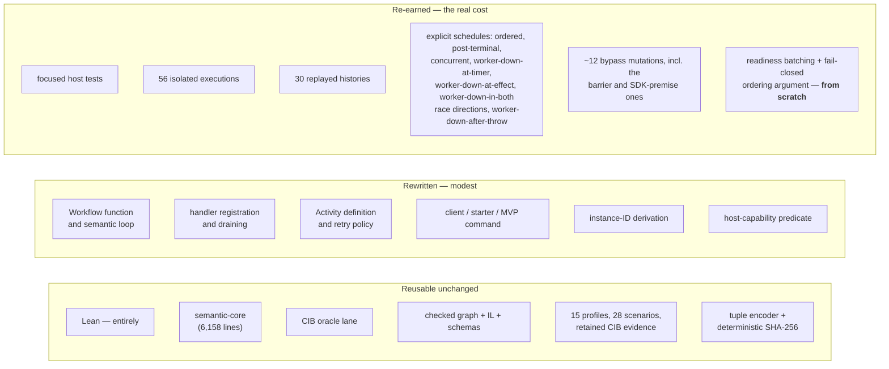

# Could Temporal be swapped later?

> *Question: would it be feasible to exchange Temporal later with a different durable-execution engine?*

Feasible — and the project is in unusually good shape for it. Three structural reasons, all verifiable from the current tree. Read [07](07-temporal-adapter.md) first if you want to know what would actually be replaced.

**What changed since the previous revision:** the answer is unchanged, one coupling was retired before it arrived, and **one genuinely new and sharper coupling appeared** — a dependency on the pinned SDK's activation-batching behaviour. That last one is the first place where the project's correctness argument rests on a behavioural property of Temporal itself rather than on an API shape.

## Reason 1 — the semantic core has no host dependency, verifiably

Not just documented; measured. Running

```sh
rg -n "temporalio|bpmn-moddle|node:" packages/semantic-core/src/
```

returns **nothing** across all 28 core modules and 6,158 nonblank lines. No Temporal SDK, no BPMN parser, not even a Node.js built-in. `IMPLEMENTATION-MAP.md` lists "Temporal SDK" in the core's *explicitly absent* column, and the code agrees.

> **⚠ Update — the layering violation this section originally under-reported is fixed, and has stayed fixed.** Independent review found that while *host* independence held, *layer* independence did not: A12 delegate bean names and Camunda extension namespaces were embedded as literal types and admission predicates inside the semantic core and Lean's production lowering. Commit `b0a4002` neutralised them — see [05](05-semantic-core-and-il.md#the-effect-descriptor-is-neutral--and-it-was-not-always).
>
> Six further capsules have since closed and **none touched the effect descriptor**, which is the predicted payoff observed rather than assumed. Neither violation was host coupling, so the answer to the swap question never changed — but the layering claim can now be read as a general clean bill of health rather than a narrow one.

The decision that closed the more dangerous leak is recorded as "R5": current-state task projection, stimulus well-formedness, command identity, and same-stimulus comparison were all moved behind core-owned operations, so *"the Workflow now delegates instead of scanning trace history or maintaining policy copies."*

A thin, delegating Workflow is a replaceable Workflow — and the measurement bears it out better than last time, because it now has a stress test. Ten IL operations were added in four days. The **production** Workflow, `packages/temporal-adapter/src/workflow-implementation.ts`, grew from 413 to **536 nonblank lines** — 123 lines for ten operations, because most of them are internal closure the host never sees.

The package's `src` totals 7,556 nonblank lines, and the distribution is the point:

| Module | Nonblank | Role |
|---|---:|---|
| `runner.ts` | 592 | harness |
| **`workflow-implementation.ts`** | **536** | **production hosting** |
| `bypass-mutation.ts` | 514 | deliberately-wrong Workflows |
| `runner-support.ts` | 512 | harness |
| `process-client.ts` | 465 | production ingress and lifecycle resolution |
| `harness-evidence.ts` | 419 | evidence extraction |
| `completion-delivery.ts` | 290 | harness scheduling |
| `history-evidence-decoding.ts` | 288 | history decoding |
| `dummy-user-task-actor.ts` | 285 | MVP host simulation |
| `event-race-readiness-scheduler.ts` | 262 | production hosting |
| `message-delivery-ledger.ts` | 162 | production hosting |
| `deterministic-sha256.ts` | 158 | host-neutral |
| `host-admission.ts` | 115 | production pre-start capability |
| … plus ~11 mutation-Workflow modules | | deliberately-wrong Workflows |

Add the production rows and the genuinely Temporal-shaped surface is roughly **1,600 lines**. Everything else is harness, evidence, or code whose job is to fail.

## Reason 2 — no history-compatibility debt exists

This is normally the thing that makes durable-execution platforms impossible to leave. In-flight instances replay against recorded histories, so their behaviour depends on the exact code shape that produced them. Over time you accumulate version markers and `patched()` branches, and every one is a permanent migration obstacle.

The pre-release policy forbids exactly that until a durable baseline is explicitly approved:

| Debt item | Status |
|---|---|
| Retained Event History fixtures | absent |
| Workflow version / patch branches | absent |
| Migration functions | absent |
| Deployment fallbacks | absent |
| Compatibility readers, embedded format counters | absent |

Every local gate *"starts clean state, replays histories produced during that gate, and discards the server state afterward."* So right now there is **nothing to migrate** — 30 histories are created, replayed, and thrown away per pipeline run.

The policy is not merely stated; it is guarded. A pre-release infrastructure guard rejects embedded format counters, retired representation names, and milestone compatibility paths. That is what made the four days of atomic replacements possible: `terminate` → `reachNoneEnd` + `completeScope`, the flat variable field → scoped variables, and `MessageChannel` → a closed two-arm union each replaced *every* producer, consumer, schema, fixture, and mutation in one change, with no parallel reader anywhere.

This is a deliberate, temporary state with a named exit. `PROJECT-DESIGN.md` lists five things the owner must approve before the first immutable release or persisted production history — which artefacts become immutable, the Event History baseline and version markers, migration/patching/rollback rules, retained replay fixtures and their provenance, and support windows. From that point on, history compatibility becomes mandatory evidence based on real retained state. **The window in which swapping is cheap is the window before that approval.**

## Reason 3 — host identity and host outcomes are already typed apart from semantics

These are stated invariants, not intentions:

- *"Definition identity, semantic instance identity, and host-runtime identity remain distinct."*
- *"Temporal transport retries remain distinct from CIB-visible retries and incidents."*
- The typed `semantic` / `processClosed` / `processUnknown` ingress result is explicitly adapter-owned and *"kept outside semantic outcomes."*
- Query and canonical result projections are verified to contain no Workflow ID, Run ID, or Update ID.

Those are the seams you would cut along, and they already exist — with tests asserting the absence of host identity in projections, which is stronger than a convention.

**The Call Activity capsule stress-tested this seam and found a real bug in it**, which is better evidence than the invariant surviving untested. A BPMN Call Activity is the one construct where host and semantic identity are most tempting to conflate: the obvious hosting is a Child Workflow, and then the called Process's identity *is* a Temporal identity. The project refused that mapping and hosted the called Process inside the same Workflow — and its closure review still found the two addresses confused in the lifecycle owner. Commit `4eaa0eb` (`fix(temporal): separate host and task addresses`) fixed it, and an identity-erasure mutation now guards the class permanently. A seam that has been broken once and repaired with a guard is a seam you can trust more than one that has never been loaded.

Worth adding: `applyStimulus` — one stimulus in, committed state plus observation out — is a **pure state-machine step**. That is the most portable shape possible for a durable host to drive. A callback-based or event-sourced core would have been far harder to move.

## What would actually be rebuilt



The dominant cost is **evidence, not code**, and the gap widened. Proving "the runner never delivers a timer stimulus, the Workflow derives it from committed state, and the execution history contains the exact timer mechanism" is a claim *about Temporal's history format*. You cannot port that; you re-earn it against the new host. Same for the bypass mutations, which are the only thing standing between "the durable mechanism was used" and "the result happened to be right".

Box `B6` is new and is the one that would genuinely hurt. See the third coupling below.

A pleasant irony in the "keep" column: the hand-rolled deterministic SHA-256 and canonical tuple encoder exist *only* because Temporal Workflows cannot call native crypto without breaking determinism. They are host-neutral, and they would remain useful anywhere.

## The three couplings that would constrain your choice

### 1 · Update-shaped command ingress

The production lifecycle is built on **Temporal Updates**: content-bound Update IDs, `REJECT_DUPLICATE`, accepted-handler draining, and retained-Update-first result resolution with retention-bounded recovery.

Abstractly, that is: *a synchronous request into a running instance, deduplicated, whose result is durably re-readable afterwards.*

Durable-execution platforms diverge sharply on exactly this axis:

| Ingress style | Fit |
|---|---|
| Durable RPC into keyed objects with idempotency keys (Restate-style virtual objects) | Maps well — arguably better, since per-key serialisation hands you ordering you currently arrange by hand |
| Idempotency-keyed workflow invocation (DBOS-style) | Maps with moderate work; the "re-read a previous command's result" story differs |
| Fire-and-forget external events only | Forces a genuine protocol change — returning a semantic outcome synchronously is not a primitive there |

Two related pieces would need re-deciding rather than porting. "Retention-bounded accepted-result recovery" is a policy borrowed from Temporal's retention semantics; it is already correctly classified as adapter-owned rather than BPMN semantics, but every platform answers "how long can I fetch a completed command's result" differently. And the `processClosed` / `processUnknown` distinction exists precisely *because* Temporal cannot tell "never existed" from "expired" — a platform with different retention behaviour might collapse or refine that union.

### 2 · Signal-shaped fire-and-forget ingress, with a project-owned result ledger

**New since the previous revision, and it *reduces* coupling.**

Message delivery arrives as a Temporal **Signal** — fire-and-forget, no return value. Since BPMN delivery has a semantic outcome the caller needs, the adapter built its own ordered durable **result ledger** beside it, readable through a Query and recoverable from the completed receipt.

That is the bottom row of the table above, already solved with project-owned code. The interesting consequence for portability is that a platform offering *only* fire-and-forget events — the row marked "forces a genuine protocol change" — is now substantially less scary than it was, because the outcome-returning layer exists as adapter code rather than as a platform feature. Whichever ingress a new host provides, one of the two patterns already has a project-owned answer.

### 3 · The pinned SDK's activation-batching behaviour — the sharp one

**Genuinely new, and qualitatively different from the other two.** Couplings 1 and 2 are about *API shape*: does the platform offer this kind of call? This one is about *runtime scheduling behaviour*, which is a much harder thing to check a replacement against.

The Event-Based Gateway must commit exactly one winner when a Message and a Timer compete. The hazard is that both readiness callbacks can arrive in the **same Workflow activation**, and callback order within an activation is a host scheduling detail. Letting it decide would make Temporal choose a BPMN outcome.

The adapter's answer tags every callback with the current activation, requires a microtask drain to close that activation before classifying the batch, and **fails closed** with typed `BpmnEventRaceOrderingUnavailable` if both competitors are in it — rather than picking a winner by any rule.

The correctness of that mechanism rests on a behavioural premise: *the installed SDK really does deliver these callbacks in one activation, and a microtask drain really does close it.* The project handled this the right way — it pinned the premise with a direct job-level witness against the installed SDK, and made **removing the premise a failing mutation**, alongside mutations for removing the barrier, imposing a fixed priority, and bypassing core selection.

For a swap, that means:

- the mechanism is **not portable as designed**. A different host's concurrency model may batch differently, not batch at all, or expose no activation concept — in which case fail-closed detection has to be re-derived from that host's actual semantics, not adapted from this one;
- but the *contract* is portable, and it is the valuable part: **coalesced readiness must be detected and refused, never silently ordered.** A new host needs its own answer to "how do I know two things became ready together?", and the project already knows that question must be answered rather than assumed;
- and the guard set ports as a specification. "Removing the ordering premise must fail" is host-independent even when the premise itself is not.

This is the first place the project depends on Temporal's behaviour rather than its API, and it is worth saying plainly that it is a real constraint. It is also handled about as well as such a dependency can be: named, tested, and mutation-guarded rather than assumed.

### And one coupling that was retired before it arrived

The previous revision reported an incoming fourth coupling: a **Java** Activity Worker on a dedicated task queue for the pinned CIB JUEL runtime, plus a still-unspecified transport for deployment-time expression validation, adding a cross-SDK payload contract to the swap surface.

None of that exists. Conditional routing shipped with a project-owned Boolean language evaluated inside pure core closure, and JUEL is deferred with its dependency graph audited and unadopted. The swap surface is *smaller* than predicted, and the reason is worth generalising: choosing a dependency-free total language over delegating to a pinned runtime removed a portability coupling as a side effect of a semantics decision.

## What to do now: nearly nothing

Do **not** build a host-abstraction layer. There is no second host consumer, and the project's own rule is to name a concrete consumer before generalising.

Two cheap, worthwhile things, both documentation-only:

1. **State the ingress requirements as host capabilities**, not as lists of Temporal features — *"synchronous, deduplicated, durably-resolvable command ingress with a re-readable result"* for coupling 1, and *"at-least-once event ingress"* for coupling 2, since the result ledger is already project-owned. That turns a future migration question from "how do we emulate Updates?" into "does this platform provide the capability?".
2. **State the ordering requirement as a host capability too**, which is the newer and more valuable one: *"a way to observe that two external readiness signals arrived together, so coalesced readiness can be refused rather than ordered."* Right now that requirement is expressed as an activation-tagging implementation plus a pinned-SDK premise. A replacement host would need the requirement, not the implementation — and the requirement is the thing nobody would think to look for unless it was written down.

Both are framing, and framing now is the one place where a sentence saves real work later.

> **Confidence note.** The 29 July version of this assessment carried a caveat that it had not read `TEMPORAL-PROCESS-LIFECYCLE-SPEC.md` or reviewed `workflow-implementation.ts` line by line. Both were read in full for the 30 July revision, and re-read for this one along with `host-admission.ts` and `event-race-readiness-scheduler.ts`. The activation-batching coupling described above did not exist at the previous revision and was found by reading the new scheduler module — which is a reasonable illustration of why the caveat mattered. The remaining unread surface is the full Temporal research document; its open-decisions list is summarised in [07](07-temporal-adapter.md) and [11](11-open-questions.md).
