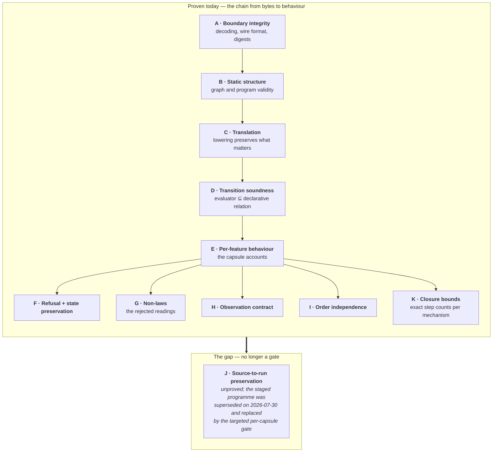

# Property inventory

*What is actually proven today, grouped by category with named representatives, and what the plan is to extend it.*

The repository's generated publication statistics count **815 public theorem declarations** and **93 supporting lemmas** among 2,974 declaration commands, across 28,795 lines of Lean code. This inventory names representatives, not every theorem.

## 9.1 The shape of the inventory

Categories A–D form a *chain*: bytes decode correctly, the decoded structure is valid, translation preserves meaning, and execution respects the rulebook. Categories E–I and K are the *content* — what the engine actually does. Category J is the missing link that would connect the BPMN-level account to the program-level account universally rather than per-fixture; by owner decision it gates nothing. See [03](03-is-lean-goal-driven.md).

**Category K is the visible fingerprint of the targeted preservation gate.** Every capsule closing under that gate must state its exact closure step count rather than inherit a bound, which produces a family of small, sharp theorems that a project without such a gate would not have.

## 9.2 Proven today — by category, with representatives

**A · Boundary integrity** — nothing downstream means anything if the input was misread.

| Representative | Kind | Property |
|---|---|---|
| strict JSON decoder locks | executable locks | duplicate keys, unpaired surrogates, and non-safe integers are rejected, not coerced |
| Unicode scalar-order locks | executable locks | identifier comparison uses scalar-value order with no normalisation, on both BMP and supplementary-plane input |
| exact-key / closed-variant decoders | executable locks | an unknown field or an out-of-set enum value rejects the whole document |
| deterministic SHA-256 equality locks | executable locks | the hand-rolled digest matches native crypto across padding boundaries, multi-block input, and supplementary-plane UTF-8 |
| `delimiter_and_non_ascii_identity_uses_utf8_lengths` | finite lock | Call Activity's length-prefixed called identity counts **UTF-8 bytes**, so a delimiter or non-ASCII name cannot forge a different identity |

That last row is the kind of thing that only gets proved if someone asks the hostile question. A length-prefixed identity built on code-point counts rather than byte counts is an identity-collision bug waiting for a multi-byte process name.

**B · Static structure** — is this graph, and this program, even legal?

| Representative | Kind | Property |
|---|---|---|
| `checkedWellFormed` + empty/flowless/dangling regressions | executable predicate + kernel witnesses | a graph with no nodes, no flows, or a dangling reference is rejected *(these three regressions exist because a real defect once accepted all of them)* |
| `programWellFormed` | executable predicate | every control place has exactly one producer and one consumer; every operation is reachable from the single `initiate` and co-reaches an end; the operation graph is acyclic |
| `reachedSet_complete` | **quantified law** | by induction on declarative reachability: a certified closed set contains *every* reachable node |
| `acyclicClosed_sound` | **quantified law** | for every accepted graph, a declarative return path is excluded |
| `graphReaches_antisymm` | **quantified law** | reachability is antisymmetric on a certified graph — makes acyclicity reusable |
| `reachableWithin_sound` / `reachableWithin_complete` | **quantified laws** | the executable bounded search agrees with declarative paths in both directions once saturation is certified |
| `exact_scoped_definition_is_admitted`, `exact_error_definition_is_admitted`, `exact_definition_binding_is_valid` | finite locks | each new scope-bearing profile's definition forest, ownership maps, and cross-artifact binding are independently accepted by Lean |

This is the group described in [01 §1.6](01-theorem-techniques.md#16-certificates-instead-of-bounded-search), and the clearest example of proof work producing a *soundness fix* rather than documentation. It is also the one part of the compositional-admission arc that **graduated into production**.

**C · Translation** — did lowering keep what the semantics needs?

| Representative | Kind | Property |
|---|---|---|
| `lower_preserves_definition_identity` | **quantified law** | profile, source ID, and source digest survive lowering unchanged for every checked graph |
| `lower_preserves_sequence_flow_origins` | **quantified law** | every control place still names the Sequence Flow it came from — provenance is not erased |
| per-artifact lowering equality | executable check, gate-enforced | the received program equals Lean's own recomputed lowering, or evaluation never begins ([01 §1.9](01-theorem-techniques.md#19-artifact-equality-before-evaluation)) |
| `handler_mutations_fail_exact_lowering` | kernel witnesses | perturbing the resolved Error handler makes the recomputed lowering disagree — so handler resolution is checked, not assumed |

**D · Transition soundness** — does the runnable code stay inside the reviewable rulebook?

| Representative | Kind | Property |
|---|---|---|
| `OperationStep` / `ProgramStep` soundness | **soundness theorems** | every transition the production evaluator produces is permitted by the declarative relation |
| `EffectCompletionStep` soundness | **soundness theorem** | same, for external-effect completion |
| `deliverMessage_sound` | **soundness theorem** | same, for Message delivery on either channel arm |
| `selectManyState_sound` / `synchronizeSelectedState_sound` | **soundness theorems** | same, for Inclusive selection and selected-subset synchronisation |
| `armEventRaceState_sound`; `eventRaceMessageWinnerState_sound` / `eventRaceTimerWinnerState_sound` | **soundness theorems** | same, for atomic arming and each winner direction separately |
| `invokeProcessState_sound` / `returnProcessState_sound` | **soundness theorems** | same, for called-Process invocation and return |
| `fireNode_sound` | **soundness theorem** | same, for the experimental direct BPMN-vocabulary account |

Direction matters — see [01 §1.4](01-theorem-techniques.md#14-claim-soundness-never-silently-claim-completeness). Completeness and determinism are *not* claimed.

Note the pattern in the Event-Based Gateway rows: **two winner directions get two theorems**, not one parameterised over a side. That is the same instinct as the two-scenario stale-completion split in [07](07-temporal-adapter.md#challenge-8--commands-after-closure) — where a case genuinely has two shapes, proving one and generalising in prose is where errors hide.

**E · Per-feature behaviour** — the capsule accounts. One or two representatives each:

| Capsule | Representative | Kind | Property |
|---|---|---|---|
| Sequential User Task | `start_reaches_single_user_task_wait` | finite lock | starting yields exactly one wait, activation `1`, the exact output place |
| Sequential User Task | `wrong_activation_is_rejected` | **quantified law** | *any* activation number other than `1` is rejected with state preserved |
| Parallel fork/join | `synchronize_consumes_per_incoming_and_preserves_excess` | finite lock | a join consumes one token per incoming flow and leaves surplus tokens available |
| Intermediate Catch Timer | exact firing trace + quantified full-identity refusal | finite lock + **quantified law** | firing at the exact deadline advances logical time; any identity or time mismatch is refused |
| Intermediate Catch Message | exact channel/identity delivery + one-consumption behaviour | finite locks + laws | a subscription is consumed exactly once by exactly the right channel and identity |
| Receive Task | exact direct-Message delivery specialisation | law by specialisation | the direct arm reuses the same delivery soundness rather than restating it |
| Service Task effect | exact success trace + quantified identity refusal | finite lock + **quantified law** | one structured intent is committed; a mismatched completion is refused with state preserved |
| CreateDocument data | output-only Process target theorem | **quantified law** | output mapping writes only to Process scope — Activity-local state cannot leak |
| Boundary Error | declarative business-error soundness + message noninterference | **soundness theorem + law** | the typed error route is permitted; the error *message* cannot affect canonical state |
| Simple Boolean Exclusive Gateway | `first_true_ignores_tail`, `selected_output_owned` | **quantified laws** | first-true routing genuinely ignores later candidates; the selected output belongs to the gateway |
| Inclusive Gateway | `evaluated_true_candidate_membership_iff`, `evaluated_default_iff_no_candidate_true` | **quantified laws, both directions** | a branch is selected *iff* its condition is true; the default is taken *iff* none is |
| Inclusive Gateway | `nonempty_selected_subset_join_ready_iff`, `synchronize_selected_exact_consumption_and_record_removal` | **quantified laws** | the join is ready *iff* exactly the selected subset has arrived, and consumption removes exactly the record |
| Event-Based Gateway | `eventRace_exact_membership_and_ownership`; `committed_message_winner_is_exclusive` / `committed_timer_winner_is_exclusive` | **quantified laws** | both live members belong to exactly one race; a committed winner excludes the other, in each direction |
| Call Activity | `called_wait_uses_derived_identity_and_caller_observation_identity` | finite lock | the called task's identity is *derived*, and the caller's observation identity stays the caller's |
| Call Activity | `return_step_removes_exact_association_and_emits_one_continuation` | **quantified law** | return removes exactly the one association and emits exactly one caller continuation |
| Embedded Sub-Process | `first_child_end_does_not_complete_scope`, `outer_task_completes_root_scope` | finite locks | one child end is not scope completion; only owned quiescence completes it |
| Embedded Sub-Process | `child_completion_order_has_same_parent_observation` | finite lock | both child completion orders are publicly indistinguishable to the parent |
| Sub-Process Error propagation | `throw_precedes_unreachable_normal_completion` | finite lock | after a throw, the normal child output is *unreachable*, not merely unused |
| Sub-Process Error propagation | `sibling_first_has_same_public_recovery_not_same_history` | finite lock | two command orders reach the same **public** recovery state while differing in hidden end counts |
| Scoped runtime data | cross-owner / missing-owner / duplicate-owner refusals; private-local non-observability | executable guards in both implementations | activation creates one owned scope; completion applies mapping and removes only the matching owner; a private local binding never enters canonical `variables` |

`sibling_first_has_same_public_recovery_not_same_history` deserves singling out as the best-named theorem in the set. It asserts an equality *and* an inequality in one statement: same public observation, different internal history. That is exactly the boundary the whole comparison architecture rests on, made into a checked proposition instead of a convention.

**F · Refusal with state preservation** — a cross-cutting family worth its own row, because it is what makes a durable host safe.

Every capsule has a law of the form *"a command that does not match the active occurrence is rejected **and leaves state exactly unchanged**"*. Representatives: `wrong_activation_is_rejected`, quantified full timer mismatch refusal, quantified full effect-identity mismatch rejection, quantified identity/code/patch refusal for boundary errors, `stale_child_completion_preserves_state`, `stale_sibling_completion_preserves_recovery`, `nonempty_start_data_is_rejected_with_exact_preservation`, and `caller_identity_cannot_complete_called_task`.

**Why this family exists.** In a durable system, commands get retried, duplicated, and replayed. "Rejected" is not good enough — a rejection that mutates state means a retry storm can corrupt a process. These laws are quantified precisely because the space of wrong commands is unbounded. It is the direct proof-side counterpart of [07 challenge 4](07-temporal-adapter.md#challenge-4--duplicate-and-retried-commands).

The family grew a new sub-shape with the scope capsules: **non-resumability** witnesses. `zero_activation_record_is_nonresumable_and_has_no_return`, `called_scope_alias_is_nonresumable_and_has_no_return`, and `duplicate_identity_record_with_one_otherwise_valid_disables_return` all prove that a *corrupted hidden association* leaves the process stuck rather than proceeding on a guess. Note the *"with one otherwise valid"* construction — the fixture makes one record genuinely valid so the theorem cannot pass by everything being broken. That is hypothesis hygiene applied to a negative witness.

**G · Non-laws — the readings that were considered and refuted.**

| Representative | Refutes |
|---|---|
| `duplicate_left_no_right_non_law` | count-based join readiness |
| early-firing non-law | a timer that may fire before its deadline |
| direct-local-patch-to-Process-scope non-law | Activity-local variables landing directly in Process scope |
| normal-success non-law | a business error also taking the normal outgoing route |
| `regional_interruption_is_not_global_cancellation` | an Error End cancelling the whole Process rather than the child region |
| missing-record and quiescence non-laws (Inclusive) | a selected-subset join that proceeds without its record, or quiescence while one is outstanding |
| incomplete- and erased-association non-laws (Event race) | a race that can commit a winner without both live members |
| `element_id_alone_is_insufficient` | element ID as a sufficient task-completion key |
| stranded-child non-resumability | a parent completing while a child occurrence survives |
| positional-lowering countermodel | pairing task inputs/outputs by list position instead of by endpoint |
| `non_call_profile_reusing_invoke_does_not_inherit_empty_start_data` | a profile inheriting another profile's data restriction merely by reusing its operation |

That last row is subtle and worth reading twice. It refutes a *cross-profile* leak: reusing `invokeProcess` must not silently import the Call profile's empty-start-data rule. As operations get reused across profiles — which is the entire point of the IL — this is a whole defect class, and it has a compiled counterexample.

**H · Observation contract** — what the outside world sees.

| Representative | Kind | Property |
|---|---|---|
| `token_projection_ignores_storage_permutation` | finite lock | permuting stored tokens does not change the public projection |
| `active_wait_projection_orders_by_semantic_kind` | finite lock, **four kinds + reverse-ordered same-kind pair** | mixed waits group by semantic kind, *and* sort by element ID within a kind |
| hidden-state non-projection theorems (Inclusive, Event race, Call) | finite locks | selected-branch records, races, and call records never enter the canonical observation |
| verifier-side raw-binding tests | executable checks | canonical status, logical time, variables, and instance identity are each derived from a raw producer observation, not asserted |

The second row is the most instructive in the table, because it is a lock that had to be *earned* rather than asserted. Its fixture carries four wait kinds plus a deliberately reverse-ordered same-kind pair, so it discriminates both halves of the ordering rule; a one-wait-per-kind fixture would let a theorem of the same name establish only half of what it claims. Full account in [01 §1.10](01-theorem-techniques.md#110-refusing-to-let-collection-order-become-semantics).

**I · Order independence** — collection order must not become scheduling.

| Representative | Kind | Property |
|---|---|---|
| `completion_order_independent_at_final_state` | finite lock | completing A-then-B and B-then-A reach the identical final state |
| `parallel_task_activation_order_has_same_observation` | finite lock | the two activation orders are publicly indistinguishable |
| data-dependent independent activation-order equality (Inclusive) | finite lock | the *first* data-dependent multiple-enabled state is order-invariant, not just the static parallel one |
| `child_completion_order_has_same_parent_observation` | finite lock | both child completion orders look the same from the parent scope |
| `enabledTransitionsAtSingleToken` | **quantified law** | at a single-token frontier the enabled list is exactly the targeted node's contribution — with no `source.nodes` order premise |
| two-token frontier permutation localisation | **quantified law** (experiment lane) | at a two-token frontier the enabled list is a *permutation* of the two contributions — deliberately not an equality |
| general operation-prefix order theorem | **quantified law** | adding the constant `operation:` prefix both preserves and reflects string order |
| data-independent enabledness guard | executable guard | internal-operation enabledness is identical for states differing only in scoped data |

**K · Exact closure bounds** — the fingerprint of the targeted preservation gate.

| Representative | Kind | Property |
|---|---|---|
| exact three-step Simple Boolean start closure | finite lock | conditional routing takes exactly three internal steps — not "at most 8" |
| exact four-step Inclusive closure + bound-three exhaustion | finite locks | the selection mechanism's precise cost, plus a witness that a lower bound genuinely exhausts |
| exact two-step Event-race arming + bound-one exhaustion | finite locks | same, for atomic arming |
| `start_closure_is_exactly_three_steps`, `called_completion_closure_is_exactly_three_steps`, `caller_completion_closure_is_exactly_two_steps` | finite locks | Call Activity's 3/3/2 profile, per transition |
| bounded post-patch closure (completion data) | finite lock | committing task data does not lengthen closure |

Why these matter more than they look: the fuel limit of 8 is a *shared* constant, so a capsule that quietly used 7 steps would leave one step of headroom for the whole system. Pinning the exact figure per mechanism converts a global safety net into a per-capsule budget, and the paired *exhaustion* witnesses prove the figure is tight rather than merely sufficient. This is what obligation 4 of the targeted gate buys, and it is the concrete answer to "did the replacement gate produce anything real" ([03](03-is-lean-goal-driven.md#did-the-replacement-hold-now-roughly-twenty-capsules-of-evidence)).

**J · Experiment-lane structural results** — infrastructure for the preservation theorem that is no longer a gate.

`SegmentAt` / `ChainFrom` declarative decomposition relations, tail-parser soundness into those relations, decomposition uniqueness *up to parallel-branch exchange*, `structuredDecomposition_sound` exporting `WholeProcessDecompositionFacts`, complete node and Sequence-Flow coverage, `parsed_chain_is_canonical`, and single- and two-token frontier localisation. All live in `BpmnSemantics/Experiments/` (**2,984** nonblank lines, of which roughly 465 are an unrelated representation spike). Plain `lake build` does not reach them; the default verification gate does, via explicit targets plus a reachability guard. Stages 1–3b are **accepted, frozen experiments**; the checked-source relation itself remains *not adopted*.

## 9.3 What is planned — and what is explicitly not

| Planned property | Category | Status | Why it matters |
|---|---|---|---|
| Profile-selected program-kind, cardinality, and closure checks | B | **now implemented in both targets** | was the cheapest asymmetry; closed by the profile-parameterized admission work |
| A TypeScript program validator as strong as Lean's | B | **implemented** | topology-independent scoped structural validation plus exact profile cardinality; both implementations reject unknown or mismatched profiles independently |
| Vertex-count fuel adequacy / no-false-rejection | B | optional, unauthorised | would prove the decider never *wrongly rejects* a valid graph — the mirror of what Stage 2d proved |
| Closure-selector soundness | D + I | absent | `closeSupported` picks the head of a list, i.e. resolves the parallel choice by node collection order; needs an explicit semantic choice first |
| An ambiguity refusal in TypeScript matching Lean's `ambiguousInternalChoice` | D | **absent, and named as such** | the core advances the lowest canonical operation ID with no ambiguity signal; agreement rests on canonical order plus per-profile unreachability ([06](06-typescript-core-correctness.md#3--deliberately-divergent-runtime-representations--with-receipts)) |
| Disjoint-step commutation | I | absent | would retire the order question as a *law* rather than per-capsule fixture checks |
| Closure fuel stability / general four-step closure theorem | B + D | absent — **and now less needed** | category K discharges the same risk per capsule with exact figures; a general theorem reopens only under the gate's stated trigger |
| Direct Timer and Service Task clauses in the BPMN-vocabulary account | E | absent | the experimental source-level account covers only start/task/gateway/end |
| `lower_preserves_supported_run` | J | **unproved, no longer a prerequisite** | for every admitted graph and supported scenario, source-level and program-level public observations coincide |
| Repeated or nested scope activation | E | absent | every scope law assumes at most one level and one activation; loops and multi-instance need more |

**Explicitly not planned, and recorded as such:**

| Not planned | Why not |
|---|---|
| A TypeScript-correspondence proof | agreement is *observed* by the differential pipeline; a proof would require formalising TypeScript ([06](06-typescript-core-correctness.md)) |
| A Temporal-correspondence proof | refinement is evidenced by replay and history checks, not proved ([07](07-temporal-adapter.md#the-exact-refinement-claim)) |
| Replay / host-attempt stability as a Lean proposition | host concerns are deliberately kept out of the semantic account |
| Arbitrary nesting, general variable types, effect faults, ancestor Error search | no capsule approved yet — see [04](04-feasibility.md#the-structural-worry-about-flat-state-and-how-it-turned-out) |
| Arbitrary BPMN XML parser correctness | out of scope; parser warnings are treated as admission-blocking instead |
| A project-owned JUEL grammar, AST, or evaluator | deferred to a compatibility overlay; the *implemented* expression language is the project-owned Simple Boolean v1, which Lean and the core each parse and evaluate independently |

That last row is worth reading carefully, because it is easy to invert. What is *not* planned is a JUEL grammar or evaluator. What exists is a five-form total language that **is** formalised on both sides. The project did not decline to formalise expression truth; it chose a language small enough to formalise twice, which is a different and better answer than delegating to a pinned runtime.

## 9.4 Three observations from assembling this inventory

**Observation 1 — most current laws are finite locks; the quantified ones cluster in exactly two places now.** Count the `by decide` finite locks against the genuinely quantified laws and the old pattern still holds: quantification concentrates in **category F, refusal**. Look at the sequential capsule — four of its five laws are finite locks over the single happy path, and the one universally quantified law is `wrong_activation_is_rejected`, over *all* wrong activation numbers.

That is not laziness; it is correct calibration. The happy path has a genuinely finite input space — one start, one completion, one correct activation number — so a kernel-checked computation covers it exhaustively. The *rejection* path has an unbounded input space, because a retry, a replay, or a hostile caller can submit any number. **Quantify where the input space is unbounded; lock where it is a single point.**

**The second cluster is new: the `_iff` laws in the Inclusive Gateway.** `evaluated_true_candidate_membership_iff` and `evaluated_default_iff_no_candidate_true` are biconditionals, which is a stronger shape than anything in the earlier capsules. The reason is structural rather than stylistic: Inclusive selection is the first mechanism where *both* directions can fail independently — a branch could be selected when its condition is false, or omitted when it is true — and a one-directional law would leave the second failure mode uncovered. Where a mechanism's error space is two-sided, the theorem should be too.

**Observation 2 — the reason this inventory names artefacts rather than summarising them.** Documentation drift is the project's most persistent defect class, and its distribution is consistent: the *authority* document is right, and what drifts are documents narrating history alongside state, plus specifications whose vocabulary nothing checks. The project has closed most of that class with guards — retired vocabulary now fails a gate across `docs/`, every registered profile must appear in the admission specification's capability table, and cost-ledger rank claims are recomputed.

Note what those guards do and do not reach. They catch a retired *name* and a missing *row*. They cannot catch a stale *number* stated in current vocabulary against a complete table — that class is recorded at ten instances in the [process assessment ledger](https://github.com/mbackschat/bpmn-lean-experiment/blob/0adda45/docs/PROCESS-ASSESSMENT-LEDGER.md) and is guarded only where a figure has an executable owner ([19](19-process-self-measurement.md)). So this inventory's figures are trustworthy exactly to the extent that each is attributed to the artefact that produced it, which is why the rows above name theorems and modules.

**Observation 3 — the newest capsules prove things about *hidden* state, which is a harder obligation than it sounds.** Three mechanisms introduced runtime state that must never be publicly observable: selected-branch records, event races, call records. Each therefore carries a paired obligation — a **non-projection** theorem showing the state stays invisible, *and* a discriminator proving its effects are nonetheless detectable at the public boundary. Getting either half alone would be a mistake in opposite directions: invisible-and-undetectable state cannot be verified at all, while visible state would break the observation contract. The Call Activity identity-erasure witness is the cleanest instance — the called identity is never projected, yet erasing it *inverts the Query identity*, so the erasure is caught through a surface that never exposes the value.

The general pattern in all three observations is worth naming: the inventory is trustworthy mostly because its *absent* columns are longer, more specific, and more actively maintained than its implemented ones — and because two of its rows record having been wrong before.
