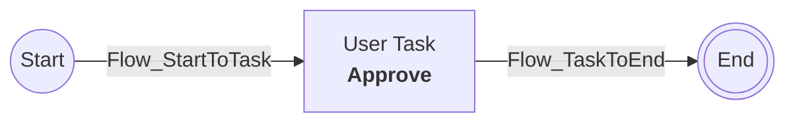
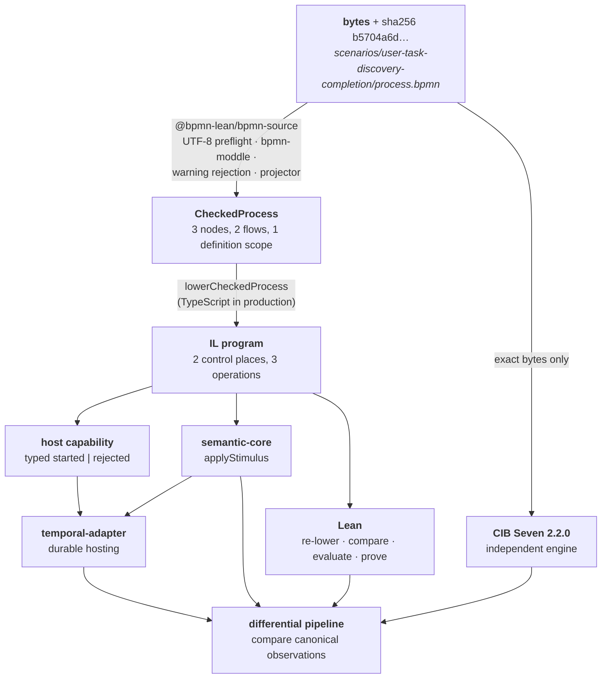
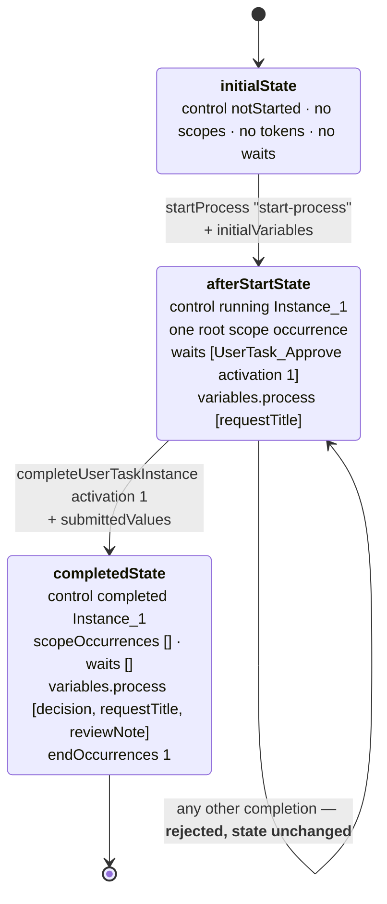
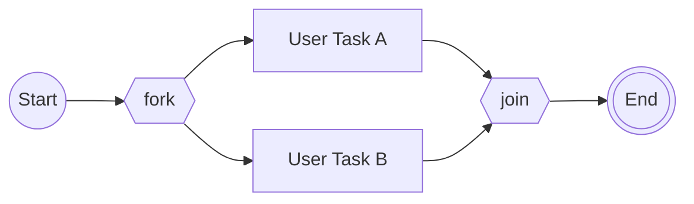

# Case study: one process through every layer

*The smallest complete example, traced end to end, with the theorems marked where they attach.*

## 10.1 The process



Three nodes, two Sequence Flows, one human step. Chosen deliberately: it is the project's `user-task-discovery-completion` scenario, it has no concurrency, and every artefact below is quoted verbatim from the repository at commit `5b65954`.

**It also carries data.** The model installs an initial Process variable at start and submits a form patch at completion, under two selected CIB extensions. That is useful for a case study: the topology is trivial, so everything below is attributable to the data, scope, and identity machinery rather than to diagram complexity.

## 10.2 Layer 0 — the exact bytes

The authoritative input is a byte sequence, not a parsed object. Its digest is `b5704a6d…86378d`:

```xml
<?xml version="1.0" encoding="UTF-8"?>
<bpmn:definitions
  xmlns:bpmn="http://www.omg.org/spec/BPMN/20100524/MODEL"
  xmlns:xsi="http://www.w3.org/2001/XMLSchema-instance"
  id="Definitions_SequentialUserTask"
  targetNamespace="https://bpmn-lean.local/scenarios/sequential-user-task">
  <bpmn:process id="Process_SequentialUserTask" name="Sequential user task" isExecutable="true">
    <bpmn:startEvent id="StartEvent_1">
      <bpmn:outgoing>Flow_StartToTask</bpmn:outgoing>
    </bpmn:startEvent>
    <bpmn:userTask id="UserTask_Approve" name="Approve">
      <bpmn:incoming>Flow_StartToTask</bpmn:incoming>
      <bpmn:outgoing>Flow_TaskToEnd</bpmn:outgoing>
    </bpmn:userTask>
    <bpmn:endEvent id="EndEvent_1">
      <bpmn:incoming>Flow_TaskToEnd</bpmn:incoming>
    </bpmn:endEvent>
    <bpmn:sequenceFlow id="Flow_StartToTask" sourceRef="StartEvent_1" targetRef="UserTask_Approve"/>
    <bpmn:sequenceFlow id="Flow_TaskToEnd" sourceRef="UserTask_Approve" targetRef="EndEvent_1"/>
  </bpmn:process>
</bpmn:definitions>
```

That the bytes did not change while the *profile identity* did — `cibseven-2.2.0-user-task-draft` became `cibseven-2.2.0-user-task-process-data-draft` — is exactly the separation the design wants. Adding data behaviour is a change of *reviewed meaning*, so it changes the profile; it is not a change of source, so it does not change the digest. Every derived artefact references both.

**Why bytes and not the parsed model:** CIB Seven must receive *exactly* this input, because an oracle fed a re-serialised approximation is observing a different document than the one you claim to support.

## 10.3 The artefact chain



The one new box is `host capability`: since whole-topology admission predicates were removed, whether the *adapter* can schedule this program's reachable wait set is a separate pre-start question from whether the program is semantically well-formed. For this model the answer is trivially yes — one passive User Task wait, no host-driven wait at all — but the check runs, and returns a typed `started | rejected` before any Workflow exists. See [07 challenge 11](07-temporal-adapter.md#challenge-11--host-capability-is-not-semantic-admission).

## 10.4 Layer 1 — admission produces `CheckedProcess`

```lean
def sequentialCheckedProcess : CheckedProcess :=
  { identity :=
      { semanticProfile := ⟨"cibseven-2.2.0-user-task-process-data-draft"⟩
        sourceId := ⟨"sequential-user-task-process"⟩
        sourceSha256 :=
          "b5704a6d526ce5029e21b2de214653860bb23f7ed6169c4d912cd2412486378d" }
    processId := ⟨"Process_SequentialUserTask"⟩
    definitionScopes := [rootDefinitionScope ⟨"Process_SequentialUserTask"⟩]
    nodeScopes := rootNodeScopes ⟨"Process_SequentialUserTask"⟩
      [⟨"EndEvent_1"⟩, ⟨"StartEvent_1"⟩, ⟨"UserTask_Approve"⟩]
    sequenceFlowScopes := rootSequenceFlowScopes ⟨"Process_SequentialUserTask"⟩
      [⟨"Flow_StartToTask"⟩, ⟨"Flow_TaskToEnd"⟩]
    nodes :=
      [ .noneEndEvent ⟨"EndEvent_1"⟩
      , .noneStartEvent ⟨"StartEvent_1"⟩
      , .userTask ⟨"UserTask_Approve"⟩ (some "Approve") ]
    sequenceFlows :=
      [ { id := ⟨"Flow_StartToTask"⟩
          sourceId := ⟨"StartEvent_1"⟩
          targetId := ⟨"UserTask_Approve"⟩ }
      , { id := ⟨"Flow_TaskToEnd"⟩
          sourceId := ⟨"UserTask_Approve"⟩
          targetId := ⟨"EndEvent_1"⟩ } ] }
```

Read out the design choices:

- **Three scope fields appeared, for a model with one scope.** `definitionScopes`, `nodeScopes`, and `sequenceFlowScopes` declare that every node and flow belongs to the root Process scope. For a flat model this looks like pure overhead — and it is exactly why adding an embedded Sub-Process was a *replacement* of a uniform shape rather than a special case bolted onto a flat one. The single-scope model pays a small tax so the two-scope model needs no new shape. See [04](04-feasibility.md#the-structural-worry-about-flat-state-and-how-it-turned-out).
- **Nodes are sorted by ID**, so `EndEvent_1` precedes `StartEvent_1`. Sorting is *serialisation*, not order of execution — the point [01 §1.10](01-theorem-techniques.md#110-refusing-to-let-collection-order-become-semantics) is about.
- **Element IDs are typed**, not bare strings — `NodeId` and `SequenceFlowId` are different types ([01 §1.7](01-theorem-techniques.md#17-typed-identifier-domains)).
- **The digest travels with the graph.** No derived artefact can drift from the bytes.
- **BPMN diagram information is gone.** Layout is not semantics.

**Where Lean helps at this layer:** `checkedWellFormed` independently re-validates the graph — one start, one end, legal arity per node kind, every reference resolves, no self-loops, sorted distinct IDs, and now scope ownership completeness. Kernel-checked regressions prove it rejects empty, flowless, and dangling-reference graphs. Those three regressions exist because a genuine defect once accepted all three.

**Where Lean cannot help at this layer:** it does not parse the XML. The step from bytes to this structure has exactly one implementation. Only CIB Seven, which reads the bytes, can independently disagree — and for this scenario it does run, which is not true of 27 of the 51 registered cases. See [02](02-evidence-and-lanes.md#for-most-of-the-surface-that-lane-does-not-run).

## 10.5 Layer 2 — lowering produces the IL program

The Lean fixture deliberately does **not** write the program out as a literal:

```lean
def sequentialProgram : Program :=
  lowerCheckedProcess sequentialCheckedProcess
```

The fixture *is* the lowering function applied to the graph. So every theorem about `sequentialProgram` is a theorem about the lowerer's actual output, not about a transcribed copy that could silently drift from it. A hand-copied program literal is precisely the kind of artefact the project's own artifact-equality rule exists to distrust ([01 §1.9](01-theorem-techniques.md#19-artifact-equality-before-evaluation)) — and here the fixture stopped being one.

What it evaluates to, for this model:

| Control places | Operations |
|---|---|
| `place:Flow_StartToTask` (origin `Flow_StartToTask`) | `initiate` → `place:Flow_StartToTask` |
| `place:Flow_TaskToEnd` (origin `Flow_TaskToEnd`) | `awaitUserTask` `place:Flow_StartToTask` → `place:Flow_TaskToEnd`, task `UserTask_Approve` / "Approve" |
| | `reachNoneEnd` ← `place:Flow_TaskToEnd` |

Stated plainly: **two Sequence Flows became two token containers; three BPMN nodes became three semantic operations wired to those containers.**

The third operation is `reachNoneEnd` rather than a single `terminate`, because reaching a none End Event and *completing a scope* are two mechanisms — a flat Process can conflate them, a Process with a child scope cannot. Root completion is a separate `completeScope` that fires only on quiescence. See [05](05-semantic-core-and-il.md#why-there-is-no-terminate-operation).

**Where Lean helps at this layer** — three distinct things, easy to confuse:

| Lean contribution | What it establishes |
|---|---|
| `lower_preserves_definition_identity` | for **every** checked graph, profile / source ID / digest survive lowering — a quantified law, not a check of this fixture |
| `lower_preserves_sequence_flow_origins` | for **every** checked graph, each control place still names its Sequence Flow — provenance cannot be erased |
| per-artifact lowering equality | for **this** artefact, the program TypeScript emitted equals the program Lean recomputes — a runtime check enforced before any evaluation |

The first two are universal statements about the translation. The third is a per-run integrity check. Both kinds are needed: the laws say the translation *preserves the right things*; the check says *this particular file really came from that translation*. The pipeline adds a guard on the guard — it mutates one operation origin without breaking structural validity and requires Lean to reject the program as unequal to its own lowering.

## 10.6 Layer 3 — the answer-free scenario

Execution needs input. The real scenario file, abridged:

```json
{
  "kind": "scenario",
  "id": "user-task-discovery-completion",
  "profile": "cibseven-2.2.0-user-task-process-data-draft",
  "bpmn": { "id": "sequential-user-task-process",
            "relativePath": "scenarios/user-task-discovery-completion/process.bpmn",
            "sha256": "b5704a6d…86378d" },
  "stimuli": [
    { "kind": "startProcess", "commandId": "start-process",
      "processId": "Process_SequentialUserTask", "instanceId": "Instance_1",
      "initialVariables": [
        { "name": "requestTitle", "value": { "kind": "string", "value": "Review invoice 42" } }
      ] },
    { "kind": "completeUserTaskInstance", "commandId": "complete-user-task-instance",
      "taskId": { "processInstanceId": "Instance_1",
                  "elementId": "UserTask_Approve", "activation": 1 },
      "submittedValues": [
        { "name": "decision",    "value": { "kind": "string", "value": "approved" } },
        { "name": "reviewNote",  "value": { "kind": "null" } }
      ] }
  ],
  "observations": [ "deployment", "commandResults", "processStatus", "activeWaits",
                    "openUserTasks", "openTimers", "openEffects", "variables",
                    "enabledInteractions", "logicalTime" ],
  "provenance": {
    "normativeRefs": [ "BPMN 2.0.2 §10.7.3", "BPMN 2.0.2 §13.3.2", "BPMN 2.0.2 §13.3.3" ],
    "cibRevision": "834a9874760de8a0107f7c1b32806e37f17fb017",
    "cibRefs": [ "…/UserTaskTest.java#testTaskPropertiesNotNull",
                 "…/TaskAssigneeTest.java#testTaskAssignee",
                 "…/TaskServiceTest.java#testCompleteTaskUnexistingTaskId" ]
  }
}
```

Four things to notice, all deliberate:

1. **Still no expected results.** Ten observation *names*; zero values. The stimuli now carry *input* data, which sharpens the answer-free rule rather than weakening it: what a caller supplies is input, what the engine does with it is the answer, and the answer is still absent. Every target computes its own and they are compared afterwards.
2. **`reviewNote` is an explicit null, not an omission.** `{ "kind": "null" }` is a distinct arm of the closed `VariableValue` union. That distinction is load-bearing — the boundary-error capsule discovered that CIB's output mapping turns a target-shaped null local write into a *present, null-valued* Process variable, which is a different thing from an absent one. Modelling null as a variant rather than as absence is what makes that observable.
3. **The completion key is a triple** — `(processInstanceId, elementId, activation)` — not just the element ID. That is a semantic decision, and `element_id_alone_is_insufficient` is a compiled counterexample against the simplification.
4. **Provenance cites the standard *and* the oracle.** Three BPMN clause references, a pinned CIB Seven git revision, and three specific CIB test methods. The scenario records *why this behaviour is believed correct*, so a future reader can re-check the reasoning rather than just the assertion.

## 10.7 Layer 4 — execution, and exactly which theorems attach where

Two stimuli, three states — and a theorem at each transition.



Note what happens *inside* the first transition. The `startProcess` stimulus commits — installing the initial Process bindings **before** the first wait — then **internal closure** runs automatically: `initiate` fires, putting a token on `place:Flow_StartToTask`; that enables `awaitUserTask`, which fires, consuming the token and creating the wait. Closure then stops, because a wait is not an automatic step. Two internal operations from one external command — and the theorem states the *end* of that closure, not the microsteps. In the Temporal host, those two internal steps also produce no Event of their own; see [07 challenge 1](07-temporal-adapter.md#challenge-1--determinism-and-replay).

Notice also the final variable order: `decision, requestTitle, reviewNote`. That is canonical sort order, not insertion order — the merge is atomic and the projection is sorted, so "which came from start and which from completion" is deliberately not observable.

Here are the five capsule theorems, verbatim, with what each buys:

**① The start transition — exact resulting state**

```lean
theorem start_reaches_single_user_task_wait :
    applyStimulus scenarioClosureLimit program initialState startStimulus =
      { outcome := .committed
        state := afterStartState
        internalStepBoundExceeded := false
        ambiguousInternalChoice := false } := by
  decide
```

Not merely "a task appears" — the *entire* resulting state, field by field, including the installed Process binding, the root scope occurrence, that the closure bound was not hit, and that no ambiguous internal choice arose. Kernel-computed.

> **Worth noticing:** `ambiguousInternalChoice` is a Lean-only field. The TypeScript `CommandResult` has no such flag, and Lean's `applyStimulus` returns a five-arm outcome union where TypeScript's returns two. That asymmetry has survived every capsule. The two implementations agree on the *canonical observation* while their transition-result values are not even the same shape, which is the concrete texture of the independence discussed in [06](06-typescript-core-correctness.md#3--deliberately-divergent-runtime-representations--with-receipts).

**② The completion transition — exact termination with committed data**

```lean
theorem matching_completion_terminates :
    applyStimulus scenarioClosureLimit program afterStartState
        completionStimulus =
      { outcome := .committed
        state := completedState
        internalStepBoundExceeded := false
        ambiguousInternalChoice := false } := by
  decide
```

`completedState` has `control := .completed`, `scopeOccurrences := []`, `waits := []`, `endOccurrences := 1`, and the merged three-binding Process scope. Completion also runs closure — the token released onto `place:Flow_TaskToEnd` enables `reachNoneEnd`, and then quiescent `completeScope` removes the root occurrence.

The atomicity here is the semantic content: the submitted patch is merged into Process scope **before** outgoing closure, so no observable state exists in which the task is complete but its data is not committed.

**③ Wrong element — rejected, and state preserved**

```lean
theorem no_completion_before_matching_command :
    applyStimulus scenarioClosureLimit program afterStartState
        (.completeUserTaskInstance ⟨"wrong-completion"⟩
          { exactTaskInstanceId with elementId := ⟨"Other_Task"⟩ }
          submittedValues) =
      { outcome := .rejected
        state := afterStartState        -- ← unchanged
        internalStepBoundExceeded := false
        ambiguousInternalChoice := false } := by
  decide
```

The `state := afterStartState` line is the load-bearing part, and it says more than "nothing happened": the rejected command *carried data*, and none of it was written. A rejection that mutated state — or that leaked a variable — would be a durability bug waiting to happen.

**④ Any wrong activation — the one genuinely quantified law**

```lean
theorem wrong_activation_is_rejected
    (submittedActivation : Nat) (mismatch : submittedActivation ≠ 1) :
    applyStimulus scenarioClosureLimit program afterStartState
        (.completeUserTaskInstance ⟨"wrong-activation"⟩
          { exactTaskInstanceId with activation := submittedActivation }
          submittedValues) =
      { outcome := .rejected
        state := afterStartState
        internalStepBoundExceeded := false
        ambiguousInternalChoice := false } := by
  exact task_identity_mismatch_is_rejected
    program exactWait ⟨"wrong-activation"⟩
      { exactTaskInstanceId with activation := submittedActivation }
      submittedValues
      0 afterStartState.variables (Or.inr (Or.inr mismatch))
```

Read the signature: `∀ submittedActivation : Nat, submittedActivation ≠ 1 → rejected`. **For every natural number** other than 1 — `0`, `2`, `7`, `10^18`, all of them.

And look at the proof: it is not `by decide` (it *cannot* be — the input space is infinite). It is one line invoking a **generic** theorem `task_identity_mismatch_is_rejected` about arbitrary programs, waits, submitted patches, and *scoped variable states*, specialised to this capsule. That is the pattern `CLAUDE.md` prescribes: *"derive family-specific theorems by specialization when the proposition genuinely agrees rather than accumulating renamed restatements."* The reusable content lives once; each capsule pays one line.

The specialisation is worth reading closely because it shows the generic theorem *absorbing* the data work rather than being replaced by it. Its argument list grew two entries — `submittedValues` and `afterStartState.variables` — and the capsule-level statement stayed one line. If the generic law had been stated only over data-free completions, adding data would have forced a second parallel law.

**Why this specific theorem earns its cost.** Activation numbers distinguish the first activation of a task from a later one. In a durable host, a command can be retried, duplicated, or replayed after a Worker restart, and a caller can submit anything. A finite lock over a few sampled values would leave the space open. This is the law that makes duplicate-command handling safe, and it is the semantic counterpart of the adapter's content-bound Update identity ([07 challenge 4](07-temporal-adapter.md#challenge-4--duplicate-and-retried-commands)) — which itself had to grow to cover the whole submitted patch for exactly the same reason.

**⑤ Element ID alone is not a sufficient key — a discriminating witness**

```lean
theorem element_id_alone_is_insufficient :
    let wrongTaskId := { exactTaskInstanceId with activation := 2 }
    wrongTaskId.elementId = exactTaskInstanceId.elementId ∧
      (applyStimulus scenarioClosureLimit program afterStartState
        (.completeUserTaskInstance
          ⟨"wrong-activation"⟩ wrongTaskId submittedValues)).outcome = .rejected := by
  decide
```

A two-part conjunction where both halves matter: the element ID **is** identical, *and* the command **is** rejected. Together they refute the tempting simplification "just key completions by element ID". Whoever proposes that next has a compiled counterexample waiting.

## 10.8 Layer 5 — four targets, one comparison

The same scenario runs through four independent paths, then their **canonical observations** are compared:

| Target | How it gets the process | What it contributes |
|---|---|---|
| **Lean** | decodes both artefacts, re-lowers, rejects inequality, echoes the scenario, then evaluates | formal account + the theorems above |
| **TypeScript core** | consumes the IL program directly | the production semantics, separately written |
| **Temporal adapter** | hosts the core in a durable Workflow, twice, in isolation | that durability preserves the result under retry, restart, and replay |
| **CIB Seven 2.2.0** | deploys the **raw XML bytes** | what a real production engine does |

This scenario is one of the 24 cases that have a CIB lane. **Twenty-seven of the 51 do not**, and for those the fourth row is deliberately empty — worth remembering when reading this case study as representative. It is the *best*-evidenced case in the catalog, not the median one.

The retained CIB evidence, abridged, showing the structure that matters:

```json
{
  "kind": "cibSevenScenarioEvidence",
  "scenario": { "id": "user-task-discovery-completion", "sha256": "72ba4bb2…9cbcae" },
  "profile":  { "id": "cibseven-2.2.0-user-task-process-data-draft", "sha256": "08d6e70e…4b6a38f" },
  "producer": { "engine": "CIB Seven", "engineVersion": "2.2.0",
                "engineRevision": "834a9874760de8a0107f7c1b32806e37f17fb017",
                "runner": "cibseven-oracle", "java": "21", "database": "H2 2.3.232" },
  "producerObservations": {
    "stateQueries": [
      { "afterCommandId": "start-process",
        "processInstanceCount": 1, "engineClockTimeMs": 0,
        "variables": [ { "name": "requestTitle", "value": "Review invoice 42" } ] },
      { "afterCommandId": "complete-user-task-instance",
        "processInstanceCount": 0, "engineClockTimeMs": 0,
        "variables": [ { "name": "requestTitle", "…": "…" },
                       { "name": "decision", "value": "approved" }, "…" ] }
    ],
    "taskQueries": [ "…" ]
  },
  "projection": { "id": "canonical-scenario-result" },
  "result": { "outcome": { "kind": "semantic", "outcome": "committed" }, "…": "…" }
}
```

Three structural points:

- **`producerObservations` is raw; `result` is the canonical projection.** The engine's own query output is kept separately from the project's canonical view of it. That separation is what makes the projection independently auditable — you can check the derivation instead of trusting it.
- **`stateQueries` is what stops half the result being adapter assertion.** `status`, `logicalTimeMs`, and `variables` are derived by verifier-side tests from raw Process-instance counts, engine-clock reads, and Process-variable queries rather than asserted. `processInstanceCount: 1 → 0` is how "running then completed" is *observed*. A canonical field with no raw source looks identical to a corroborated one in a passing run, which is why this block exists.
- **Both hashes are present**, so this evidence is bound to exactly this scenario and this profile. Edit either and the binding breaks loudly rather than silently invalidating every stored observation.

## 10.9 What Lean bought here, and what it did not

**Bought:**

| Layer | Lean's contribution | Quantified? |
|---|---|---|
| bytes → checked graph | independent re-validation; empty / flowless / dangling rejections | witnesses |
| checked graph → program | identity and flow-origin preservation | **yes, ∀ graphs** |
| this artefact | recomputed-lowering equality before evaluation, plus origin-mutation rejection | per-run check |
| program validity | producer/consumer shape, reachability, co-reachability, certified acyclicity, scope ownership | **yes, ∀ graphs** |
| evaluator vs rulebook | every produced transition is permitted | **yes, ∀ transitions** |
| happy path | exact state after start and after completion, including committed data | finite locks |
| refusal path | any wrong activation rejected, state and variables preserved | **yes, ∀ ℕ ≠ 1** |
| key design | element ID alone insufficient | witness |
| observation | projection ignores token storage order; waits sort by kind then element ID | finite locks |

**Not bought — and this is not a gap in the work, it is the boundary:**

- **That this is the right reading of BPMN.** Lean proves properties of the *chosen* account. The three normative clause references and the CIB test references in the scenario's provenance block are what support the choice.
- **That CIB Seven agrees.** That is the retained evidence, a different lane — present here, absent for 27 of the 51 cases.
- **That Temporal preserves it.** That is refinement and replay, a third lane.
- **That the TypeScript core matches Lean.** Observed by the pipeline; explicitly *not* proved. [06](06-typescript-core-correctness.md).
- **That lowering preserves *behaviour*.** The laws cover identity and provenance. Full observational preservation — `lower_preserves_supported_run` — is unproved, and by owner decision is not a prerequisite for anything ([03](03-is-lean-goal-driven.md)).

That last one deserves a sharp statement, because it is easy to assume away. Nothing yet proves *in general* that executing the lowered program means the same thing as the BPMN graph it came from. For this fixture, four targets agreeing is strong empirical evidence — bounded by the fact that three of them consume the same compiled graph.

## 10.10 The same process, one gateway richer

Add a parallel fork and join around two tasks and the assurance requirements change qualitatively, not just quantitatively:



| New situation | Consequence | What answers it |
|---|---|---|
| Two tokens exist at once | concurrency is real; "which step next?" becomes a question | closure must make an *explicit* choice; every other multiple-enabled state is rejected as unresolved |
| The join needs a readiness rule | two plausible readings of the standard diverge | `duplicate_left_no_right_non_law` refutes the count-based reading |
| Tokens can pile up unevenly | surplus must survive a firing | `synchronize_consumes_per_incoming_and_preserves_excess` |
| Tasks can complete in either order | is the final state order-dependent? | `completion_order_independent_at_final_state`, `parallel_task_activation_order_has_same_observation` |
| Token list order is now observable internally | must not leak into the public view | `token_projection_ignores_storage_permutation` |
| Two nodes can be enabled simultaneously | a theorem about the enabled *list* must not fix an order | `enabledTransitionsAtSingleToken`, plus the two-token *permutation* localisation from Stage 3b |
| Two concurrent completions can be durably accepted in either order | the host must not impose caller order | an unordered one-commit/one-rejection race witness; both orders must reach the same final state |
| **The split can now combine with a host-driven wait** | that needs a scheduler the adapter does not have | `selectMany`-style token splitting is classified and **rejected pre-start** as `concurrentHostDrivenWaits` ([07 challenge 11](07-temporal-adapter.md#challenge-11--host-capability-is-not-semantic-admission)) |
| **CIB Seven disagrees** | a schema-valid duplicate-same-flow gateway probe exposes divergent behaviour | classified as candidate deviation `CIB-DEV-0001`, kept visible, **not** absorbed into the compatibility claim |

The second-to-last row shows the cost of removing whole-topology admission: a hazard that was *accidentally* impossible became possible, and had to be turned into an explicit typed pre-start refusal rather than left to a runtime failure.

The final row is the whole assurance system working as designed. The oracle produced a *disagreement*. It was not resolved by voting, not silently adopted, and not quietly dropped. It was classified, given a stable identifier, and left prominently visible — and the project deliberately declined to expand its CIB profile to claim parallel compatibility.

Which brings the case study back to the first point in [00 — background](00-background.md): "implement BPMN" is not well defined until you say *whose reading*, and every mechanism in these documents exists to make that reading explicit, reviewable, and honestly bounded.
