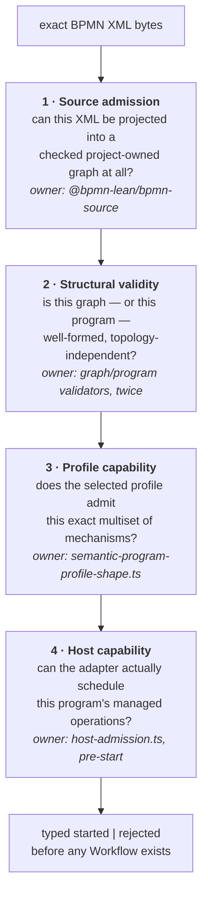

# Admission: what it means for a model to be accepted

## Why this deserves its own document

"Does the engine support this diagram?" sounds like one question. In this repository it is **four**, asked in order, by four different owners, with four different failure modes — and the first of them additionally *partitions* the document rather than accepting or rejecting it whole:



Keeping them apart is not tidiness. Each one, if merged into another, produces a specific bad outcome:

| Merge | What breaks |
|---|---|
| 1 into 2 | XML quirks become semantic rules; the parser starts deciding meaning |
| 2 into 3 | every new profile re-implements reachability and acyclicity, and they drift |
| 3 into 2 | structural validity starts depending on which features you selected — the thing that produced whole-topology predicates |
| 4 into 3 | an adapter limitation becomes a claim about BPMN, which is the boundary the whole project exists to defend |

The fourth row is the one that actually happened and had to be repaired; see [§ Host capability](#host-capability-is-not-semantic-admission).

## The two generalisations that shipped

These are the only **horizontal** generalisations in the repository, and neither came from the route built to produce one.

### One validator plus a per-profile capability

The alternative — and the thing this replaced — is to ask "is this one of the named shapes I recognise?" through exact whole-topology execution-surface predicates: `hasSequentialExecutionSurface`, `hasTimerExecutionSurface`, `hasBalancedParallelExecutionSurface`. Adding a feature means adding a disjunct, forever.

The [profile-parameterized admission specification](../bpmn-lean-experiment/docs/PROFILE-PARAMETERIZED-ADMISSION-SPEC.md) splits the question in two instead:

- **one reusable, topology-independent validator** owning reference closure, arity, ownership, unique root initiation, one completion per scope, scope-local reachability and co-reachability, global initiation-to-root-completion reachability, acyclicity, and the one-producer/one-consumer control-place discipline;
- **a per-profile capability** naming only *"kinds and cardinalities, not complete node IDs, Sequence Flow IDs, or one full model path."*

And then it locked the door behind itself. The retired predicate names are in `scripts/pre-release-architecture.test.ts`'s prohibited list, so reintroducing one **fails a gate**. The spec states the rule directly: *"Adding a profile must extend the typed capability table and its separating tests, not add another whole-program disjunct."*

**Why the route matters.** The seven-stage compositional-admission proof programme existed to make exactly this widening safe, and was superseded before delivering it ([03](03-is-lean-goal-driven.md)). The widening shipped as ordinary implementation work instead. The lesson is not "the proofs were worthless" — the graph-validation results from that arc *are* the reachability and acyclicity backstop this validator relies on. The lesson is that the theorem was gating the wrong thing: what the generalisation needed was a clean separation of concerns, not a universal preservation theorem.

### Execute, preserve, or reject — per element

The second generalisation is the [preserve-only admission partition](../bpmn-lean-experiment/docs/PRESERVE-ONLY-ADMISSION-SPEC.md), and it is the closest thing in the repository to admitting a *family* rather than a shape. One generic profile classifies parsed material three ways through [a closed recursive classifier](../bpmn-lean-experiment/packages/bpmn-source/src/preserved-element-classification.ts): executed, preserved, or rejected.

Three properties make it more than a permissive mode:

- **a container is preserved only when every descendant is**, so preservation cannot silently swallow an executable element;
- **references are excluded from the walk**, so a preserved shape may point at an executed element without dragging it out of execution;
- and the preserved source reaches its twin's checked graph and program **once exact-source identity is normalized away** — meaning retained notation provably changes nothing executable.

Refusals name their element rather than the document: nullable `id`, `$type`, containment path, named property or attribute, and the missing capability, collected across loci, deduplicated, and ordered by path. What preservation does *not* buy is any execution meaning: `IMPLEMENTATION-MAP.md` keeps a **structural** requirement row separate from the **operational** row it leaves open, and [PRESERVE-ONLY-ADMISSION-SPEC.md](../bpmn-lean-experiment/docs/PRESERVE-ONLY-ADMISSION-SPEC.md) explains why `preserved` is deliberately *not* a disposition in the requirement ledger. Retained notation is countable without reading as executable support.

## What a profile capability looks like

A capability is an exact operation multiset, checked as data. From `packages/semantic-core/src/semantic-program-profile-shape.ts`:

```ts
case SemanticProfileId.ExclusiveGatewaySimpleBoolean:
  return rootProgram([
    SemanticOperationKind.Initiate,
    SemanticOperationKind.Choose,
    SemanticOperationKind.AwaitUserTask,
    SemanticOperationKind.AwaitUserTask,
    SemanticOperationKind.AwaitUserTask,
    SemanticOperationKind.ReachNoneEnd,
    SemanticOperationKind.ReachNoneEnd,
    SemanticOperationKind.ReachNoneEnd,
    SemanticOperationKind.CompleteScope,
  ]);
```

Nine operations, one definition scope. That is the whole capability — no node IDs, no flow IDs, no topology.

Three consequences, each load-bearing:

**A capability is a multiset, so some genuine variation is already admitted.** The Timer/User Task composition profile permits *"both finite acyclic linear orders selected by graph facts"* — Timer-then-Task and Task-then-Timer are the same multiset, so both pass without a second predicate. The spec is careful that this is not accidental: each retained end-to-end scenario uses one order while *"focused source, Lean, and TypeScript checks also cover the reverse order so the broader structural admission is not accidental."* Covering only the shipped order would leave you unable to tell generic admission from a lucky fixture.

**A capability is not payload validation.** *"Exact Timer duration, effect descriptor and mapping, boundary route, gateway condition, source-language, origin, and arity restrictions remain checked by their existing owners."* So `PT1S`-only is still enforced — just not by the capability table.

**Wrong profile is a rejection, not a shrug.** The same structurally valid Timer/User Task program *"is therefore accepted under the composition profile and rejected under the Timer-only, User-Task-only, and unknown profiles."* Cross-profile rejection is tested explicitly: the Receive Task graph is rejected under the Intermediate Catch Message capability and vice versa. Without those witnesses, "we validate against the profile" could mean nothing.

## The two validators that do not call each other

`checkedWellFormed` runs over project-owned BPMN nodes and Sequence Flows; `programWellFormed` runs over control places and typed operations. They check structurally similar properties over deliberately different representations, and — the point — **each is implemented twice**:

> *"TypeScript and Lean each implement this check; neither calls the other."*

That is the decorrelation rule of [02](02-evidence-and-lanes.md) applied to admission rather than to execution. A validator bug that admits a malformed program has to be made *twice, independently, identically* to escape.

Two details in the checked-source validator are worth pulling out because they show where the representation had to be more subtle than "a graph":

- **An admitted exit is a None End Event *or* an Error End Event.** Once a scope can end exceptionally, "co-reaches the end" is no longer one target.
- **A boundary Error stays a parent-scope node** and gets *"one checked-graph-only exceptional reachability edge from its attached Sub-Process; that edge is never a Sequence Flow and never crosses definition scopes."* So the reachability check can see the exceptional route without anyone pretending it is control flow. Modelling that edge as a Sequence Flow would have been much easier and would have made the exceptional path indistinguishable from a normal one.

## Host capability is not semantic admission

The fourth question exists because merging it into the third produced a real defect.

The adapter admits **at most one managed operation** — one thing it must actively schedule against a deadline — and no host-driven wait beside a token split. For a period that limitation was *accidentally* protected: the whole-topology predicates simply never admitted such a program, so nobody had to state the rule because nothing could reach it.

Removing the predicates removed the accident. Owner decision 10 names it precisely — this is *"an adapter limitation accidentally protected by current whole-topology admission, not BPMN meaning"* — and fixes the shape of the answer: *"Violation must be a deterministic pre-start adapter admission result, never a non-retryable Workflow crash."*

So `packages/temporal-adapter/protocol/src/host-admission.ts` answers a separate question, before Workflow creation, and the production start API returns typed `started | rejected`. That module depends on the semantic core and on **no Temporal SDK package**, which is what lets the capability question be answered without a client. Its own documentation draws the distinction that matters:

```ts
/**
 * Conservatively proves the current single-host-driven-wait contract.
 *
 * User Task and Message waits are passive ingress and may coexist. A token
 * split combined with a timer or effect can create more than one host-driven
 * branch, which requires a scheduler that this adapter does not implement.
 *
 * Four operation classes are managed rather than passive, each owning one
 * scheduler instance: the Event-Based Gateway race, the bounded User Task, the
 * bounded Sub-Process scope, and the monitored User Task whose deadline spawns
 * a branch without ending it. […] The host admits at most one managed
 * operation across all four classes, so a race
 * beside a bounded Activity wait is rejected even though each alone is
 * admissible.
 */
```

**Passive versus managed is the whole classification.** A User Task Update or a Message Signal arrives whenever it arrives; the host schedules nothing, so any number can coexist. A managed operation needs its own scheduler instance and the loop's attention, so two of them need machinery that does not exist. Scope operations — `enterScope`, `completeScope`, `invokeProcess`, `returnProcess` — are internal closure and cost nothing.

Three properties make this a boundary rather than a bug report:

- the classification is **exhaustive over operation kinds** and mutation-guarded against omitting one, so a twenty-fifth operation forces a host decision instead of defaulting to "probably fine";
- every capsule must either preserve the bound or build the scheduler — the Inclusive Gateway had to classify `selectMany` as token-splitting and accept that combining it with a timer is rejected as `concurrentHostDrivenWaits`;
- **the budget is one across all four classes, not one per class.** The comment explains why counting per class would be wrong: it would admit a race beside a bounded Activity wait, needing two schedulers the adapter does not run concurrently. Each new managed class therefore widens the set of programs the host accepts *one at a time*, never the number that can run at once.

The honest cost: a general multi-wait scheduler does not exist, several remaining BPMN mechanisms will need one, and the adapter says so in a typed result instead of discovering it at runtime.

## What admission still does not do

The spec's own closest-unsupported-claim sentence is the right summary: *"The closest unsupported claim is arbitrary serial composition. Admission does not infer an unbounded grammar, repeated Timer or User Task mechanisms, loops, arbitrary graph cardinalities, or general BPMN Process Execution Conformance."*

Put in terms of the four questions: **question 2 generalised, question 3 did not.** The graph-shape half is now one reusable validator with no per-profile knowledge. The capability half is still an enumerated multiset per profile, so the number of *accepted graphs* remains finite and fixtures still cover the reachable space. That is exactly why the quantified-theorem argument of [01](01-theorem-techniques.md#10-first-why-formalise-anything-at-all) has not yet become load-bearing, and why [11 §2](11-open-questions.md#2--can-one-mechanism-be-generalised-from-a-literal-to-a-family) still asks whether one mechanism can be generalised from a literal to a family.

## Why the capability table is guarded rather than trusted

The admission specification's capability table is checked by [an executable coverage guard](../bpmn-lean-experiment/scripts/document-reviewability.test.ts) that derives the registered profile IDs from TypeScript source and requires each to appear exactly once. That guard exists because the table drifted, in two ways whose *shapes* are more instructive than the fix.

**The smaller defect: a stale hand-maintained inventory.** The capability table carried fewer rows than there were registered profiles — several implemented, evidence-closed, registered profiles were absent from the document entirely, no row and no prose. Every registered profile now has a row carrying its exact `SemanticProfileId`, with multisets derived from the capability source.

**The larger defect: the specification's core claim contradicted the authority document.** It asserted, for every selected profile, that the structural check establishes *"one rooted definition-scope tree"*. But `IMPLEMENTATION-MAP.md` records a **forest** — existing profiles keep one rooted tree while the Call profile adds *"one distinct parentless called root"* with *"entry-root and called-root completion strategies"*. The words `forest`, `called root`, and `parentless` appeared **zero times** in the document that owns the admission contract, and every behavioural gate stayed green throughout, because the specification had **no executable dependency on the profile registry**.

The distinctions are worth stating explicitly, since [14](14-scopes-and-cancellation.md#call-activity-a-second-root-not-a-child) depends on them: checked source validates a definition-scope forest with independent per-scope reachability, co-reachability, and acyclicity; every non-Call profile retains one parentless entry root; the Call profile has that entry root plus one distinct parentless called root bound to `calledProcessId`; Semantic Process admission still requires **exactly one `initiate`**, owned by the entry root; and entry and nested scopes complete through `completeScope` while **the called root has no `completeScope` at all** and completes through its paired `returnProcess`.

That last asymmetry is the reason the naive fix — swapping "tree" for "forest" — would have been wrong. A second root does *not* mean a second initiation or a second completion operation; it means one initiation, one `completeScope`, and a `returnProcess` that terminates the called root. The Call Activity capability row shows it: two definition scopes, but one `initiate` and one `completeScope`.

The coverage guard in `scripts/document-reviewability.test.ts` closes it: it derives the registered IDs from the TypeScript source and requires each to appear in the capability table exactly once. Its red state was the already-drifted document, reporting both a row shortfall and every ID absent, because the old rows carried only friendly names rather than exact `SemanticProfileId` values.

**Two things this confirms.** It is the **inventory** drift class, which a retired-vocabulary guard structurally cannot catch: nothing lexical is wrong with a table that is merely short. And the fix was *not* "add the missing rows" but "make absence fail a gate", which is the stronger of the two repairs `CLAUDE.md` allows. The recommendation for the eventual proper fix is better than the obvious one: rather than scraping the `switch` statement for publication, promote admission's capability data to a first-class immutable map that both the validator and the table derive from — a switch is not a data source, and generating documentation from one would trade this drift for a brittle parser.

