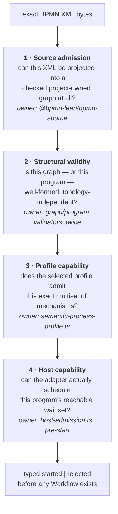

# Admission: what it means for a model to be accepted

*New in this revision. The topic grew out of [05](05-semantic-core-and-il.md) and [07](07-temporal-adapter.md) once admission stopped being one predicate and became four separate questions.*

## Why this deserves its own document

"Does the engine support this diagram?" sounds like one question. In this repository it is **four**, asked in order, by four different owners, with four different failure modes:



Keeping them apart is not tidiness. Each one, if merged into another, produces a specific bad outcome:

| Merge | What breaks |
|---|---|
| 1 into 2 | XML quirks become semantic rules; the parser starts deciding meaning |
| 2 into 3 | every new profile re-implements reachability and acyclicity, and they drift |
| 3 into 2 | structural validity starts depending on which features you selected — the thing that produced whole-topology predicates |
| 4 into 3 | an adapter limitation becomes a claim about BPMN, which is the boundary the whole project exists to defend |

The fourth row is the one that actually happened and had to be repaired; see [§ Host capability](#host-capability-is-not-semantic-admission).

## The generalisation that actually shipped

This is the part worth understanding, because it is the only **horizontal** generalisation in the repository and it did not come from the route that was built to produce it.

**Before.** Admission asked "is this one of the named shapes I recognise?" through a set of exact whole-topology execution-surface predicates — `hasSequentialExecutionSurface`, `hasTimerExecutionSurface`, `hasBalancedParallelExecutionSurface`, and so on. Adding a feature meant adding a disjunct. Six existed, and the seventh was the obvious next step.

**After.** The [profile-parameterized admission specification](../bpmn-lean-experiment/docs/PROFILE-PARAMETERIZED-ADMISSION-SPEC.md) split the question in two:

- **one reusable, topology-independent validator** owning reference closure, arity, ownership, unique root initiation, one completion per scope, scope-local reachability and co-reachability, global initiation-to-root-completion reachability, acyclicity, and the one-producer/one-consumer control-place discipline;
- **a per-profile capability** naming only *"kinds and cardinalities, not complete node IDs, Sequence Flow IDs, or one full model path."*

And then it locked the door behind itself. The retired predicate names are in `scripts/pre-release-architecture.test.ts`'s prohibited list, so reintroducing one **fails a gate**. The spec states the rule directly: *"Adding a profile must extend the typed capability table and its separating tests, not add another whole-program disjunct."*

**Why the route matters.** The seven-stage compositional-admission proof programme existed to make exactly this widening safe, and was superseded before delivering it ([03](03-is-lean-goal-driven.md)). The widening then shipped as ordinary implementation work. The lesson is not "the proofs were worthless" — the graph-validation results from that arc *are* the reachability and acyclicity backstop this validator relies on. The lesson is that the theorem was gating the wrong thing: what the generalisation actually needed was a clean separation of concerns, not a universal preservation theorem.

## What a profile capability looks like

A capability is an exact operation multiset, checked as data. From `packages/semantic-core/src/semantic-process-profile.ts`:

```ts
case SemanticProfileId.ExclusiveGatewaySimpleBoolean:
  return rootProgram([
    SemanticOperationKind.Initiate,
    SemanticOperationKind.Choose,
    SemanticOperationKind.AwaitUserTask,
    SemanticOperationKind.AwaitUserTask,
    SemanticOperationKind.AwaitUserTask,
    SemanticOperationKind.ReachNoneEnd,
    SemanticOperationKind.ReachNoneEnd,
    SemanticOperationKind.ReachNoneEnd,
    SemanticOperationKind.CompleteScope,
  ]);
```

Nine operations, one definition scope. That is the whole capability — no node IDs, no flow IDs, no topology.

Three consequences, each load-bearing:

**A capability is a multiset, so some genuine variation is already admitted.** The Timer/User Task composition profile permits *"both finite acyclic linear orders selected by graph facts"* — Timer-then-Task and Task-then-Timer are the same multiset, so both pass without a second predicate. The spec is careful that this is not accidental: each retained end-to-end scenario uses one order while *"focused source, Lean, and TypeScript checks also cover the reverse order so the broader structural admission is not accidental."* Covering only the shipped order would leave you unable to tell generic admission from a lucky fixture.

**A capability is not payload validation.** *"Exact Timer duration, effect descriptor and mapping, boundary route, gateway condition, source-language, origin, and arity restrictions remain checked by their existing owners."* So `PT1S`-only is still enforced — just not by the capability table.

**Wrong profile is a rejection, not a shrug.** The same structurally valid Timer/User Task program *"is therefore accepted under the composition profile and rejected under the Timer-only, User-Task-only, and unknown profiles."* Cross-profile rejection is tested explicitly: the Receive Task graph is rejected under the Intermediate Catch Message capability and vice versa. Without those witnesses, "we validate against the profile" could mean nothing.

## The two validators that do not call each other

`checkedWellFormed` runs over project-owned BPMN nodes and Sequence Flows; `programWellFormed` runs over control places and typed operations. They check structurally similar properties over deliberately different representations, and — the point — **each is implemented twice**:

> *"TypeScript and Lean each implement this check; neither calls the other."*

That is the decorrelation rule of [02](02-evidence-and-lanes.md) applied to admission rather than to execution. A validator bug that admits a malformed program has to be made *twice, independently, identically* to escape.

Two details in the checked-source validator are worth pulling out because they show where the representation had to be more subtle than "a graph":

- **An admitted exit is a None End Event *or* an Error End Event.** Once a scope can end exceptionally, "co-reaches the end" is no longer one target.
- **A boundary Error stays a parent-scope node** and gets *"one checked-graph-only exceptional reachability edge from its attached Sub-Process; that edge is never a Sequence Flow and never crosses definition scopes."* So the reachability check can see the exceptional route without anyone pretending it is control flow. Modelling that edge as a Sequence Flow would have been much easier and would have made the exceptional path indistinguishable from a normal one.

## Host capability is not semantic admission

The fourth question exists because merging it into the third produced a real defect.

The adapter can host exactly **one host-driven wait** at a time. A committed timer *or* a committed effect — not both, and not either alongside a token split. Before the generalisation, that limitation was *accidentally* protected: the whole-topology predicates simply never admitted such a program. Nobody had to state the rule because nothing could reach it.

Removing the predicates removed the accident. Owner decision 10 names it precisely — this is *"an adapter limitation accidentally protected by current whole-topology admission, not BPMN meaning"* — and fixes the shape of the answer: *"Violation must be a deterministic pre-start adapter admission result, never a non-retryable Workflow crash."*

So `packages/temporal-adapter/src/host-admission.ts` answers a separate question, before Workflow creation, and the production start API returns typed `started | rejected`. Its own documentation draws the distinction that matters:

```ts
/**
 * Conservatively proves the current single-host-driven-wait contract.
 *
 * User Task and Message waits are passive ingress and may coexist. A token
 * split combined with a timer or effect can create more than one host-driven
 * branch, which requires a scheduler that this adapter does not implement.
 * …
 */
```

**Passive versus host-driven is the whole classification.** A User Task Update or a Message Signal arrives whenever it arrives; the host schedules nothing, so any number can coexist. A timer or an effect needs the loop's attention, so two of them need a scheduler that does not exist. Scope operations — `enterScope`, `completeScope`, `invokeProcess`, `returnProcess` — are internal closure and cost nothing.

Three properties make this a boundary rather than a bug report:

- the classification is **exhaustive over operation kinds** and mutation-guarded against omitting one, so an eighteenth operation forces a host decision instead of defaulting to "probably fine";
- every capsule must either preserve the bound or build the scheduler — the Inclusive Gateway had to classify `selectMany` as token-splitting and accept that combining it with a timer is rejected as `concurrentHostDrivenWaits`;
- the one exception is narrow and explicit: exactly one operation-addressed Message versus `PT1S` Timer managed race, and every other composition requiring a second host-driven branch or a second scheduler instance is refused.

The honest cost: a general multi-wait scheduler does not exist, several remaining BPMN mechanisms will need one, and the adapter says so in a typed result instead of discovering it at runtime.

## What admission still does not do

The spec's own closest-unsupported-claim sentence is the right summary: *"The closest unsupported claim is arbitrary serial composition. Admission does not infer an unbounded grammar, repeated Timer or User Task mechanisms, loops, arbitrary graph cardinalities, or general BPMN Process Execution Conformance."*

Put in terms of the four questions: **question 2 generalised, question 3 did not.** The graph-shape half is now one reusable validator with no per-profile knowledge. The capability half is still an enumerated multiset per profile, so the number of *accepted graphs* remains finite and fixtures still cover the reachable space. That is exactly why the quantified-theorem argument of [01](01-theorem-techniques.md#10-first-why-formalise-anything-at-all) has not yet become load-bearing, and why [11 §2](11-open-questions.md#2--can-one-mechanism-be-generalised-from-a-literal-to-a-family--unchanged) still asks whether one mechanism can be generalised from a literal to a family.

## One inventory drift found while writing this document — since resolved

Two defects turned up in the admission specification itself while this document was being written, and both were fixed in commit `2a29e94` (`fix(admission): synchronize profile capability documentation`). They are recorded here because the *shape* of the failure is more instructive than the fix.

**The smaller defect: a stale hand-maintained inventory.** The capability table had **11 rows against 15 registered profiles.** Receive Task appeared in prose but had no row; Inclusive Gateway, Event-Based Gateway, and Call Activity were absent from the document entirely — no row, no prose — despite all three being implemented, evidence-closed, and registered. All 15 rows are now present, each carrying its exact `SemanticProfileId`, with multisets derived from `semantic-process-profile.ts`.

**The larger defect: the specification's core claim contradicted the authority document.** The Exact claim asserted, "for every currently selected profile", that the structural check establishes *"one rooted definition-scope tree"*, and the Structural validators section repeated *"one rooted acyclic definition-scope tree."* But `IMPLEMENTATION-MAP.md` records a **forest** — existing profiles keep one rooted tree while the Call profile adds *"one distinct parentless called root"* with *"entry-root and called-root completion strategies"*. The words `forest`, `called root`, and `parentless` appeared **zero times** in the document that owns the admission contract.

The corrected text now distinguishes the layers accurately, and the distinctions are worth having explicitly since [14](14-scopes-and-cancellation.md#call-activity-a-second-root-not-a-child) depends on them: checked source validates a definition-scope forest with independent per-scope reachability, co-reachability, and acyclicity; every non-Call profile retains one parentless entry root; the Call profile has that entry root plus one distinct parentless called root bound to `calledProcessId`; Semantic Process admission still requires **exactly one `initiate`**, owned by the entry root; and entry and nested scopes complete through `completeScope` while **the called root has no `completeScope` at all** and completes through its paired `returnProcess`.

That last asymmetry is the reason the naive fix — swapping "tree" for "forest" — would have been wrong. A second root does *not* mean a second initiation or a second completion operation; it means one initiation, one `completeScope`, and a `returnProcess` that terminates the called root. The Call Activity capability row shows it: two definition scopes, but one `initiate` and one `completeScope`.

**Why it escaped, and what now prevents it.** The executable registry, validators, artefacts, capsules, and implementation map stayed mutually consistent, so every behavioural gate stayed green — the admission specification simply had **no executable dependency on the profile registry**. Its last update predated the three missing profiles, and the Receive Task change updated nearby prose without adding a row, which is the signature of an inventory maintained locally rather than checked as a set.

A coverage guard now lives in `scripts/document-reviewability.test.ts`: it derives the registered IDs from the TypeScript source, requires exactly 15 capability rows, and requires every ID exactly once. Its red state was the already-drifted document — `rowCount: 11, expected: 15`, plus all 15 IDs reported absent because the old rows carried only friendly names.

**Three things this confirms.** It is the **numeric/inventory** drift class, so the retired-vocabulary guard added in `e873ec7` could not catch it — the gap noted in [12](12-corrections-log.md#what-the-pattern-suggests) was demonstrated within hours of being written down. The fix was *not* "add four rows" but "make absence fail a gate", which is the stronger of the two repairs `CLAUDE.md` allows. And the recommendation for the eventual proper fix is better than the obvious one: rather than scraping the `switch` statement for publication, promote admission's capability data to a first-class immutable map that both the validator and the table derive from — a switch is not a data source, and generating documentation from one would trade this drift for a brittle parser.

